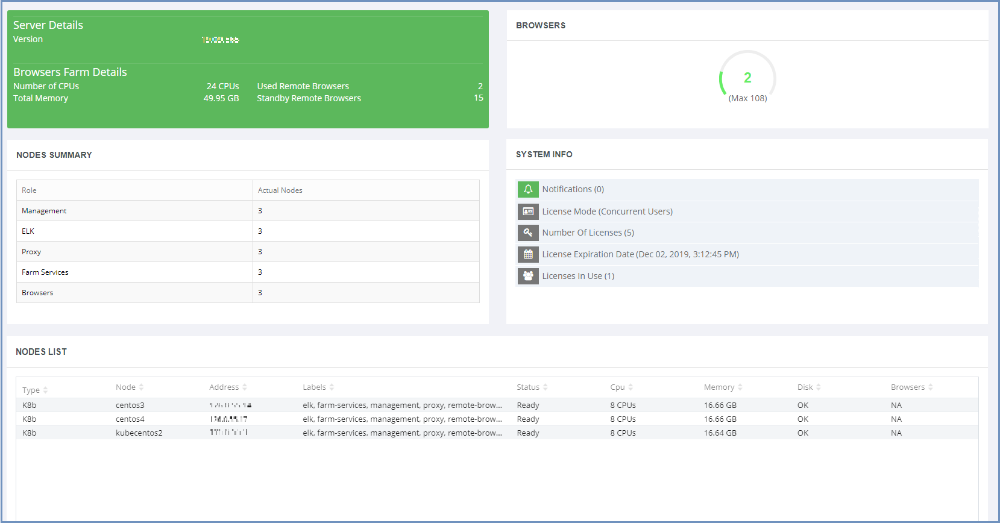
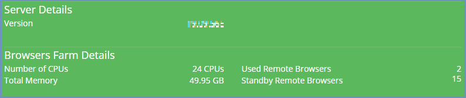
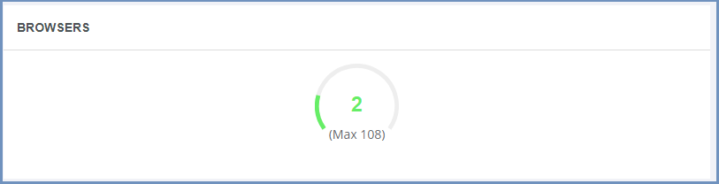
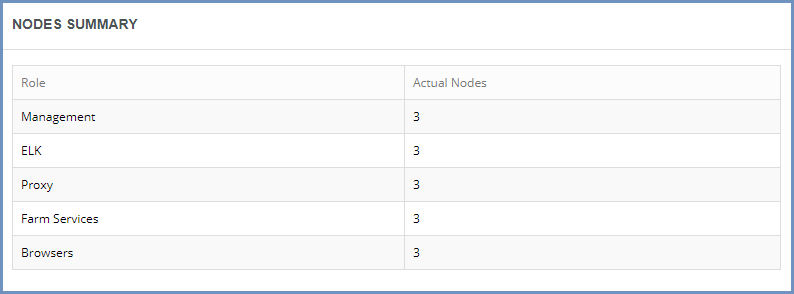
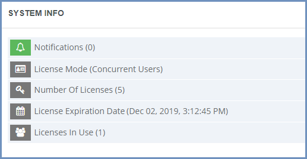
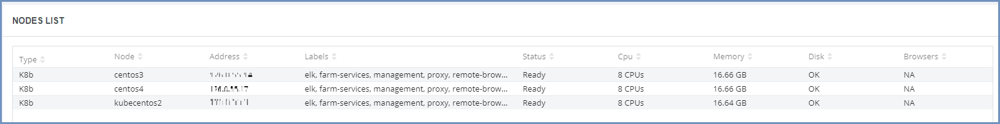
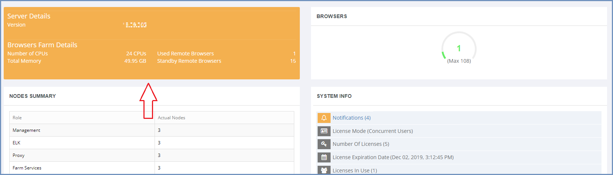
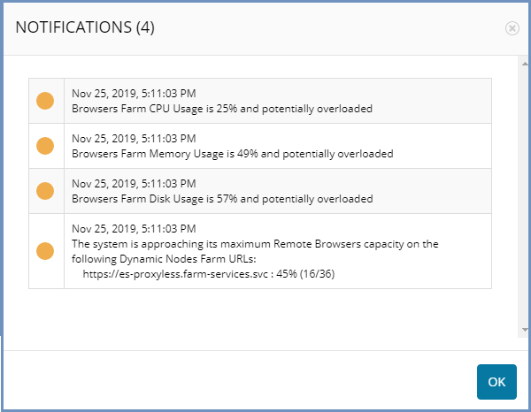

*********
Dashboard
*********

The Shield Administration Console dashboard includes useful data, allowing the administrator to quickly understand the system status and analyze 
problematic issues.

The dashboard is constantly refreshed, to display up-to-date information.

The dashboard includes the following components:

System Status
-------------

Includes data related to the Shield system itself, to easily determine if the system requires attention. When there is a problematic situation that requires attention and a notification is issues, this area's color changes to indicate the issue. The colored indicator may be yellow (to indicate a Warning level notification) or red (to indicate a Critical Error notification). For more information about the notifications, please see below.

Browsers
--------

Includes a gauge displaying the number of browsers in the system.
The green area represents the used remote browsers, currently active in the system. The grey area represents the standby remote browsers.
The maximum capacity of the system is displayed at the bottom. 

Nodes Summary
-------------

Includes a table with the different components in the system (Management, ELK, Proxy, Farm Services & Browsers), and the number of actual nodes per each component. 

System Info
-----------

This section displays some information about the system, e.g.: notifications (if any) and license information (number of licenses, expiration date and how many licenses are actually used).

If there are any notifications, the colored indicator is reflected here as well, and the total number of notifications is displayed.  For more information about the notifications, please see below.

Nodes List
----------

Includes a table displaying the different nodes in the system, includes the following data:

	*	Type - the node type
	*	Node - the node name
	*	Address
	*	Labels - which components are installed on this node
	*	Status
	*	CPU
	*	Memory
	*	Disk - represents the disk state (OK/Pressure)
	*	Browsers - number of browsers on the node. If the node does not include Shield browsers on it, the value is NA

Notifications
=============

Ericom Shield includes a notifications mechanism.
The system collects information about various parameters in the system. According to this information, if irregular data is captured and a problematic 
situation is recognized, a notification is issued. 

This notification is indicated in the Dashboard. It includes a colored indicator on the ``Status`` section (top left) and on the ``System Info`` (middle right) section. The green area turns to yellow or red, according to the severity of the alert.

If there are active notifications in the system (the colored indicator is yellow/red and the counter is greater than 0), clicking the **Notifications** link 
in the ``System Info`` will open a pop up, displaying the notifications in a table. 

.. note:: If the Notifications counter is set to (0) and the colored indicator is green, clicking this option will do nothing. 

Once the problematic situation is resolved, the notification is closed, the colored indicator returns to green and the notifications counter is set to (0) again. 

For a detailed list of possible alerts/notifications, see `here <alerts.html#list-of-alerts>`_.