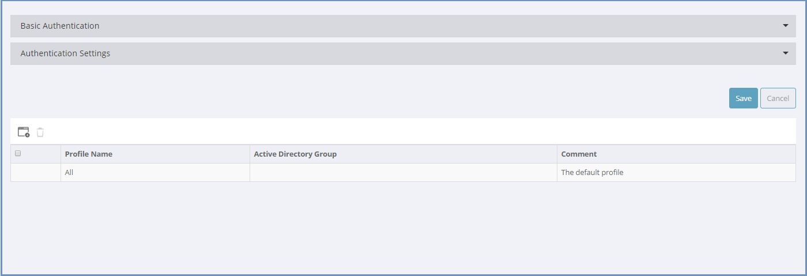
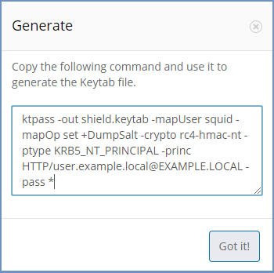
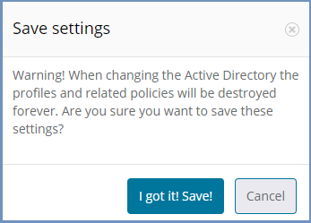
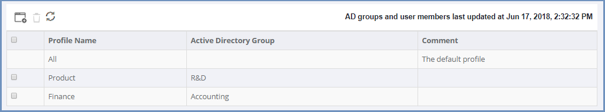
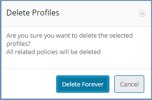

********
Profiles
********

Ericom Shield supports several authentication methods (basic, Kerberos and DLAP), as per the authentication method used at the customer's environment. 
The authentication method and its related settings are defined in the upper section of the page.

If LDAP is defined in the system, Active Directory groups can be supported, in the form of Shield Profiles. This allows pinpoint definitions 
in the `Policies <policies.html>`_ and `Applications <applications.html>`_ sections, per specific profile. For more details, see the specified sections. 
Profiles are created and managed in the bottom section of the page.

Authentication
==============

There are several authentication methods available in Shield: Chaining, Basic, Kerberos and LDAP. 

*   `Authentication Chaining <profiles.html#id1>`_

*   `Basic Authentication <profiles.html#id2>`_

*   `Active Directory Authentication <profiles.html#id4>`_

Authentication Chaining
=======================

This authentication method is used when user details are previously authenticated by a different component out of Shield system. In this case no additional authentication is required. 

Enabled
-------

Enable or disable this authentication method. When this method is Enabled - other authentication methods are automatically disabled (apart from the possible combination with LDAP).

Trusted IP Address
------------------

Define the source IP address that is trusted to send user details to Shield. User details are received via the X-Authenticated-User header. In this case, no other authentication is performed.

Please use the following syntax:

- IP address - e.g. 126.0.2.50
- Subnet - e.g. 126.01.1.1/16
- Range - e.g. 126.0.0.0-126.255.255.255

.. note:: Setting it to 0.0.0.0/0.0.0.0 will allow connection from any address

Basic Authentication
====================

The Basic Authentication includes setting credentials for the user to login to the proxy. 

Enabled
-------

Enable or disable this authentication method. When this method is Enabled - other authentication methods are automatically disabled.

Username & Password
-------------------

Basic credentials (username and password) for proxy authentication. 

Message
-------

A customizable prompt message to display to the user while opening a new tab.

Credentials TTL (min)
---------------------

The credentials **Time To Live** duration. Once this duration is passed, credentials are required again upon opening a new tab.

Active Directory Authentication
===============================

The additional methods of authentication include Kerberos and LDAP authentication. There are common settings, which are relevant to both methods, 
and specific settings for each authentication method. 

It is possible to define up to 2 Active Directories - Primary and Secondary. Only once the primary AD is fully defined it is possible to define a secondary AD.

Users can connect to Shield both in the UPN format (e.g. username@domain.com) and in the SamAccountName format (e.g. domain.com\username). This is possible on all Active Directories (primary & secondary).

Primary Active Directory Settings
---------------------------------

Groups the following settings, which are common to both Kerberos and LDAP.

**Domain**

The Active Directory Domain name to connect to. 

**DC Address**

The IP Address of the domain controller to connect to. Multiple values can be defined, separated by a comma ",".

**Secured DC Communication**

Select if the communication with the domain controller should be secured by SSL or no (LDAP/LDAPS).

**Base DN**

The root of the domain controller, separated with commas (e.g., ``DC=COMPANY,DC=LOCAL``)

.. note:: To connect the Active Directory to Shield, a designated user needs to be created. This user credentials should be filled in the matching fields described hereunder.

**Domain Username**

Enter the username of the designated Shield user in the Active Directory. Username only (e.g., "shieldUser"), no domain, no suffix.

**Password**

Enter the password of the designated Shield user in the Active Directory.

**Alternate UPN Suffix**

Alternate UPN Suffix of the domain controller. Multiple values can be defined, separated by a comma ",".

.. note:: If the domain name is domain.com and the defined suffixes are e.g. domain, ABC then a user called **george** can connect to the system in the following ways: george@domain, ABC\george, domain.com\george etc.

**Add Secondary Active Directory** - select this option (only after the Primary AD is fully defined) to define a secondary Active Directory. When this option is selected, 
a new sub-section appears, named **Secondary Active Directory Settings** which includes the same settings as for the Primary Active Directory. 

In case a Secondary Active Directory is defined and needs to be removed, select the option **Remove Secondary Active Directory**. A confirmation dialog will appear and once confirmed
the Secondary Active Directory will be removed.

.. note:: All other changes done in this section will be commited by the **Remove Secondary Active Directory** operation

Kerberos
--------

The Kerberos settings include the following settings:

**Enabled**

Enable or disable this authentication method. This method can be enabled with LDAP only, otherwise - other authentication methods are automatically disabled.

**Service Principal Name**

A unique identifier of a service instance. Used by the connecting browsers for authentication. Constructed from the proxy hostname and the domain name (Active Directory domain name, **always in UPPERCASE**). The hostname must be known in the DNS. It is VITAL to verify that there is only one hostname associated with the specific IP (nslookup [IP]).
The correct syntax is: HTTP/<hostname>@<domain> (e.g. ``HTTP/Shieldnode.company.local@COMPANY.LOCAL``)

**Keytab** 

Select the ``Generate`` option. A pop up is opened with a command:

Copy this command and use it to create the Keytab file. Once done, select the Keytab file and upload it to the admin.
If a Keytab file already exists, upload is directly. It is essential that the Keytab file matches the same machine specified in the **Service Principal Name**.

**Fallback to NTLM**

Select whether to use NTLM as a fallback mechanism in case an error occurs during Kerberos authentication. 

LDAP
----

The LDAP settings include the following settings:

**Enabled**

Enable or disable this authentication method. This method can be enabled with Kerberos or Chaining authentication methods only. 

**Proxy Message**

A customizable prompt message to display to the user while opening a new tab, to login to the proxy.

.. note:: This message supports Ascii character codes **only**.

**Use Active Directory Profile For Admin Login**

This setting is visible only if LDAP is enabled. 
Define whether to login to the Administration Console using LDAP profiles or not (in this case use the default user). If set to **Yes**, define the Active Directory group of users that may login to the Administration Console. This option is available only if LDAP is properly defined and all related settings were saved. Prior to this, LDAP groups cannot be retrieved.

.. note:: Once this setting is set to Yes, login to the Administration Console will be done using AD profile only. It is CRUCIAL that the LDAP is enabled in this scenario.

**Active Directory Admin Users Group**

Select the Active Directory group of users that may login to the Administration Console (from the list of LDAP groups). This setting must have a value if the previous setting is set to **Yes**.
Start to type the name of the desired group to get the list of groups. Once the list is retrieved, select one group of users that are allowed to login to the Administration Console.

.. note:: The list of LDAP groups is displayed only is LDAP is properly defined and all its relevant settings are saved.

If LDAP or Kerberos authentication is Enabled - then the Basic Authentication is automatically disabled.

Both authentication methods (Kerberos / LDAP) can be enabled simultaneously.

.. note:: When using Kerberos - the proxy server **MUST** be referred to by its name (not by its IP address). When users connect to the proxy, it should be done by the server name **only**. In addition, it is **VITAL** to verify that there is only one hostname associated with the specific IP (nslookup [IP]).  In other words, the Linux machine must be registered with DNS in order for Kerberos Authentication to work correctly.

Shield requires a dedicated user account for authenticating domain users using Kerberos protocol and performing LDAP group lookups.
For detailed instructions (including a working example) go `here <../kerberos.html>`_

The more authentication methods that are enabled (Kerberos/LDAP) - the less frequent users will be prompted to enter credentials. 
This is because the browser can easily select the best method to authenticate and only prompt the user to authenticate if that method fails.
For example, a user accessing the proxy on a domain joined machine, the browser would first attempt to authenticate via Kerberos.  
If successful, then the page is displayed without the need to prompt for authentication.  

Once all settings are filled in and saved, it is possible to create ``Profiles`` and define relevant policies for each profile. For more information, please see below.

Updating Existing Settings
--------------------------

When updating existing information in the Authentication Settings section (e.g., **Domain**/**Base DN** fields) - This action will remove all the defined 
profiles and any related policies will also be deleted.  Once removed, these items cannot be restored, they would need to be re-entered. 
It is **crucial** that any update is applied carefully to avoid losing important configuration.  
Other fields can be updated as required without affecting the profiles or policies.  If an update will result in these items being removed, then the following message is displayed:

Validation checks are performed only for the **Enabled** method of authentication. If the updated information is not valid or incorrect, an error message is displayed.

Profiles Table
--------------

This table displays existing profiles defined in the system. Profiles are assigned to Active Directory Group(s) which allows the Administrator to apply separate policies to 
different users based on their specific group membership. The available actions are: ``Add New Profile``, ``Delete Profile`` & ``Refresh``.

The table includes a default profile named **All**. All policies (URL's) defined in the policies table, that are not related to a certain profile - are by default related 
to the **All** profile.

Select the ``Add New Profile`` option to create a new profile. Enter a profile name and associate it to one or more Active Directory group(s). The ``Comment`` field is optional.

.. note:: This option is only available if the LDAP Enabled setting is set to ``Yes``, else - the option is disabled.

Once a profile is created, it is possible to define policies and assign the policy to this Profile. For more information about setting profile's policies, go to `Policies <policies.html>`_.

To edit an existing profile, select the specific entry in the table and a dialog appears with the profile details. Modify the fields as desired. All fields except ``Comment`` must have a value.

If a profile is deleted (using the ``Delete Profile`` option), all the related policies are also deleted. Since this action is irreversible, a message is issued to verify the action should take place:

To avoid deleting related policies, view the policies in the policies section first and re-assign any that are still required.

.. note:: It is highly recommended that each user will be associated to a single Shield profile only. If a user is associated to several Active Directory groups, this will lead to several Shield profiles, which may lead to inconsistent Shield policies enforcement. When this it the case, a warning message appears in the Dashboard, explaining the issue at hand.

For advanced configuration, using more than one authentication method, go `here <../FAQ/advanceAuth.html>`_. 