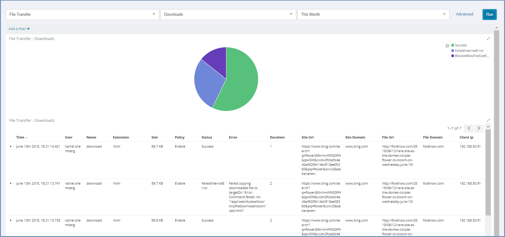
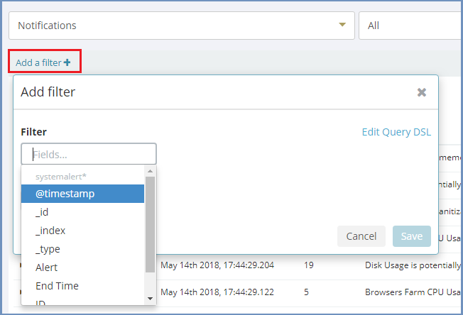

*******
Reports
*******

This section allows retrieving data and info collected using Kibana. These reports are displayed in a graphical and informative manner. The available report categories are:

*   **Connections** - displays information about browsing sessions and browsing analysis in the Shield system. 

*	**Users** - displays information about named users, currently active users and currently active sessions in the system.

*   **System** - displays information about the system, technical status of user sessions and browser sessions.

*   **File Transfer** - displays information about file transfer in the system, which files were downloaded, which blocked and which sanitized successfully.

*	**Errors** - displays the errors that are issued by Shield components which have the severity of Error/Fatal.

*	**End User Feedback** - displays the feedback submitted by end users (using the right click menu option).

*	**Applications** - displays information about applications in the Shield system.

*	**Notifications** - displays information about all the notifications that are issued in the system (shown in the dashboard).

*	**Analyzer** - displays the results of the full system health checks, performed via the Analyzer section. 

*	**Max Users Sessions** - displays the maximum number of users and sessions per day.

To retrieve the info, select the category, the type of the report and the time filter and press ``Run``.

In the report result, it is possible to use the Kibana infrastructure and add more filters, using the ``Add a filter`` link. 

Click the ``Advanced`` link to open Kibana in a new tab, for an enhanced view of system logs.