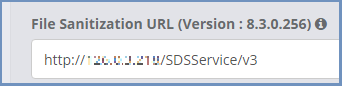

********
Settings
********

This section includes 8 sub-sections, where different settings are organized according to subjects. Each sub-section is collapsible by clicking the header.
The available sub-sections are:

*   `General <settings.html#id1>`_

*   `Suspicious Sites <settings.html#id2>`_

*   `SSL <settings.html#id3>`_

*   `Logs <settings.html#id4>`_

*   `Categories <settings.html#id5>`_

*   `Files & Sanitization <settings.html#id6>`_

*   `DNS <settings.html#id15>`_

*   `Proxy & Integration <settings.html#id16>`_

*   `Content Isolation <settings.html#id21>`_

*   `End User Options <settings.html#id22>`_

*   `Dynamic Nodes <settings.html#id24>`_

*   `Restore <settings.html#id25>`_

General
=======

System Name
-----------

Define a meaningful name to the entire system (whether multi machine or single machine). Used in various places for display purposes mainly (also used in alerts).

Enable Audio
------------

Enable or disable audio at the system level. If audio is disabled, then no remote browsers will support audio in any sessions. If audio is enabled, then audio is available throughout the system.

Allow Direct IP Address
-----------------------

Since navigating to IP addresses is considered un-common by regular users, IP addresses are blocked by default. 
This setting controls the use of direct IP address access in the Shield system.
When IP addresses are allowed, they will be handled according to the default Access Policy (e.g., if the default value is Shield, then any site accessed via its IP address will be shielded as well).

Enable Caching
--------------

Enable or disable web caching. When caching is enabled, content such as files, images and web pages is stored on the proxy thus improving the performance and user experience. Enabled by default.

Enable Periodic Health Checks
-----------------------------

Enable or disable periodic tests. When enabled, Shield runs internal tests, periodically, to identify problematic areas in the system. 
These tests a partial set of the pre-installation checks and are performed as a background process. 
The periodic tests are executed according to the defined frequency (see below).

Periodic Health Checks Frequency (min)
--------------------------------------

Define the frequency of running the periodic tests, in minutes.

Slow Network Message Interval (ms)
----------------------------------

When the network is slow, and a site takes a long time to load, the user will see a matching message. Define the time interval to show the **Slow Network** message to the user (in ms). If this interval is reached and the site was not loaded, the message is displayed. To disable this message from showing - update the value to be 0.

Enable Tech-Preview Features
----------------------------

Shield includes some features that are defined in Tech-Preview mode. These features may change between Shield versions. To enable tech-preview features in the Administration Console, set to Yes.

Suspicious Sites
================

Suspected Sites Action
----------------------

Select the desired action when a suspected (unsecured/malicious) site is found. The available actions are:

*   Block - access to this site is completely denied. 

*   Read-Only - user receives a message about the suspected site and may open it in read-only mode. 

*   Warning - user receives a message about the suspected site and must acknowledge it. Once confirmed, access is allowed. 

*   Notification - user is notified about the suspected site. 

*   Ignore – ignore the suspected site and treat as any other site.

Potential Phishing Detection Action
-----------------------------------

Select the desired action when a potential phishing site is found. The available actions are:

*	Block - access to this site is completely denied. 

*	Read-Only - user receives a warning message about the potential risk of this site and may open it in read-only mode. 

*	Warning - user receives a warning message about the potential risk of this site, but access is allowed (after confirming the message).

*	Notification - user is notified about the potential risk of this site.

*   Ignore – ignore the potential risk and treat as any other site.

.. note:: When the potential phishing mechanism is enabled, and a user browses to a domain which is identified as potential phishing site - this domain will be handled according to the defined action (block/read-only/warning). This is true even if this domain is defined in the policies table explicitly. All connections marked as potential phishing sites will appear in the Connections report with the phishing reference in the **Matched Reason** column, including the action (Block/Read-Only/Warning/Notification).

SSL
===

Administration Console FQDN
---------------------------

The Fully Qualified Domain Name. Mandatory for creating the Administration Console SSL certificate. Once this field is populated and the info is saved, a matching certificate is created in the background. 

.. note:: This certificate is based upon either the default Shield certificate, or upon the custom CA certificate (if one was uploaded by the user).

Custom CA Password
------------------

Set the custom Certification Authority password (if required).

Upload Custom CA Public Key
---------------------------

Upload custom Certification Authority public key. Used with the private key. Both keys are used to sign all SSL certificates in the system.

Upload Custom CA Private Key
----------------------------

Upload custom Certification Authority private key. Used with the public key. Both keys are used to sign all SSL certificates in the system.

Upload Custom Trust Certificate
-------------------------------

Upload custom trusted certificate. This certificate is verified and then added to the Certification Authority certificates.

.. note:: Both single certificates and certificate chains are supported.

Restore Shield Default Certificates
-----------------------------------

Select this option to delete all existing certificates and restore Shield default certificates.

Logs
====

Remote Browser Log Level
------------------------

Define the logging level for the Browser component.

ICAP Log Level
--------------

Define the logging level for the ICAP component.

CDR Dispatcher Log Level
------------------------

Define the logging level for the CDR Dispatcher component.

CDR Controller Log Level
------------------------

Define the logging level for the CDR Controller component.

File Preview Log Level
----------------------

Define the logging level for the File Preview component.

Collector Log Level
-------------------

Define the logging level for the Collector component.

Dynamic Nodes Farm Scaler Log Level
-----------------------------------

Define the logging level for the Dynamic Nodes Farm Scaler component.

External Syslog Host
--------------------

Define the external syslog host name, to send all logs to external system. If empty, this option is ignored.
Multiple servers may be defined - enter several IP addresses, seperated by a comma (","). Same data will be sent to all hosts.

External Syslog Port
--------------------

Define the external syslog port. Default value is 514. Need to specify a port only if other than default.

Categories
==========

.. note:: This subsection is visible only if the relevant license exists.

Enable Categories
-----------------

Enable or disable the categories use in Shield. 
When set to No, all categories and their related policies are disregarded and removed from the Policies table. 
In this case **only** domain policies are active.

Internal Cache Duration (h)
---------------------------

The categories are cached and saved in Shield for this defined duration. Used to improve performance and reduce domains loading time. 

Files & Sanitization
====================

These settings control how the CDR service processes uploaded and downloaded files via Ericom Shield.

Preview File Size Limit (MB)
----------------------------

Define the maximum file size that can be previewed.

Download File Size Limit (MB)
-----------------------------

Define the maximum file size that can be downloaded.

Upload File Size Limit (MB)
---------------------------

Define the maximum file size that can be uploaded.

File Sanitization Provider
--------------------------

Select the desired CDR provider. The supported providers are: Votiro (default), Check Point SandBlast and Sasa Gate Scanner.
Upon selection, the sub-section below may be expanded to view and update the related providers settings.

The possible options are:

*   `Votiro <settings.html#votiro-default>`_

*   `Check Point SandBlast <settings.html#id8>`_

*   `Sasa Gate Scanner <settings.html#id9>`_

Votiro (Default)
================

File Sanitization URL
---------------------

Set the URL to be used for this CDR solution. https://api.votiro.com/v3 is the cloud-based CDR solution that is provided for the initial evaluation period. 
The cloud-based CDR solution can only be used for evaluation.  
Once the production Shield license is applied, the cloud-based CDR will no longer accept incoming CDR requests. Install the Votiro on premise (included with Shield) 
as described `here <../filesanitization.html>`_ and update the URL as described in the installation instructions. 

Multiple URLs are supported. This is optional, for high availability purposes. Enter the URLs, seperated with a comma (",").

Each sanitization server version is displayed in the setting title.

Votiro Internal Sanitization Policy
===================================

This sub section includes all the settings which define the out-of-the-box, internal default Votiro sanitization policy in Shield. These settings are:

Sanitize Office Files
---------------------

Define if all MS Office files are to be inspected and any threat is to be sanitized. 
This setting does not refer to password protected Office files. 
For these cases, please refer to the **Block Password Protected Office Files** setting.

Sanitize PDF Files
------------------

Define if all PDF files are to be inspected and any threat is to be sanitized. 
This setting does not refer to password protected PDF files. 
For these cases, please refer to the **Block Password Protected PDF Files** setting.

Sanitize Image Files
--------------------

Define if all image files are to be inspected and any threat is to be sanitized.

Sanitize CAD Files
------------------

Define if all CAD files are to be inspected and any threat is to be sanitized.

Sanitize Email Files
--------------------

Define if emails and their attachments should be extracted and sanitized.

Sanitize Archived Files
-----------------------

Set if Archived files (e.g. zip,7z) should be extracted, inspected and sanitized.

Antivirus Scan
--------------

Set if files should be inspected and scanned by the multi-scan Anti-Virus engine.

Block Password Protected Office Files
-------------------------------------

Set if password protected Office files should be blocked or not (and as a result - downloaded without sanitization)

Block Password Protected PDF Files
----------------------------------

Set if password protected PDF files should be blocked or not (and as a result - downloaded without sanitization)

Block Unsupported Files
-----------------------

Set if unsupported files types should be blocked or not (and as a result - downloaded without sanitization)

Block Unknown Files
-------------------

Set if unknown files should be blocked or not (and as a result - downloaded without sanitization).

Block Binary Files
------------------

Set if binary files should be blocked or not (and as a result - downloaded without sanitization).

Block Script Files
------------------

Set if script files should be blocked or not (and as a result - downloaded without sanitization).

Block Fake Files
----------------

Set if fake files should be blocked or not (and as a result - downloaded without sanitization).

Block Equation OLE Object
-------------------------

Set if OLE Objects should be blocked or not (and as a result - downloaded without sanitization).

.. note:: Password protected files are blocked by default (download is disabled). However, if password protected files are allowed (Office & PDF), these files cannot currently be sanitized and will therefore be downloaded without sanitization.

.. note:: If one of these Votiro related settings is updated in the Administration Console, it should also be updated manually in the ``PasswordPolicy.xml`` (located on the CDR server under ``C:\Program Files\Votiro\SDS Web Service\Policy``.)

Named Policies
==============

When using Votiro on-premise, if named policies are defined (outside of Shield), it is possible to map these named policies into Shield, and later select them to be used (via the policies table) during the sanitization process.

This sub-section includes a table, to define the named policies within Shield. This table comes with 2 initial entries, one for the Shield Internal Sanitization Policy (``Shield (Def)``) and another for the Votiro Default Named 
Policy (``Votiro (Def)`` - defined in the Votiro on-premise).

For more details about defining and using named policies, go `here <../FAQ/namedpolicies.html>`_.

Check Point SandBlast
=====================

Primary File Sanitization URL
-----------------------------

Set the URL to be used for this CDR solution. For evaluation purposes use https://CDRServerIPAddress/tecloud/api/v1.

Secondary File Sanitization URL (Optional)
------------------------------------------

Define a secondary URL for CDR. Optional, for high availability purposes. Set it to the secondary CDR server (if one exists).

Activation Key
--------------

This provider requires an activation key in order to connect and use the CDR cloud-based solution. Enter the key provided by Check Point to use this CDR solution.

Sasa Gate Scanner
=================

Primary File Sanitization URL
-----------------------------

Set the URL to be used for this CDR solution. For evaluation purposes use https://CDRServerIPAddress/scanner.svc/v2.

Secondary File Sanitization URL (Optional)
------------------------------------------

Define a secondary URL for CDR. Optional, for high availability purposes. Set it to the secondary CDR server (if one exists).

Activation Key
--------------

This provider requires an activation key in order to connect and use the CDR cloud-based solution. Enter the key provided by Sasa to use this CDR solution.

Named Policies
==============

When using Sasa Gate Scanner, it is possible to map named policies into Shield, and later select them to be used (via the policies table) during the sanitization process.

This sub-section includes a table, to define the named policies within Shield. This table comes with a default policy, mapped to the default named policy in Sasa Gate Scanner.

.. note:: The named Policies in Sasa Gate Scanner are identified by a numeric ID. When mapping a named policy in Shield, the **Provider Named Policy** must be mapped to the numeric ID (and not the policy **name**).

For more details about defining and using named policies, go `here <../FAQ/namedpolicies.html>`_.

DNS
===

Primary Internal DNS Address
----------------------------

Define a primary internal DNS server address, to be used for Shield infrastructure (AD, authentication, etc.).

Secondary Internal DNS Address
------------------------------

Define a secondary internal DNS server address, to be used for Shield infrastructure (AD, authentication, etc.).

Primary External DNS Address
----------------------------

Define a primary external DNS server address, to be used by the Browsers Farm. This could be the same server as the internal one, depends on deployment scheme.

Secondary External DNS Address
------------------------------

Define a secondary external DNS server address, to be used by the Browsers Farm. This could be the same server as the internal one, depends on deployment scheme.

.. note:: In a multi machine system, make sure that internal DNS addresses point to the management node/s (where Shield infrastructure is located) and external DNS addresses point to the browsers farm node/s.

Proxy & Integration
===================

Set Client IP In Header
-----------------------

Define if the originating Client IP address should be included in the header or not. Some external proxies and domains require this information. 

Set XFF In Header
-----------------

Define if the XFF should be included in the header or not. XFF (X-Forward-For) is another method of identifying the originating Client IP address. Some external proxies and domains require this information.

Set User In Header
------------------

Define if the authenticated username should be included in the header or not. Some external proxies and domains require this information.

.. note:: The above mentioned settings include 3 possible values: Set, Forward & Remove. Set - if this value is selected, then the specific input (Client IP/XFF/Username) is included in the header. Forward - forward the header as it was, unchanged. Remove - if the header includes Client IP/XFF/Username in it, it will be explicitly removed. 

.. note:: Some security services, e.g., google reCAPTCHA, will not work unless Client IP and XFF are SET in the header.

Set User Groups In Header
-------------------------

Define if the authenticated user groups should be included in the header or not. Some upstream proxies and domains require this information.

Enable Redirection Mode
-----------------------

Enable Shield to work in **Redirection Mode**.

Redirection Mode is relevant per system deployment. When this mode is enabled, requests are redirected from the gateway to Shield, without passing through the **built-in** Shield proxy. 
In this scenario, Access Control (whitelist/blacklist a domain/category) is recommended via the gateway. This is the best practice, in order to avoid redundant traffic to Shield and reduce Shield resources consumption.
Having said that, domains/categories defined as **blocked/shielded** will be enforced as expected. Domains/categories defined as **white** will be 
Shielded (white policies cannot be enforced in redirection mode via Shield).

Remain Within Shield Boundary
-----------------------------

Relevant to **Redirection Mode** - define whether Shield session redirected links should be shielded as well, or not. 
When enabled, all links opened from a Shield session will be opened as Shield sessions as well, regardless of the existing proxy definitions.

Use External Upstream Proxy
---------------------------

Enable the use of an external upstream proxy. Disabled by default. Used by the Remote Browsers. When an external upstream proxy is used, 
use this setting to allow Shield to connect to it. Setting it to **Yes** will open the **External Upstream Proxy Configuration** sub-section:

External Upstream Proxy Configuration
=====================================

Upstream Proxy Address
----------------------

Populate this field with the upstream proxy address to connect to. This field is mandatory if the external upstream proxy is enabled.

Upstream Proxy port
-------------------

Populate this field with the upstream proxy port to connect to. If not populated, the default port of 3128 will be used.

Upstream Proxy Username
-----------------------

If the upstream proxy requires credentials, populate this field with the username. Make sure to update the password field as well.

Upstream Proxy Password
-----------------------

If the upstream proxy requires credentials, populate this field with the password. Make sure to update the username field as well.

Use Client Certificate Authentication
-------------------------------------

Enable the use of a client certificate authentication, when one is required by an upstream proxy. Disabled by default. 
If enabled, make sure to upload the certificate public and private keys.

Upload Client Certificate Public Key
------------------------------------

Select and upload the client certificate public key (.crt file). Make sure to upload the private key as well.

Upload Client Certificate Private Key
-------------------------------------

Select and upload the client certificate private key (.key file). Make sure to upload the public key as well.

Bypass Upstream Proxy For Listed Functionality
----------------------------------------------

When using upstream proxy in the system, some internal functionalities may malfunction when trying to connect via the upstream proxy. At other times it is simply redundant and may cause system overhead. The functionalities are File Sanitization, Email Alerts & Post Alerts. When set to Yes, Shield will connect directly to the relevant servers (File Sanitization server, email etc.) and not via the upstream proxy.

Use Internal Upstream Proxy
---------------------------

Enable the use of an internal upstream proxy. Disabled by default. Used by the Shield-Proxy (e.g. for white-listed domains). 
Setting it to **Yes** will open the **Internal Upstream Proxy Configuration** sub-section:

Internal Upstream Proxy Configuration
=====================================

Upstream Proxy Address
----------------------

Populate this field with the upstream proxy address to connect to. This field is mandatory if the internal upstream proxy is enabled.

Upstream Proxy port
-------------------

Populate this field with the upstream proxy port to connect to. If not populated, the default port of 3128 will be used.

Upstream Proxy Username
-----------------------

If the upstream proxy requires credentials, populate this field with the username. Make sure to update the password field as well.

Upstream Proxy Password
-----------------------

If the upstream proxy requires credentials, populate this field with the password. Make sure to update the username field as well.

Content Isolation
=================

Allow Resources
---------------

Allow requests that are identified as resources (not HTML pages) to be opened not via Shield (whitelisted). To block resources requests - set to No (in this case, if a page includes resources, they will not be displayed).

Allow Non Get Requests
----------------------

Allow non HTTP Get requests (whitelisted). To block non HTTP Get requests - set to No.

Allow FTP
---------

Allow requests that are identified as File Transfer Protocol (FTP) to be opened not via Shield (whitelisted). In this case, files will not be sanitized. To block FTP requests, set to No.

End User Options
================

Allow End User Shield Indicator
-------------------------------

Define whether a visual indicator is displayed when using Shield browser. When set to Yes, a default string/icon appears in the tab name, prior to the domain name. For Crystal Rendering it is **[CR]**, for other rendering modes it is ⭐  .

This default string can be modified via the translation strings (``STR_END_USER_INDICATOR``). For more details, go `here <../FAQ/enduser.html>`_.

Allow End User To Send Feedback 
-------------------------------

Allow end user to send feedback about a specific website. Set to Yes - the right click menu will include the **Send Feedback** option.
All related feedback settings (channels etc.) are defined in the `Alerts <alerts.html>`_ section.

Allow End User To Pause Shield 
------------------------------

Allow end user to pause Shield, thus temporarily whitelist the domain. Set to Yes - the right click menu will include the **Pause Shield & Reload** option. Valid according to the duration setting (see below). When the user selects this option, the page is reloaded, this time in white mode. For Production - set to No (more secure).

Pause Shield Session Duration (min) 
-----------------------------------

The duration to keep a domain whitelisted when end user chose to pause Shield and reload (relevant for a specific domain only).

Enable AutoFill
---------------

.. note:: This is a **Tech-Preview** feature. This setting will be visible only if the **Enable Tech-Preview Features** is set to Yes.

Enable or disable the AutoFill feature in Shield. When enabled, the user will be prompted to save credentials in the browser. 
If credentials are saved, on future logins, the credentials will be filled in automatically by the browser.

Dynamic Nodes
=============

Enable Dynamic Nodes
--------------------

Enable the use of the dynamic nodes in the system. When set to Yes, connections will be done via the URL detailed below.

Dynamic Nodes Farm URLs
-----------------------

Define the URLs of the dynamic nodes webservers. Must be populated if the Enable Dynamic Nodes is set to Yes. Multiple URLs may be defined, seperated with a comma (",").

Restore
=======

Upload File To Restore
----------------------

Upload a file that will be used to restore Shield system. Note – the restore process does not start automatically and must be initiated manually.

After the file is uploaded, select the ``Restore Shield`` option to initiate the restore process.

.. note:: This process is **irreversible**. All existing system settings will be overwritten, and the system will be restored using the selected file. 

A pop up is displayed. Before proceeding, verify that the uploaded file is the correct one and consider this process thoroughly before confirming the pop up.