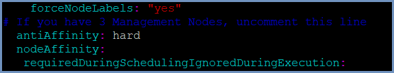

***************************************
How To Add Nodes To An Existing Cluster
***************************************

To add nodes to an **existing** Shield cluster that is already in production, follow these steps:

Make sure to prepare the node(s) as required (detailed `here <../deployment.html#prepare-the-linux-machines>`_)

Join the node(s) to the existing cluster using the copied commaned from Rancher (as explained in the Installation process). 
Make sure the copied command matches the node to join (**Master**/**Worker**). 

Once the new nodes are added, set the labels (detailed `here <../deployment.html#set-node-labels>`_). 

If the new node(s) are Management or Proxy nodes, the cluster should be redeployed for the changes to take affect. 

.. note:: When new node(s) are Browser nodes, this step can be skipped.
    
Now, **redeploy** the system with the new cluster formation::

    ./delete-shield.sh
    ./deploy-shield.sh
    
For more details about these services, see `here <services.html#delete-shield>`_.

The cluster is now updated with the new nodes.

Robust HA
=========

In a multi-machine system, to ensure a more robust high availability, the consul component must be explicitly reshuffled

between the nodes. To do that, download and update the matching yaml file:

For example, if there are 3 nodes with the label ``Management`` - update the custom-management.yaml::

    curl -s -o custom-management.yaml https://raw.githubusercontent.com/EricomSoftwareLtd/Shield/Rel-19.12.1/Kube/scripts/custom-management.yaml

Or, if there are 3 nodes with the label ``farm-services`` - update the custom-farm.yaml::

    curl -s -o custom-farm.yaml https://raw.githubusercontent.com/EricomSoftwareLtd/Shield/Rel-19.12.1/Kube/scripts/custom-farm.yaml

Edit the file - uncomment the following line (remove the #)::

    # antiAffinity: hard
 

Now - redeploy shield (use the -n option for the specific namespace, if desired) to enforce the changes and reshuffle the consul service between the nodes.