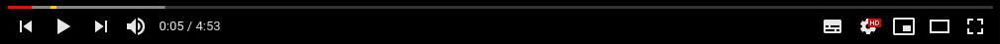
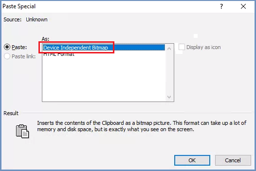

********************************
How To Address Additional Issues
********************************

Hereunder are some explanations and work-arounds for additional issues that might be encountered while using Shield.

Video Related Issues
====================

1. Shield has 2 media streaming options (as defined in the **Media** policy) - Stream and Frame.

When video is streamed in Shield (Media policy is set to ``Stream``), a special video player appears in the video frame, and video is streamed directly through Shield, to improve performance and reduce resources. 
This player's display is somewhat different then site-specific players.

For example, on youtube.com, this is the specific player:

And this is the Shield special player:

2. Sometimes while playing a video (in ``Stream`` mode), the video frame will overlay other elements in the page (e.g. menus) which will appear to be in the background.

3. Flash-embedded videos are not supported in Shield. The workaround is to open the video in its related original site.

Slow Loading Sites 
==================

Some sites and security services (e.g. google reCAPTCHA) are harsher when identifying browsing from a cloud IP address.
As a result, when Shield is deployed in the cloud and the browser IP address is originated in the cloud, some sites may take a while to load. 
In addition, some security services may behave in a more stringent manner (e.g. presenting more complex questions), to verify that it is indeed a human user.

Pasting Images From Shield Into Office 2010/2013
================================================

When copying images from Shield, and pasting them to Office 2010/2013 applications, sometimes it does not work as expected, and the image is not pasted correctly. 
To solve this, pasting an image should be done as follows:

1. Select the ``Paste Special`` option:

.. figure:: images/pastespecial.png	
	:scale: 75%
	:align: center

2. Select ``Device Independent Bitmap`` and click ``OK``:

Result: the image is pasted as expected.

Crystal Rendering Mode
======================

When this policy is selected, it is available while browsing in Chrome. When other browsers are used, rendering is automatically reverted to Frame Rendering.

Browser Menu - Find
===================

In Chrome and Edge browsers, the ``Menu | Find`` option is not supported. CTRL+F should be used.

Scale While Printing
====================

In Chrome, while printing via Shield, the scaling works differently compared to unsecured browsing. If the scale is modified, it will affect each page separately (regardless of the info in it). This may leave blank spaces on the printed pages (when > 100%) or include only partial info (when < 100%).
Best practice is to print using the **Fit to Page** option.

Auto Complete
=============

In some input fields, the browser shows a few suggestions, based on past input. This allows the user to start typing a few characters and then select one of the options and thus auto completing the input. Due to specific browser based algorithms this is not always supported in Shield.
If this is the case, simply type the desired input text.

WebGL
=====

WebGL is a component used mainly for 3D graphical elements and is rarely being used. This is currently not yet supported in Shield. 

Using Internal Sites In Dynamic (Cloud) Browser Farm 
==================================================== 

When the browsers farm is Dynamic - deployed in the Cloud - internal websites cannot be accessed.
This is because there is no connection between these sites and the Cloud. To enable accessing internal sites in this scenario - 
exclude internal sites in the PAC file or whitelist them in the policies table.

Limit Number Of Sessions In A System With No Authentication
===========================================================

Shield comes with a default number of maximum sessions per user (**Maximum Active Remote Sessions Per User**, defined in the ``Admin | Resources | Resources Conservation``).
In a system with no specific authentication, users are identified with a browser GUID generated automatically by the system. 
Since the user is not identified by the personal credentials, the number of sessions is not enforced automatically.

To enforce this setting on a unidentified user, follow these steps:

On the Rancher Server machine, download the custom-proxy file to the **ericomshield** folder::

    curl -s -o custom-management.yaml https://raw.githubusercontent.com/EricomSoftwareLtd/Shield/Rel-19.12.1/Kube/scripts/custom-proxy.yaml

Edit the file - uncomment the following 2 lines (remove the #)::

	# shield-proxy:
	# checkSessionLimit: true

Save the changes and deploy Shield, run::

    ./deploy-shield.sh

.. note:: When editing the yaml file it is important to avoid any redundant characters (e.g. blank spaces, tabs etc.). In addition, it is recommended to back up this file.

Run Kubernetes On Ubuntu 16.04
==============================

In order for Kubernetes to run successfully on a Ubuntu 16.04 system, the OS must be fully updated with the **latest** updates. 
To do so, follow these steps (**before** installing Rancher)::

	sudo apt update
	sudo apt upgrade
	reboot
	sudo apt autoremove