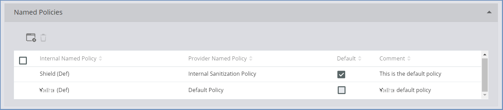
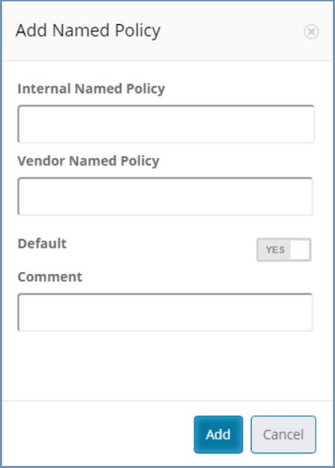
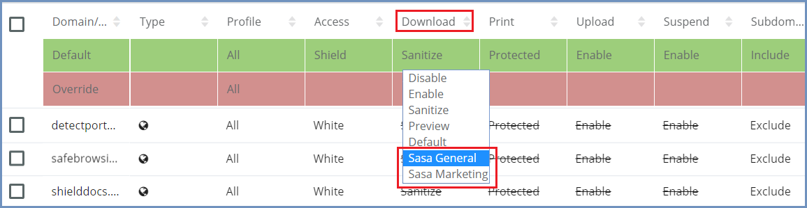

**************************************************
How To Map External CDR Named Policies Into Shield
**************************************************

When the selected CDR solution supports Named Policies, it is possible to use these named policies within Shield. 

Named policies are a set of definitions grouped into a single rule, which can be created in the CDR solution (external to Shield). 
If these named policies exist, that can be mapped into Shield, and later on used per domain, profile, category etc.
To define new named policies in Shield Administration Console, please follow these steps:

*   Go to ``Settings | Files & Sanitization`` 

*   Select the ``File Sanitization Provider`` from the drop-down list

*   Verify that the URLs are defined properly

*   Open the Named Policy sub-section

	
* Select the desired named policy to use as **default** or add a new named policy. 

* To add a new policy, select the ``Add New Policy`` icon at the top of the table and fill in the dialog. 

Once the dialog is complete, click ``Add`` and the new named policy appears in the table. 

.. note:: The Provider Named Policy value MUST match the named policy defined in the external provider solution (outside of Shield).

Once done adding named policies, go to the Policies table and the newly defined Sanitization Named Policies will be available in 
the ``Download`` policy list of values:

For each domain/category, select which named policy to use, or define the Default/Override Download policy value.

Shield comes with the Shield(Def) named policy set as ``Default``.
The named policy marked as ``Default`` is the actual policy used for the Download policy ``Sanitize`` option.  
In this case, if the download policy is set to ``Sanitize`` - the ``Default`` named policy will be used as the actual sanitization 
policy, meaning all sanitized files will be sanitized according to the definition of the provider named policy (external CDR solution).

The mapping of provider named policies within Shield is completely under the responsibility of the Admin user. 
Shield cannot manage the provider named policies and no validation is performed regarding the accuracy of the definitions.
If the provider named policy is incorrect - the outcome is unknown. On some CDR providers sanitization will fail (at times without a proper message), on other CDR providers a different named policy may be used. 
It is of utmost importance that when defining named policies - the correct provider named policy will be mapped.

The initial ``Default`` named policy (mapped to the default external named policy) cannot be deleted.
In addition, any other named policy, which is selected to be the ``Default`` (by marking the checkbox), cannot be deleted.
To delete a named policy which is defined as ``Default``, first define another named policy as ``Default`` and only then delete the named policy.

To edit an entry in the Named Policies table, click the desired entry (one single click). The row is now editable and can be modified. After completing the desired changes,
click outside of this row (in another place within the table). The row is no longer editable, and the changes have been committed.

.. note:: For Sasa Gate Scanner - provider named policy must be a numeric value that matches the named policy ID.
