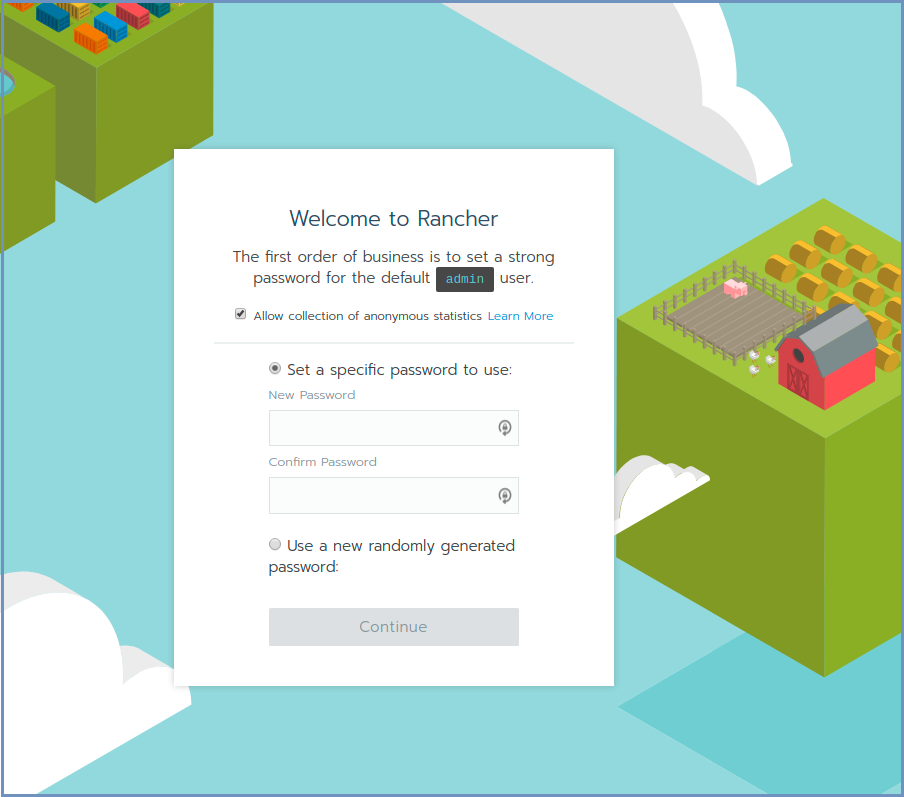
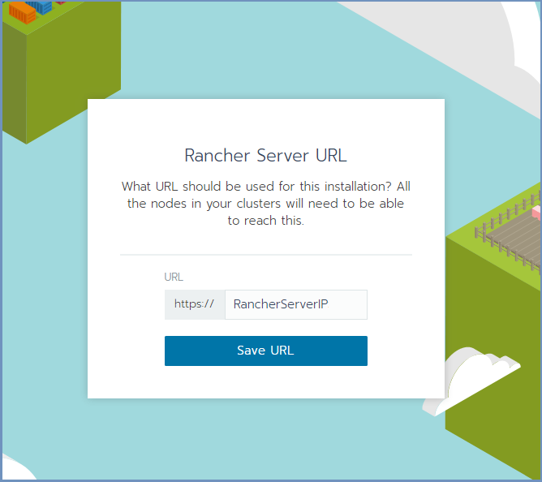
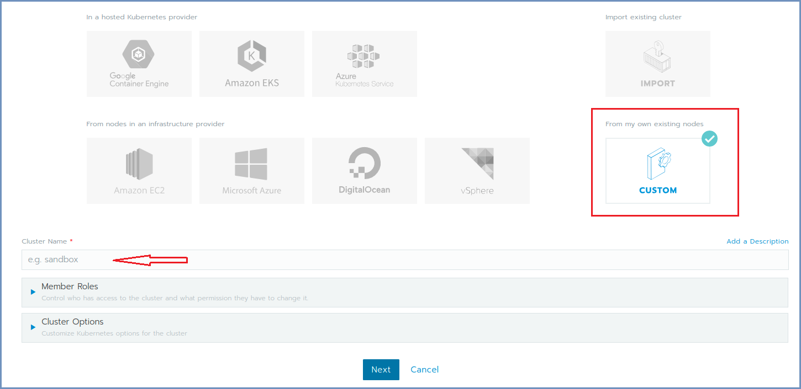
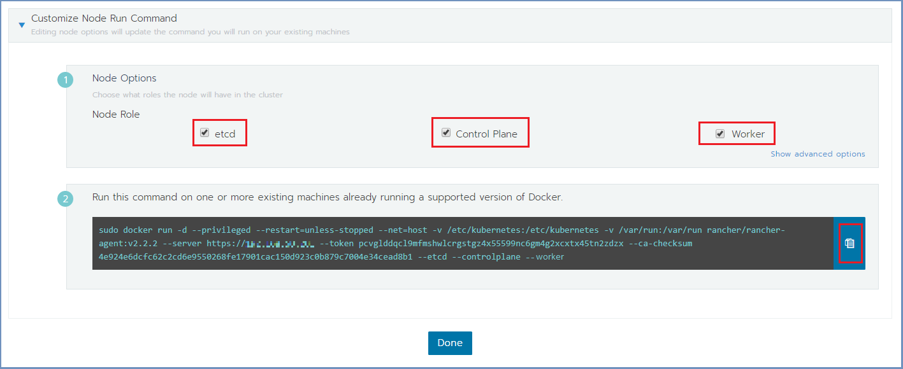
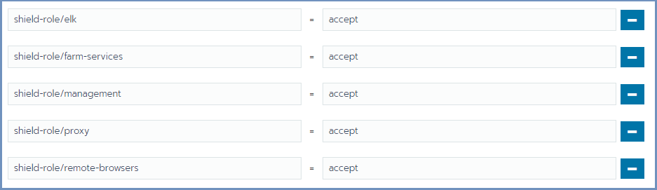
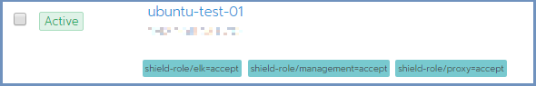
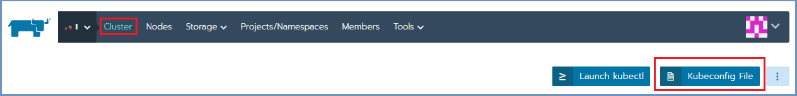
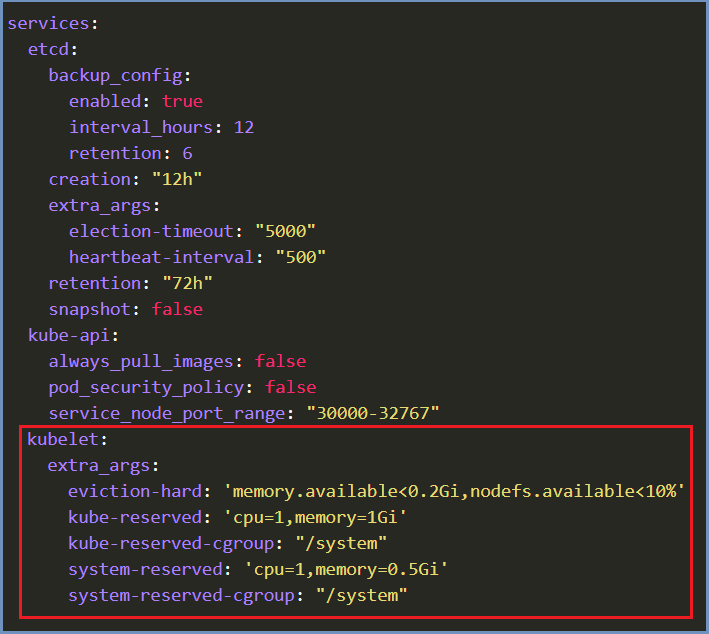
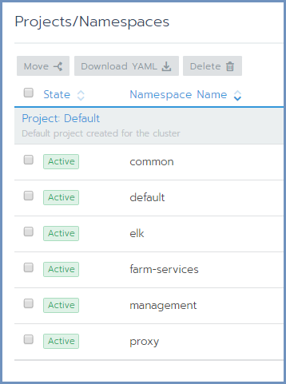
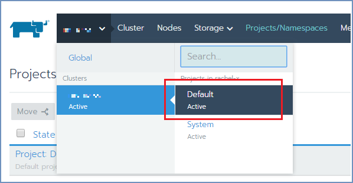

*************************
Installation & Deployment
*************************

Shield can be installed in 2 main methods:

1. Using the Installation Scripts (can be used for Ubuntu and CentOS)

2. Using the OVA file (for Ubuntu) 

Shield components are deployed on Linux machines using Rancher. Rancher is a well-known software platform that enables easy 
deployment and management of Docker and Kubernetes products in production environments.

First step is to create the Kubernetes cluster (using Rancher) and once the cluster is ready - deploy Shield on it.

The recommendation is to set up a dedicated Linux machine which will be used for cluster deployment and management. This machine 
will be referred to as the **Rancher Server** machine. This machine will also include the Kubectl & Helm on it (see below). The **Rancher Server**
can be a separated machine or on one of the Master machines (running etcd & Control Plane).

.. note:: For High Availability deployments, 3 Master (cluster management) machines are required.

The process detailed below is dedicated to installing using the **Installation Scripts**.
When installing using the **OVA**, some steps can be skipped (due to the components that are included in the OVA). 
For detailed instructions on installing using the OVA go to:

*	`OVA Installation <deploymentova.html>`_

.. note:: The process detailed below includes steps performed both on the **Rancher Server** machine and on the Rancher user interface (using a browser). The steps describe where it takes place (either in Rancher or Linux).

.. note:: When using **Ubuntu 16.04** for a Kubernetes system, some steps are needed for Kubernetes to run successfully. For more details, go `here <../deploymentguide/FAQ/knownissues.html#run-kubernetes-on-ubuntu-16-04>`_.

Prepare The Rancher Server
==========================

On the Linux **Rancher Server** machine, download and run this service:: 

	curl -s -o install-shield.sh https://raw.githubusercontent.com/EricomSoftwareLtd/Shield/Rel-19.12.1/Kube/scripts/install-shield.sh
	chmod +x install-shield.sh
	sudo ./install-shield.sh

Prepare The Server Nodes
========================

Each server node that takes part in the Shield cluster must be prepared before creating the cluster.
From the Linux **Rancher Server** machine run::

	curl -s -L -o shield-prepare-servers https://github.com/EricomSoftwareLtd/Shield/releases/download/shield-prepare-servers-Rel-19.12.1/shield-prepare-servers
	chmod +x shield-prepare-servers
	./shield-prepare-servers [-u <USER>] <SERVERIPADDRESSES>

<SERVERIPADDRESSES> represents the IP addresses of all the server nodes (that will form the cluster). Multiple IP addresses may be entered, separated by a space (" ").

E.g.::

	./shield-prepare-servers -u ericom xx.xx.xx.xx yy.yy.yy.yy zz.zz.zz.zz

.. note:: The Kernel may be updated during this process (if required).

Now, perform these steps on ALL the machines in the cluster (both **Rancher Server** machine and server nodes)::

1. Add current user to the docker group::

	sudo usermod -aG docker "$USER"

2. Logout and login again.

3. Verify that Docker is installed properly::

	docker version

4. All the machines should be synchronized. Configure the NTP (Network Time Protocol) and the timezone on the machine.

Create The Cluster
==================

Init Rancher
------------

Open a browser and go to https://RancherServerIPAddress:8443 (using the Rancher Server IP address). 

Set the administrator password (as desired) and click ``Continue``

Click ``Save URL``.

Form A Cluster & Add Nodes
--------------------------

In Rancher, click the ``Add Cluster`` option (on the right). 

Fill in the Cluster Name. 

Expand the ``Cluster Options`` and on the ``Network Provider`` select the **Flannel** option. Click ``Next``.

Select the required check boxes. 
For a **Cluster Management** node (Master machine), select all check boxes. For **Worker** node, select the ``Worker`` check box. E.g.,:

    
Copy the command on the bottom (using the **Copy to Clipboard** option in the right).

Run the copied command on EACH server node to join it to the cluster. Make sure the copied command matches the 
node to join (**Master**/**Worker**). Follow the node joining by clicking on ``Nodes`` in the cluster menu.

Wait until the process is finished. After the node is joined to the cluster, a green message appears at the bottom of the page. 
Repeat this process per each node until the cluster is complete. Click ``Done``.

Set Node Labels
---------------

According to the planned deployment, set the node labels for each machine:

In Rancher, select ``Nodes`` and for each node you wish to edit, select the ``Edit`` option from the menu on the right

.. figure:: images/rancher7.png
	:scale: 55%
	:align: center

In the ``Edit Node`` dialog, expand the ``Labels`` section and add the desired labels to the node. For each label, set the value 
**accept**. The possible labels are:

Labels can be added manually, one by one, or using copy/paste for one or more lines of the following labels::

    shield-role/management=accept
    shield-role/proxy=accept
    shield-role/elk=accept
    shield-role/farm-services=accept
    shield-role/remote-browsers=accept

Press ``Save``. The updated labels now appear on the node details:

The new Kubernetes cluster is now up and ready. 

Update Kubeconfig
-----------------

In Rancher, go to ``Cluster`` and select ``Kubeconfig File``

Scroll down and select the ``Copy to Clipboard`` option. This will copy the content of the Kubeconfig file to the Clipboard. 

On the Linux **Rancher Server** machine, edit (or create) the file named ``~/.kube/config``. Paste the clipboard content to the file. 

Check that kubectl is configured properly (client and server)::

    kubectl version

The expected outcome is similar to::

    Client Version: version.Info{Major:"1", Minor:"14", GitVersion:"v1.14.3", GitCommit:"5e53fd6bc17c0dec8434817e69b04a25d8ae0ff0", GitTreeState:"clean", BuildDate:"2019-06-06T01:44:30Z", GoVersion:"go1.12.5", Compiler:"gc", Platform:"linux/amd64"} 
    Server Version: version.Info{Major:"1", Minor:"13", GitVersion:"v1.13.5", GitCommit:"2166946f41b36dea2c4626f90a77706f426cdea2", GitTreeState:"clean", BuildDate:"2019-03-25T15:19:22Z", GoVersion:"go1.11.5", Compiler:"gc", Platform:"linux/amd64"}

.. note:: If migrating from a legacy system, stop at this point and go to **step 6** `here <../deploymentguide/FAQ/migration.html>`_.

Deploy Shield
=============

.. note:: Shield repository requires a valid **PASSWORD**. Before you continue, contact Ericom Shield Professional Services to get a valid password.

Run the install-shield service a second time (this time with the -p parameter), to complete the Shield installation process::

	sudo ./install-shield.sh -p <PASSWORD>

In Rancher, edit the newly created cluster. Select the ``Edit as YAML`` option. Scroll down to the **services** section. Under the 
**kubelet** add the following lines::

	extra_args:
	  eviction-hard: 'memory.available<0.2Gi,nodefs.available<10%'
	  kube-reserved: 'cpu=1,memory=1Gi'
	  kube-reserved-cgroup: "/system"
	  system-reserved: 'cpu=1,memory=0.5Gi'
	  system-reserved-cgroup: "/system"

Please note that the correct indentation must be kept, using spaces only. Using tabs is not supporte in YAML and causes errors. 
Final result should look like this:

Run the install-shield service again::

	sudo ./install-shield.sh -p <PASSWORD>

Move Shield-Services To Default Project
---------------------------------------

After Shield is deployed, the different namespaces (components) should be moved to be under the ``Default`` project, for easy display and access.

Under the cluster, there 5 namespaces: Management, Proxy, ELK, Farm Services & Common. There is also a default namespace, which exist by default under each cluster. 
The namespaces correspond with the Shield-Management, Shield-Proxy, Shield-Log, Farm Services and Common components respectively.

The Browsers component is a logical component, not represented by a namespace. This is because the browsers are created and managed **by** the Farm Services.

In Rancher, click on the ``Cluster``. Then click on ``Projects/Namespaces``. Select all Shield namespaces and click on the ``Move`` option 
on top. Select ``Default`` and confirm. The Shield components are now displayed under the ``Default`` project.

Now, click on the cluster and select ``Default`` under the cluster name

Verify System Status
--------------------

In Rancher, check under ``Workloads`` if the system is up and running. For more information see `here <FAQ/status.html>`_.

Backup
------

Set up the backup path and storage account. For more details go `here <FAQ/backuprestore.html>`_.