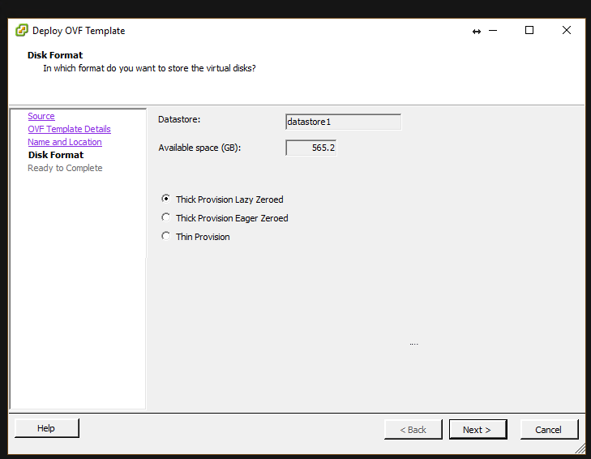
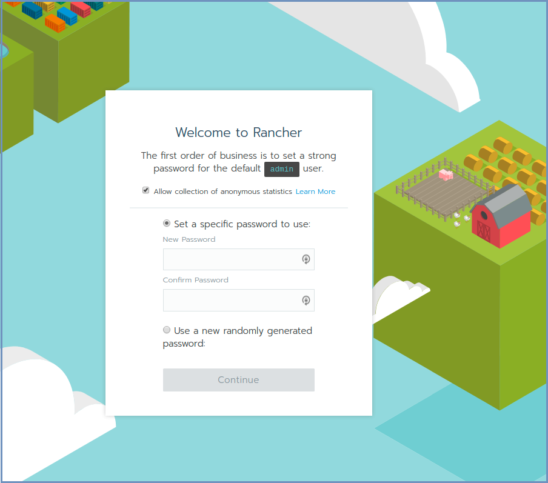
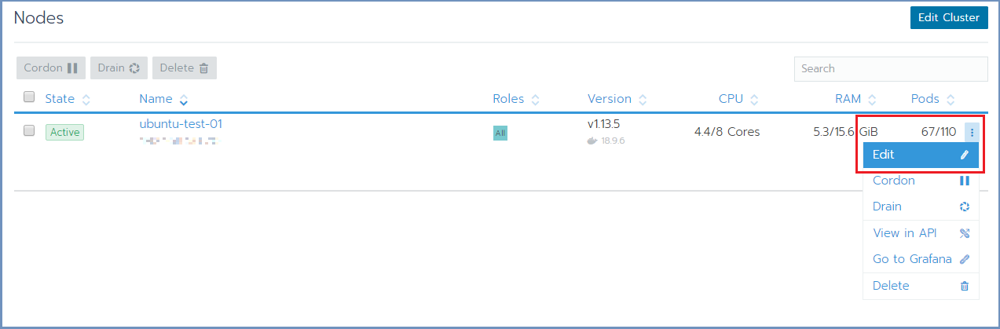

********************
Deployment Using OVA
********************

Install Shield using the OVA on **each** machine that is part of Shield system. For a multi machine cluster, repeat the OVA installation instructions 
until all machines are ready and only than - form the cluster.

.. note:: These instructions are for OVA installation on **Ubuntu** only

Prerequisites
=============

VMware vSphere versions 4, 5 or 6 with these hardware requirements:

.. csv-table::
    :header: "", "Minimum", "Recommended", "Recommended (ELK)"
    :widths: 10, 10, 10, 10

    Core processors, 4, 8, 8
    Memory (GB), 16, 16, 16
    Disk (GB), 64, 100, 256

.. note:: For improved performance, **SSD** disk is recommended

Download the OVA file from `here <https://shield-ova.s3.amazonaws.com/shield-kube-rel-19.12.1.ova>`_.

OVA Installation
================

1.	From the VMware vSphere client, select ``File > Deploy From OVF Template``. 

.. figure:: images/ova1.png	
	:scale: 75%
	:align: center

Browse to the location of the OVA file and select it. Click ``Next``

.. figure:: images/ova2.png	
	:scale: 50%
	:align: center

2.	Name the file and select the storage path. Complete all the steps and click ``Finish``

3.	Wait for the machine to be ready

.. figure:: images/ova6.png	
	:scale: 75%
	:align: center

4.	Enter the machines settings and change the CPU to 4 cores (minimum) or 8 cores (recommended) and the memory to 16GB (minimum).

.. figure:: images/ova7.png	
	:scale: 75%
	:align: center

5.	Power on the machine.

.. figure:: images/ova8.png	
	:scale: 75%
	:align: center

6.	Login using: **ericom/ericomshield**

7.	Configure the IP of the machine to be unique and static:

	*	Go to /etc/systemd/network

	*	Edit the 20-wired.network file. Change the line with **DHCP=ipv4** to refer to a specific IP address/subnet, for example::

			[Match]
			Name=en*
	
			[Network]
			Address=10.1.10.12/24
			Gateway=10.1.10.1
			DNS=10.1.10.1
			DNS=10.1.10.2 	//optional, multiples may be used
			IPForward=ipv4

.. note:: In case a DHCP server exists in the environment, configure it to lease a reserved (static) IP to the OVA. You should be able to determine the MAC address of the OVA by the IP address given the OVA at first startup.

8.  All the machines should be synchronized. Configure the NTP (Network Time Protocol) and the timezone on the machine::

		sudo timedatectl set-ntp on
		sudo systemctl restart systemd-timesyncd
		timedatectl set-timezone <Continent>/<City>

9.	Rename each node with a **unique** name (necessary for the cluster to be created properly). As **root**, run::

		hostnamectl set-hostname NEW_UNIQUE_HOSTNAME
		reboot
		
10.	Reboot the machine

Repeat these steps for each machine in the system. 

Create The Cluster
==================

Once all Shield machines are ready, select a machine to be the **Rancher Server** to init Rancher and form the cluster. 

.. note:: For High Availability - Shield cluster must include 3 Master (cluster management) machines

Deploy Rancher
--------------

On the Linux **Rancher Server** machine, run Rancher::

   ./run-rancher.sh

Init Rancher - open a browser and go to https://RancherServerIPAddress:8443 (using the Rancher Server IP address). 

Set the administrator password (as desired) and click ``Continue``

.. figure:: images/rancher2.png
	:scale: 75%
	:align: center

Click ``Save URL``.

Form A Cluster & Add Nodes
--------------------------

In Rancher, click the ``Add Cluster`` option (on the right). 

.. figure:: images/rancher3.png
	:scale: 55%
	:align: center

Fill in the Cluster Name. 

Expand the ``Cluster Options`` and on the ``Network Provider`` select the **Flannel** option. Click ``Next``.

Select the required check boxes. 
For a **Cluster Management** node (Master machine), select the ``etcd`` & ``Control Plane`` check boxes. For **Worker** node, select the ``Worker`` check box. E.g.,:

.. figure:: images/rancher4.png
	:scale: 55%
	:align: center
    
Copy the command on the bottom (using the **Copy to Clipboard** option in the right).

Run the copied command on EACH Linux machine to join it to the cluster. Make sure the copied command matches the 
node to join (**Master**/**Worker**). Follow the node joining by clicking on ``Nodes`` in the cluster menu.

Wait until the process is finished. After the node is joined to the cluster, a green message appears at the bottom of the page. 
Repeat this process per each node until the cluster is complete. Click ``Done``.
   
Set Node Labels
---------------

According to the planned deployment, set the node labels for each machine:

In Rancher, select ``Nodes`` and for each node you wish to edit, select the ``Edit`` option from the menu on the right

In the ``Edit Node`` dialog, expand the ``Labels`` section and add the desired labels to the node. For each label, set the value 
**accept**. The possible labels are:

.. figure:: images/rancher7a.png
	:scale: 75%
	:align: center

Labels can be added manually, one by one, or using copy/paste for one or more lines of the following labels::

    shield-role/management=accept
    shield-role/proxy=accept
    shield-role/elk=accept
    shield-role/farm-services=accept
    shield-role/remote-browsers=accept

Press ``Save``. The updated labels now appear on the node details:

The new Kubernetes cluster is now up and ready. 

Update Kubeconfig
-----------------

In Rancher, go to ``Cluster`` and select ``Kubeconfig File``

.. figure:: images/rancher5.png
	:scale: 55%
	:align: center

Scroll down and select the ``Copy to Clipboard`` option. This will copy the content of the Kubeconfig file to the Clipboard. 

On the Linux **Rancher Server** machine, create a directory named `~/.kube` (mkdir ~/.kube) then create a new file named ``~/.kube/config`` and paste clipboard content to the file. 

Kubectl, helm & Shield Repository
---------------------------------

OVA includes **kubectl**. Verify that it is configured properly (client and server)::

    cd ../
	kubectl version

The expected outcome is similar to::

    Client Version: version.Info{Major:"1", Minor:"14", GitVersion:"v1.14.3", GitCommit:"5e53fd6bc17c0dec8434817e69b04a25d8ae0ff0", GitTreeState:"clean", BuildDate:"2019-06-06T01:44:30Z", GoVersion:"go1.12.5", Compiler:"gc", Platform:"linux/amd64"} 
    Server Version: version.Info{Major:"1", Minor:"13", GitVersion:"v1.13.5", GitCommit:"2166946f41b36dea2c4626f90a77706f426cdea2", GitTreeState:"clean", BuildDate:"2019-03-25T15:19:22Z", GoVersion:"go1.11.5", Compiler:"gc", Platform:"linux/amd64"}

OVA includes **helm**. It requires initialization. Run this script (in this case it will init the service, without re-installing it)::

	./install-helm.sh -c

OVA includes **Shield Repository**. Verify that it is configured properly::

    helm search shield

The expected outcome is similar to

Verify the Shield version. 

.. note:: If it is not the desired one (e.g. outdated release and a new one exists) follow the instructions to install a specific version. For more details, go `here <FAQ/specificversion.html>`_.

Deploy Shield
-------------

OVA includes the **deployment** script, run::

	./deploy-shield.sh

To complete the process successfully, follow the steps detailed `here <deployment.html#move-shield-services-to-default-project>`_.