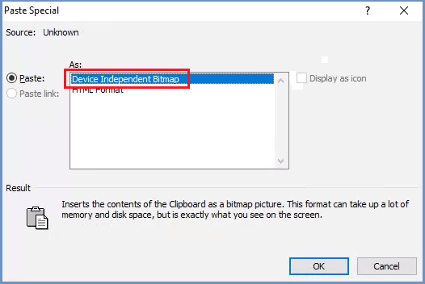

**************
End User Guide
**************

Shield is designed to be seamless to the end user, to provide a browsing experience as similar to un-secured browsing as possible (without Shield).

The right click menu while browsing in shield contains some exclusive options. As with various browsers, these options vary a bit, depending on where the cursor lays.

Here are some examples:

The first example on the left appears While standing on a link. The example on the right is while standing on an image. The example in the middle is the general case, while browsing in Shield.

Pause AdBlock & Reload
======================

Shield includes an internal ad blocker solution. This may cause some sites to load somewhat differently compared to un-secured browsing. 
It is possible to pause this ad blocker temporarily, per a specific website, per the current session. 

.. note:: If after Pause AdBlock & Reload the page appears as expected and the issue disappears, it is recommended to use the **Send Feedback** option, describing the problem that was encountered. Admin can define a specific policy for this website to avoid this issue in the future.

Pause Shield & Reload
=====================

This option is included in the right click menu as per the administrator decision. It is useful when evaluating Shield.
Selecting this option disables Shield and whitelists the specific website, for a predefined period of time (as configured by the administrator).
Using it should be done after deep consideration (and only if website cannot function properly with Shield), as it may cause a security breech. 
The events of pausing Shield are logged and appear in the reports as a user-induced whitelisted site.

.. note:: It is highly recommended to use the **Send Feedback** option, describing the problem that was encountered in the website prior to using this option. This way the problem can be investigated and handled.

Send Feedback
=============

This option allows sending feedback about a certain website or issue that is encountered, directly to the system administrator.
Selecting this option opens the following dialog:

Please fill in all fields and press ``Send``.

Copy & Paste In Shield
======================

It is possible to copy and paste text and images to and from Shield.

The clipboard can be managed via the Policies table (there is a system default value and it can be managed per category and per domain as well). Clipboard can be enabled or disabled. 
If it is disabled, it is not possible to copy/paste to and from the remote browser. In this case, clipboard options are available **within** the remote browser only.
The clipboard options are available using the right-click menu and using the common shortcuts. Using these options in Shield may vary a bit depending of the browser. In some browsers it will be seamless, just like un-secured browsing, while in others - please follow the displayed instructions.

When copying images, a pop up is opened, with a thumbnail of the original image. Follow the instructions: right-click the thumbnail and select the desired option.

.. figure:: images/copyimage.png
	:scale: 75%
	:align: center

When pasting images from Shield, sometimes the result may vary. At times it will be seamless and work as expected with no issues. On certain applications in 
Office 2010/2013, sometimes it does not work as expected, and the image is not pasted correctly. 
To solve this, paste the image as follow:

1. Select the ``Paste Special`` option:

2. Select ``Device Independent Bitmap`` and click ``OK``:

Result: the image is pasted as expected.

Preview File
============

When the Download policy is defined as ``Preview``, files can be opened for **viewing** only. 

Downloading is not allowed per this policy definition. 
If the Print policy is set to ``Enable`` - the previewed file can be printed (after sanitization).

Shield Preview feature displays the selected document and the user can read it. No other action is allowed in this scenario.

The supported file types for Preview are: doc, docx, odt, xls, xlsx, ods, ppt, pptx, odp, jpg, txt.

