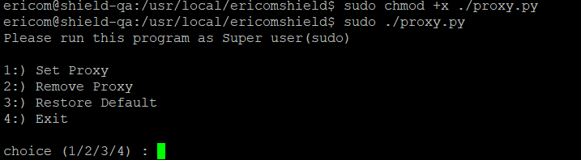

Upstream Proxy Configuration
============================

To configure the servers to work with the upstream proxy, follow these steps to retrieve and run the relevant service.

First, check which Phyton is used in the system::

	python --version

If no Python exists - install Python 2 (minimal)::

	apt install python-minimal

If Python 2 is used - retrieve the proxy.py file::

	sudo wget https://raw.githubusercontent.com/EricomSoftwareLtd/Shield/master/Utils/proxy.py  
	sudo chmod +x proxy.py
	sudo ./proxy.py

If Phyton 3 is used, retrieve the proxy3.py::

	sudo wget https://raw.githubusercontent.com/EricomSoftwareLtd/Shield/master/Utils/proxy3.py  
	sudo chmod +x proxy3.py
	sudo ./proxy3.py

.. note:: if **wget** is not available, make sure to copy the proxy.py in a different manner - download from another server, using a USB key etc.

Next, select the ``Set Proxy`` option (#1) and enter the following proxy details (when prompted): IP address, port, username & password (if defined, else - skip)

Once the upstream proxy is defined, commence with the installation.