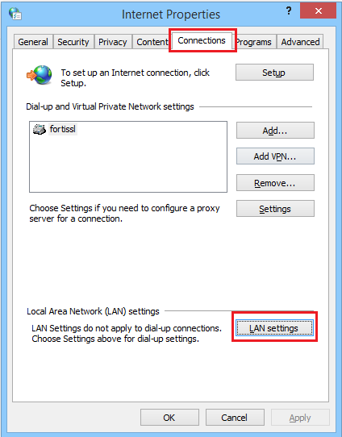

Chrome & IE
===========

Open the ``Internet Options`` dialog - Press the Windows logo key and type **'Internet Options'**. The dialog is opened. Go to ``Connections`` tab

Click on ``LAN settings``.

	
	*Lan Area Network Settings*
	
* Select the option ``Use a proxy server for your LAN...``
* Enter the ``<ShieldHostname>`` in the ``Address`` field.
* Enter ``3128`` as the port number.

Click ``OK`` on each dialog to apply the changes.
