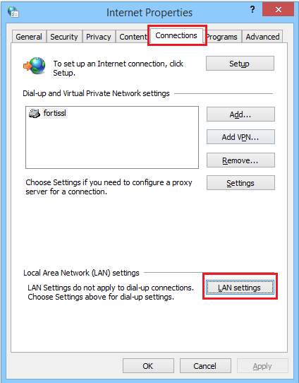
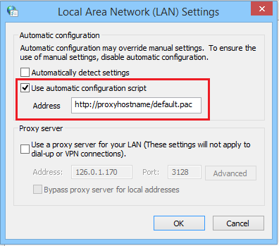

Chrome and IE
=============

1. Open the ``Internet Options`` dialog - Press the Windows logo key and type **'Internet Options'**. The dialog is opened. Go to ``Connections`` tab and select the ``LAN Settings``:

	
2. Select the ``Use automatic configuration script`` checkbox and enter the PAC file location (to use the default PAC file, use the following path: ``<http://ShieldHostname/default.pac>``).

	