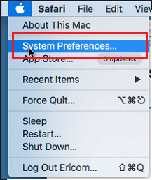
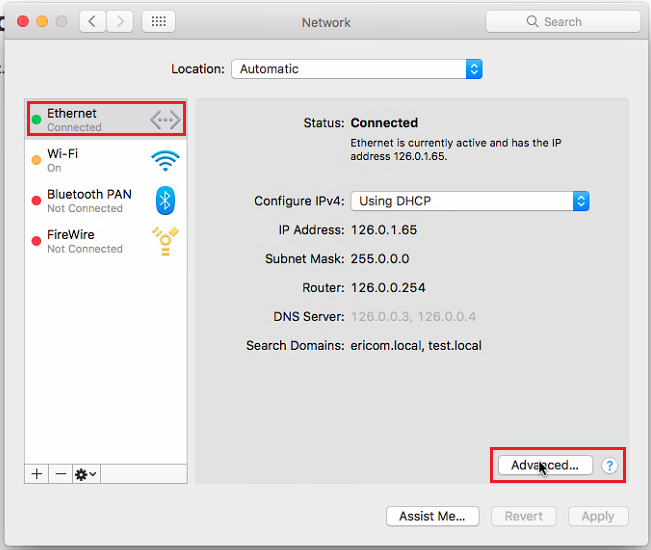
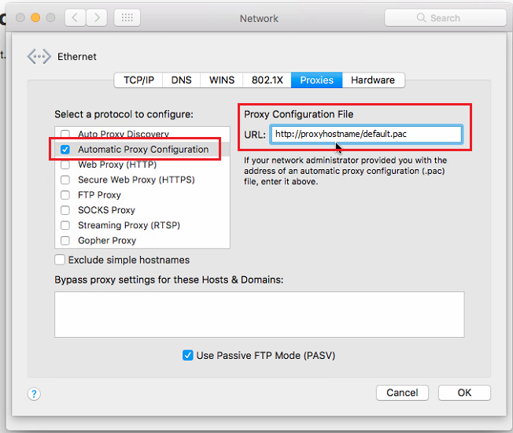

Safari
======

Open a Safari browser and click the apple icon on the top left corner. Select the ``System Preferences...`` option.

.. figure:: images/SafariNetwork.png
	:scale: 75%
	:align: center

Click ``Network``

On the left, select the desired network and the click the ``Advanced`` option (bottom right).

Click the ``Proxies`` option in the upper bar, then, on the left-hand side, mark the ``Automatic Proxy Configuration`` checkbox, 
and on the right-hand side, enter the PAC file location (to use the default PAC file, use the following path: ``<http://ShieldHostname/default.pac>``).