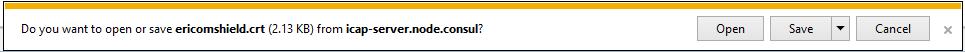
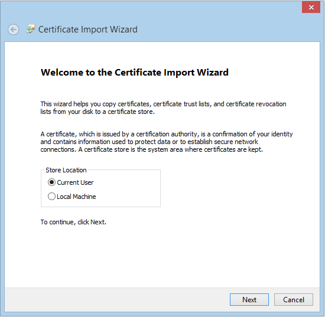
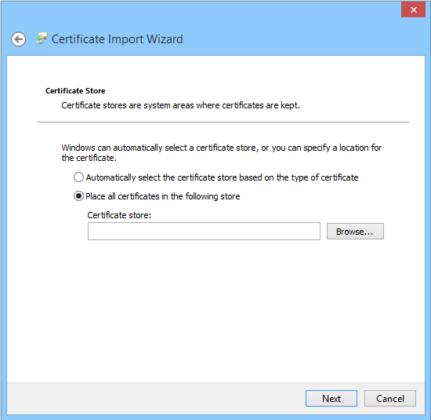
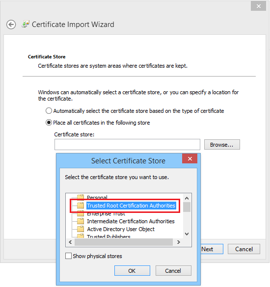
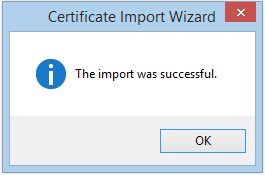

Internet Explorer
=================

These instructions are for Windows. If you are using Mac, please go `here <safari.html>`_.

Once the ``Download Certificate`` link is selected, the following prompt is displayed:

	
Click ``Open``

.. figure:: images/open.png
	:scale: 75%
	:align: center
	
Click ``Open``

.. figure:: images/securitywarning.png
	:scale: 75%
	:align: center
	
Click ``Open``

.. figure:: images/installcertificate.png
	:scale: 75%
	:align: center
	
Click ``Install Certificate``

	
Click ``Next``

	
Click ``Browse`` and select the **Trusted Root Certification Authorities**. Click ``OK``

Click ``Next``

.. figure:: images/importwizard3.png	
	:scale: 75%
	:align: center
		
Click ``Finish``	

An acknowledge message is displayed:

	
Click ``OK``	

Now the certificate is successfully installed in IE browser and browsing HTTPS websites is available.