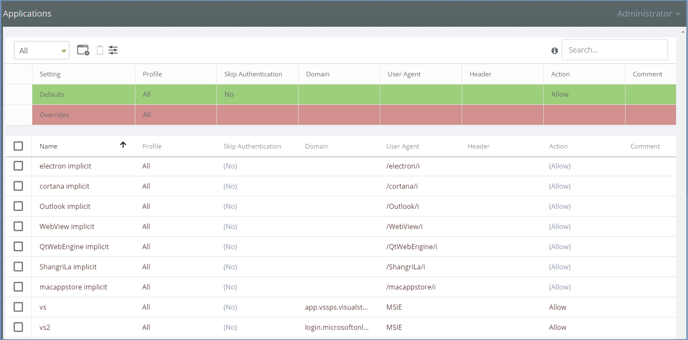
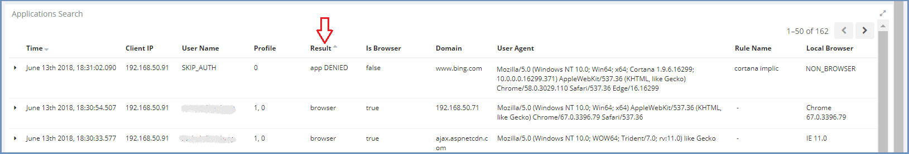
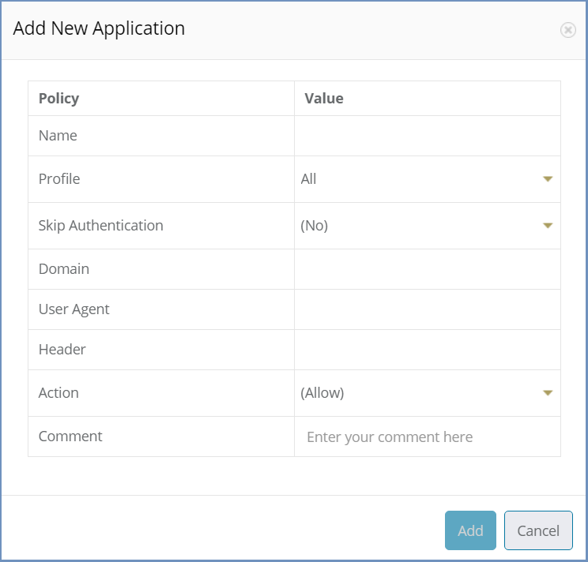

************
Applications
************

Ericom Shield allows an organization to define different desktop applications to be allowed or blocked via Shield.

Use this section in the Administration Console to manage applications in Ericom Shield.

.. note:: Shield comes with some pre-defined rules, mostly of commonly used applications. These rules can be used out of the box, or edited (in which case, caution is recommended).

In the upper bar there is a profile filter and the available actions: ``Add New Application``, ``Delete`` and ``Toggle View``. In addition, there is a search box, allowing the administrator to search for a specific application.

The upper section includes the **Defaults** table. In this table, default and override values are defined and affect all applications in the system. 
Changing a certain setting default value will affect all applications which have the default value in that setting. 

.. note:: Ericom Shield recommends that applications should be ALLOWED by default (**Action=Allow**)

Override values - this is a highly useful tool that enables the administrator full control system-wide. 
Once an override value has been set, the entire column is marked in red, to visually highlight that an override value has been set. 
The override value affects all applications in the system, including applications that are recognized by Shield but are not part of 
the table. For more details on override values go `here <policies.html#override-values>`_.

Applications can be defined per a specific **Profile** or per the default **All** profile.
Select the desired profile in the profiles filter to view this profile applications. 
The available options are according to the profiles defined in the system. 
For more information about defining profiles, go to `Profiles <profiles.html>`_.
It is possible to define applications for a certain profile either by adding new applications or by modifying existing ones.

How To Identify An Application
==============================

Applications come in various forms and shapes. Applications may come with different **identifiers** or might be considered (incorrectly) as browsers.
Applications that are identified as applications, are recognized easily, and are handled with the system default values (defined in the **Defaults** table).

For all other applications to be allowed in Shield, they need to be properly **recognized** by the system and added to the table.

An application can be identified by three parameters: Domain Name, User Agent or Header. Sometimes a combination of two such parameters is required to successfully recognize the application. 
The process may involve some manual trial and error by the administrator until the application is successfully identified.

To identify an application and add it to Shield, it is recommended to follow these steps:

1. Launch the desired application
2. If the application fails to function (since not yet recognized - may be followed by an error, but not always), open the Administration Console and go to **Reports | Applications | All** and run this report
3. In the most recent results, search for an entry where the ``Result`` is **App Denied**
4. Make sure the domain of that entry seems related to the desired application (the name should indicate a relation)

.. note:: Some applications might be identified as browsers, and might display a different result in the report (other than **App Denied**). In this case, search by the Domain, which should imply the application by name.

5. Add the application to the table (using the ``Add New Application`` dialog) with the domain as an identifier. For more details, see below.
6. Launch the application. If it keeps failing, it is probably not recognized yet, and another identifier should be added (e.g., user agent).
7. Edit the related entry in the table and use **part** of the user agent details in the dedicated column 

.. note:: Do no use User Agent as a whole. This might allow too many applications since it is not a unique **enough** identifier per application.

8. If Shield is configured to work with Kerberos or LDAP authentication, some applications might require user credentials (to be passed to Shield Proxy). 

Some applications may not support proxy authentication. If Shield is configured to work with Kerberos or LDAP authentication, these applications might fail. For these applications to function, the option **Skip Authentication** must be enabled.
If the application is added using the domain and user agent fields and still fails to connect, set **Skip Authentication** to Yes and try again.

Browsers Masked As Applications
===============================

Sometimes, certain web proxies alter the original User Agent string generated by a client system as an HTTP request passes through the proxy system. 
E.g., BlueCoat Proxy rewrites all User Agent strings to **Mozilla/4.0**.
This may cause HTTP requests to be falsely recognized as **applications**, leading to whitelisting them (as described above, this is the recommended default, **Action=Allowed**).
To solve such scenarios, it is possible to define a rule in the applications table, with the masked user agent and define it as Browser (**Action=Browser**).

Applications Masked As Browsers
===============================

Sometimes, when an application is identified as a browser (e.g. office365 and skype for business), it will be handled as a browser, which might lead to it malfunctioning.
In these cases, the applications appear in the Applications report with **Is Browser** set to yes, but they are not opened properly.
To handle this, rules must be added to the Applications table, with the specific domains and the User Agent set to ``/.*/``. 

Add New Application
===================

Use the "Add New Application" option to add an application to the table. 

Each application must have a string value in at least one of the following fields: Domain, Header or User Agent. If more than one of these fields includes a value, these values will be used together to allow a more specific identification.
These fields can be simple strings or regular expressions.

Define the related AD profile and whether it should be allowed, blocked of defined as Browser. Add a comment, if desired.

Modify an Existing Application
==============================

To edit an existing application, locate the specific entry in the table, select the column to change and enter a new value. Once done, click anywhere else in the page and the changes are committed. 

.. note:: Changes may take a few moments to apply.

Deleting a single or multiple applications is also possible - mark the relevant checkboxes on the left side and select the ``Delete`` option.

Troubleshooting
===============

1.	Sometimes, even after defining an application according to the above mentioned explanation, the application is still not functioning properly, try the following steps:

*	Clear the cache

*	Check the **Reports | Applications | All** again, per the specific application.

2. 	Some applications require defining Shield proxy manually, inside the application. Follow these steps:

*	Open the application

*	Go to ``Settings``

*	Update the shield proxy details: IP address, port and credentials (if required, depends on the application)

*	Restart the application. Now the application should work as expected.
