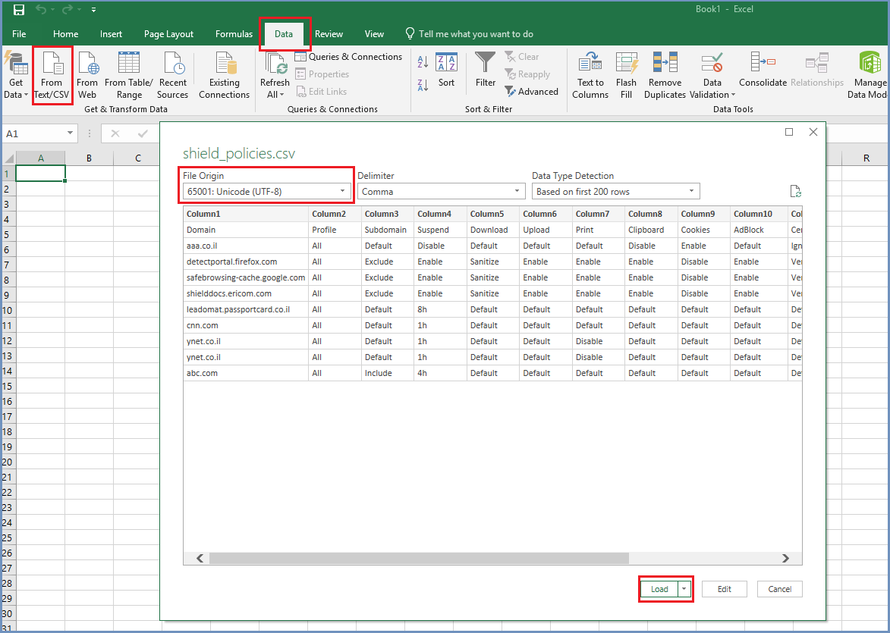
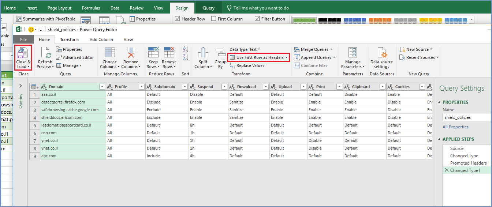
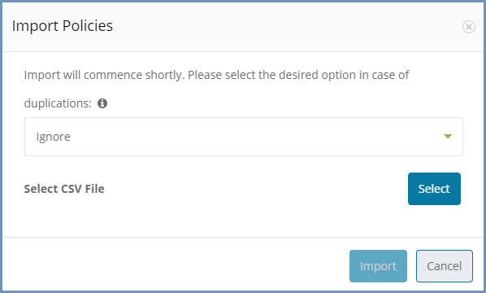
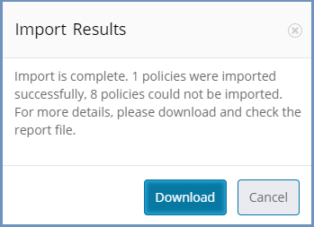

**************************
Export And Import policies
**************************

It is possible to export and import the policies in a CSV file format. This is an easy way to add and modify policies to the table.
The recommendation is to first export the table, then edit the CSV file (add new policies, modify existing ones) and later import this file back to the admin.

The export/import mechanism is relevant for domains and IP addresses only. Categories are currently not supported. 

Select the ``Export`` option (top bar, on the right). A CSV file is downloaded locally. 
This file includes the same columns and entries as the Policies table in the Administration Console. 
All the values in the file (column names, policies values) are in English. In case domain names and/or comments are in other languages (i.e., Japanese), CSV file formatting might change the characters. 

To view the file correctly (and later import it correctly) follow these steps:

1. Open Excel and create a new, empty spreadsheet

2. Go to the **Data** tab, select the **From Text/CSV** option. Select the desired file and choose ``Import``. Change the file origin to be Unicode (UTF-8) and load.

3. Go to **Edit Query** (using Alt+Q or the search box)

4. Select the "Use First Row as headers"

5. Close and load

Now the CSV file is displayed correctly and is ready for editing. Make the desired changes and save it in **CSV UTF-8 (comma delimited)** format. 

Make sure to enter valid values for each policy. Incorrect values will result in an error.

When the CSV file is ready - select the ``Import`` option (top bar, on the right). A dialog is opened:

Select the desired action in case of duplicates between the CSV file and the Policies table. Each entry is defined by a key comprised of the Domain Name and the Profile. 
These keys are used to identify duplicates. The possible options are:

1. Ignore - if a duplicate entry was found - ignore this line completely and continue to the next entry.

2. Overwrite - if a duplicate entry was found - validate it and (in case its data is valid) overwrite the existing entry in the table.

.. note:: Importing a CSV file might add new entries to the table. Removing policies can be done only by deleting them explicitly, using the ``Delete`` option.

Select the file and press ``Import``.
The import process commences, checking every entry in the CSV file and validating its data.

If the import is successful and no errors were detected, a green notification is briefly displayed to the user. 
If the import failed for some reason (invalid values, no profile, duplicate entries without overwrite option) - a message is issued:

The user can download the report file to review the policies that failed the import process.
This is a CSV file, which includes the failed entries and the failure reason. 
Use this file to correct the failed entries and import again (this time make sure the **Overwrite** option is selected).