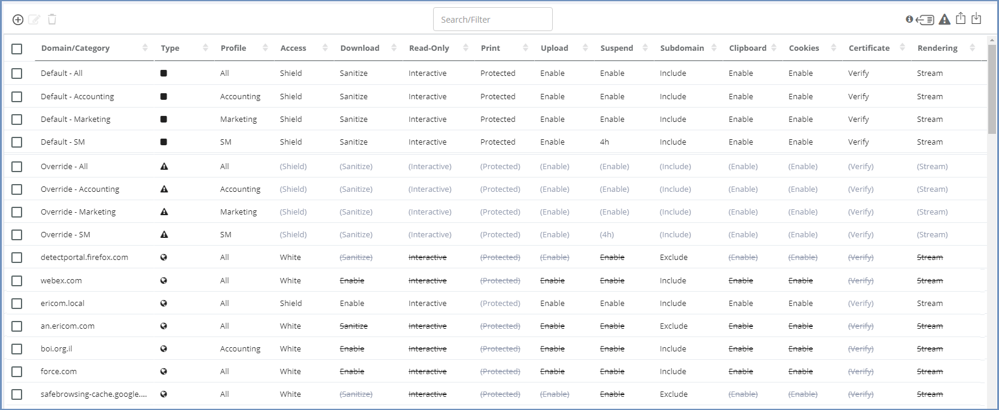
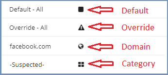
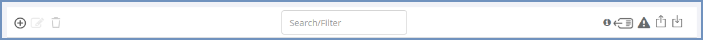
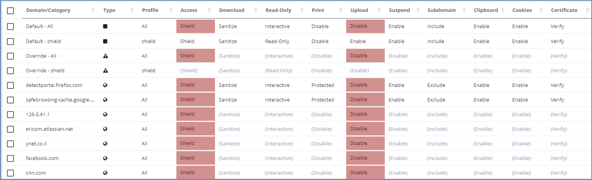
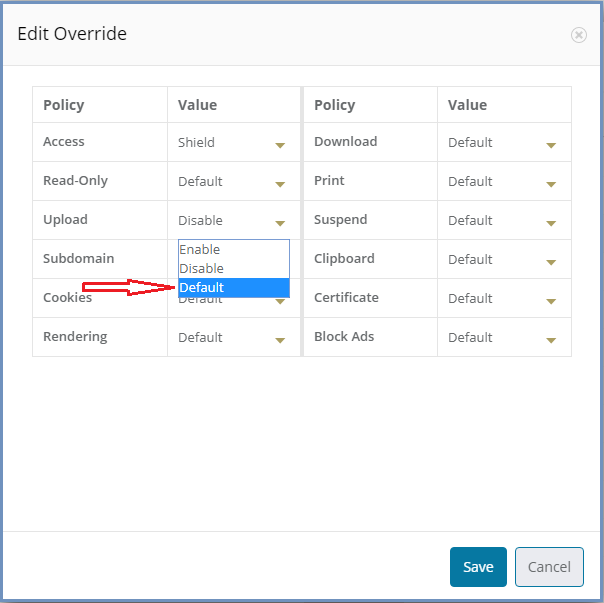
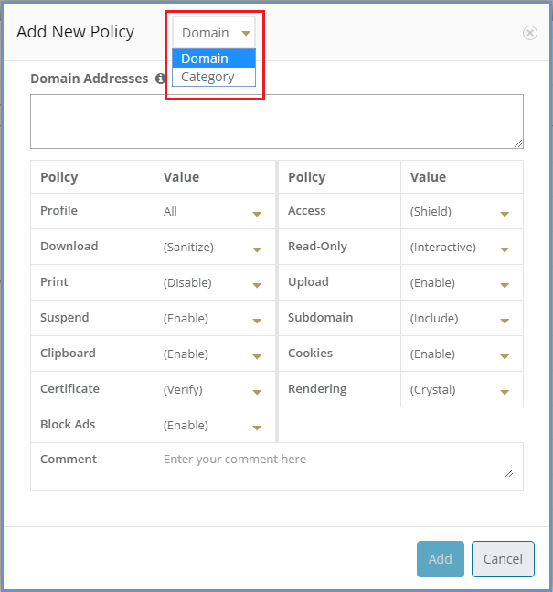
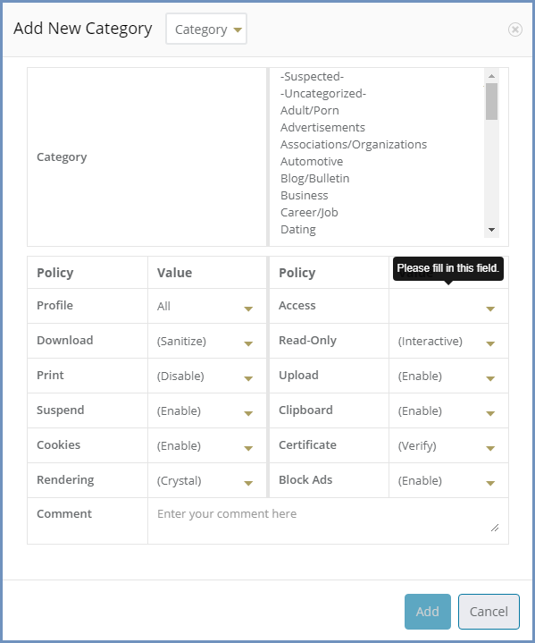

********
Policies
********

Ericom Shield allows an organization to define different policies that best protect the business from external threats while still allowing the business to function. 
In today's world, almost every employee needs access to the internet to complete their work. Ericom Shield offers a level of protection out of the box, but it's possible to 
go further and define additional policies that provide additional protection. For example, instead of allowing full access to the internet, internet access can be blocked 
apart from a list of whitelisted sites. Or full access can be granted to all sites, but only downloads from whitelisted sites is allowed. 
This level of granularity can be achieved by defining policies as described in this section.

Policies Table
==============

Policies can be defined per specific domains, IP addresses or categories.
In addition, there are System Defaults policies and Override policies which affect the entire system. The system comes with predefined defaults for each policy. 
As for the Override - this is a highly useful tool that enables the administrator full control system-wide. For further information on the System Default and the Override policies, see below.

Policies can be defined per a specific **Profile** or per the default **All** profile.

The Policies table includes a list of domains, IP addresses and Categories, with their defined policies. 

.. note:: The Categories are displayed in the table **only** if a matching license exists and if the categories are enabled in the system.

To identify if a certain entry represents a domain/IP address or a category, use the ``Type`` icon 

The policies table can be viewed in 2 modes: Compact & Verbose. 
The compact mode includes the fields: Domain/Category, Type, Profile, Access & Comment. The verbose mode includes ALL the table columns (detailed below).

.. note:: Shield comes with some pre-defined rules, to enable smooth browsing in Shield via Chrome and Firefox. It is recommended to keep these policies as is.

Available Policies
==================
The following policies are available within Shield, either at the System Defaults level or for specific domain:

* **Access** – define whether the domain is:

	1.	Shield - opened via Ericom Shield
	2.	White - opened without going through the Ericom Shield system
	3.	Black - completely blocked

* **Download** – define if a file may be downloaded and sanitized from the specified domain. The possible values are:

	1. Enable - the file is downloaded (without sanitization)
	2. Sanitize - the file is sanitized and if sanitization was successful, file is downloaded
	3. Preview - the file can only be previewed (in a dedicated pdf viewer) but cannot be downloaded 
	4. Disable - file cannot be downloaded, sanitized or previewed 

Additional values may be included, if defined in the Named Policies subsection (under ``Settings | Files & Sanitization``)

.. note:: Download policy affects the Print policy. 

* **Read-Only** - define if a domain/category will be viewed in a read-only mode or will interactive mode

* **Print** - define if a file may be printed. When printing a file, it is downloaded first and then printed, therefore the Download policy affects the Print policy. The possible values are:

	1. Enable - printing is always possible, regardless of the Download policy
	2. Protected - printing is allowed only if download is allowed (either Enable/Sanitize). If Download is not allowed, then printing is disabled as well
	3. Disable - printing is completely disabled

* **Upload** - define if a file may be uploaded to the specific domain. Possible values: Enable/Disable

* **Suspend** - define if the domain, while in idle state, will be suspended (according to a certain timeout) or remain active. The possible values are:

	1. Enable - domain will be suspended, when idle, until R/O & R/W timeouts are met (for more details see **Resources** section)
	2. 3 available timeouts - 1h/4h/8h
	3. Disable - domain will remain active until Terminate timeouts are met (for more details see **Resources** section)
	
* **Subdomain** – define whether the domain’s subdomains are included or not. E.g., if example.com is defined as a domain and subdomains = include, then both west.example.com and east.example.com are included and affected by all policies values defined for example.com. There's no need to explicitly add them to the domain section.

.. note:: when subdomains = exclude, only the **exact** specific domain will be matched. E.g. if example.com is defined as a domain and subdomains = exclude, then www.example.com will not be matched by the policy.

* **Clipboard** – enable or disable the clipboard usage  

.. note:: Clipboard policy affect both texts AND images. Disabling the clipboard will prevent copying and pasting of texts AND images to and from the remote browser. In this case these options are available internally (within the remote browser only).

* **Cookies** – enable or disable the usage of cookies (bi-directionally)

.. note:: Since most sites use some form of authentication using cookies, globally blocking cookies will make these sites unusable. However, the main reason to block cookies is to prevent tracking cookies, leading to malvertizing and retargeting (receiving annoying ads based on past searches etc.). As blocking all cookies may cause issues with some sites needed by the organization, a policy of black and white lists can provide the best of both worlds.

* **Certificate** - verify that HTTPS domains have a trusted certificate, ignore any certificate related errors (less secure) or block once certificate errors are found.

* **Rendering** - define how the content is rendered. There are 3 options available:

	1. Frame - all browser content is transferred as frames (images). DOM elements, CCS, internal logic and API calls are hidden from the client.
	2. Stream - all media elements are streamed directly. Other elements are transferred as frames. 
	3. Crystal - Some of the browser content is displayed as is - HTML elements such as DOM elements & CCS (which are considered safe). Other elements which are considered potentially harmful (internal logic & API calls) are hidden from the client. This is a Tech-Preview feature, available only when Tech-Preview features are enabled.

* **Block Ads** - enable or disable ads on websites. Ads might consume resources and decrease performance so blocking them is highly recommended (enabled by default).

.. note:: Some sites might not function properly when ads are disabled. To solve this, first verify that it is indeed related to ``Block Ads``. If this is the case, add a specific policy for each such site to enable ads in it (Block Ads = Disabled). End user can disable ads locally, while browsing, using the right-click-menu option ``Pause AdBlock & Reload``. This will affect current session only.

Upper Toolbar
=============

In the table's upper bar, the following actions are available:

``Add``, ``Edit``, ``Delete`` on the left and the ``Info``, ``Compact/Verbose Mode``, ``Show/Hide Override``, ``Export`` and ``Import`` on the right. 

In addition, there is a search/filter box in the middle, which allows to filter the displayed domains/categories, or search for entries in the table. 

The search/filter is performed on the following fields: Domain/Category, Profile, Access & Comment.

System Defaults
===============

The System Default policies are displayed in the table (usually on top). The entry is titled ``Default - Profile Name``. The default profile is the **All** profile. 
When a new profile is created (in the ``Profiles`` section), automatically a Default entry is added to the policies table. This is also true for the Override, which is not displayed by default.

To edit the default values, select the specific line and the ``Edit`` option. Change the desired value and confirm the action. This will affect all domains/categories in the table that 
have the default value for this policy. Domains/Categories with pre-defined values will not be affected.
	
Override Values
===============

Each profile has a matching Override entry in the table. These override entries are hidden by default. To see them, select the ``Show/Hide Override`` at the top bar.
Use the override values to define a specific policy value, which will immediately affect ALL domains/categories of the related profile. 
	
To apply an override, select the specific line and the ``Edit`` option. Change the desired value and confirm the action.
Once an override value has been set, the entire column is marked in red, to visually highlight that an override value has been set. 

Override values take precedence over existing policies values and provides an efficient way to apply changes quickly thus improving overall protection in times where certain threats may be high. 

To remove an override value and return the system to the previous status, select the override and the ``Edit`` option. Change the value to ``Default`` and confirm the change. 

The override value is removed, and the previously set values are retrieved and displayed in the table.

Profile Policies
================

Each profile defined in the system (for more details, go to `Profiles <profiles.html>`_) has a matching Default and Override entries in the table. 
It is possible to define policies for a certain profile either by adding new policies or by modifying existing ones. 

Policies Hierarchy
==================

The more detailed, specific rule which exists in the system - takes precedence.

When the end user browses to a certain domain, the following steps are carried out, to determine how to access this domain (and which policies will be referred to):

*	If authentication is defined in the system, the user's profile is matched, and the lookup is performed based on this profile. Else, the general profile **All** is used for reference.

*	The domain is looked up in the Policies table. If matched for a specific rule there - act according to the defined policies.

*	Else, the domain's category is looked up in the Policies table. If matched - act according to the defined category policies.

*	Else, act according to the profile/system default policies values.

.. note:: This is true for all domains, apart from domains which are identified as potentially harmful or unsecure. In this case, Shield selects the more secure approach. 
For more details see `here <settings.html#suspicious-sites>`_.

Add New Policies
================

To add new domains/IP addresses/categories to the Policies table, press the ``Add`` icon (top bar, on the left). 
	
The **Add New Policy** dialog opens:

This dialog is used to add new domains and IP addresses. To add a category, select the **Category** option on top, and the dialog is changed. For more details see below.

The dialog opens with the current system default options applied (per the selected profile). 
Add the domains/IP addresses in the ``Domain Addresses`` field. Multiple addresses can be added, separated with a new line.
The domain can be, for example **bbc.com**, or **www.bbc.com**. Specific URLs (e.g. **http://www.bbc.com/news/**) are not supported, as the policies refers to an entire 
domain. Define the required option(s) for this policy using the drop-down list of values. Once complete, click the ``Add`` button.

The added domains/IP address are validated to make sure there are no existing duplicates. 
This is to prevent the same domain/IP address having different options applied in multiple policies, which leads to errors in connecting to that domain/IP address.
Same domain/IP address **may** appear under different profiles. This is **not** considered a duplication.

If a duplication exists, a message is displayed stating the domain already exists (under the specific profile).
The dialog remains open, allowing the user to modify the entered details. 

Once the validation checks are successfully completed, the dialog closes and the new domains/IP addresses are displayed in the table. 
Each domain policies will take priority over the System Default policies, except if an override value has been set.

If a domain is marked as ``white`` in the Access policy, a notification is issued to the Administrator, confirming that only the specific domain is allowed, and any 
redirects from this site, will NOT be allowed unless they are also whitelisted. In addition, once the policy is displayed in the table, all settings that are irrelevant 
for a whitelisted domain are marked as crossed out text.

Add New Category
----------------

.. note:: This option is available only with the matching license add-on and if the Categories are enabled at the system level.

If **Category** was selected, the dialog changes to the **Add New Category**:

The dialog opens with the current policies default values applied (that match the selected profile).  
Select the category from the drop-down list available in the ``Category Name`` field. Multi-select is available (using the CTRL/Shift keys), so multiple categories can 
be added at the same time. Modify the different policies as desired (by using the drop-down list of values) or leave the defaults unchanged. Once complete, click the 
``Add`` button.

The added categories are validated to make sure there are no duplicates. 
This is to prevent the same category having multiple definitions, which might lead to errors when a domain is identified to belong to that category.
Same category **may** appear with different profiles. This is **not** considered a duplication.

If a duplication exists, a message is displayed stating the category already exists (verified per a specific profile).
The dialog remains open, allowing the user to modify the entered details. 

Once the validation checks are successfully completed, the dialog closes and the new categories are displayed in the table. 

Edit An Existing Policy
=======================

To edit an existing entry in the table, select the relevant checkbox and then the ``Edit`` option on the top bar. The matching Edit dialog is opened (according to the entry that 
was selected, whether it is a policy, category, default or override).

All the values can be updated (same as when adding a new entry). Once done updating the values – confirm the dialog and the updated values are validated (same checks are performed 
as when adding a new domain) and committed. 

.. note:: Each update made in this section, once validated and committed, may take a few moments to apply. In addition, is relevant for **new** sessions only. These changes do not affect running sessions.

Pre-Defined Policies
====================

Shield comes with a few pre-defined domains/IP addresses policies to begin with. In addition, if the Categories are enabled, they are included in the Policies table.
These predefined policies are:

*	detectportal.firefox.com - this site is used by Firefox when detecting whether it is using a `captive portal <https://searchmobilecomputing.techtarget.com/definition/captive-portal>`_. 
	Since this site is commonly used and should work as expected in Shield - it is **whitelisted** by default.

*	safebrowsing-cache.google.com - Safe Browsing is a service from Google that helps fighting the spam and phishing sites by blocking them in the browser.
	When shielded, this service causes unexpected behavior. Since this site is commonly used and very beneficial, it is **whitelisted** by default.

*	IP address 169.254.169.254 - this IP is used in a few cloud computing platforms (e.g. Amazon EC2) to distribute metadata to cloud 
	instances. In Shield It is **blocked** by default, to protect Shield metadata from outsiders reach.

Export And Import Policies To CSV File
======================================

It is possible to export and import the policies in a CSV file format. 
For more details go `here <../Admin/importexport.html>`_.