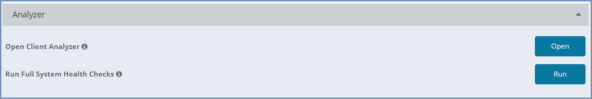
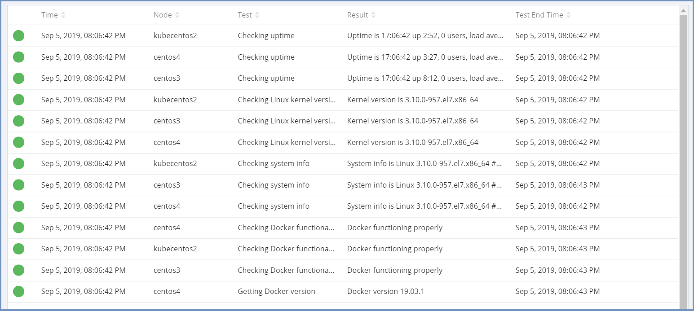
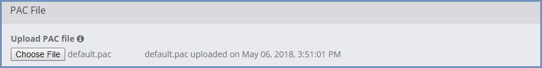

********
Services
********

This section includes several services, organized in the following sub-sections.

Analyzer
========

Ericom Shield comes with a built-in **Shield Analyzer** tool. When the Shield system seems to be overloaded or under stress, it is recommended to use this tool.

**Shield Analyzer** includes 2 functionalities:

1. Client Analyzer - this functionality checks the system performance on the end user side.

2. Full System Health Checks - this functionality checks the system internally, verifying all aspects of the system are working properly. 

Open Client Analyzer
====================

Select this option to open the **Client Analyzer** in a new tab. For more details, go `here <../deploymentguide/clientanalyzer.html>`_. 

Run Full System Health Checks
=============================

This option initiates a series of checks, that run throughout the system, and are used to understand the system status, find it's weak points and stressed components. 
This operation stresses the system. It consumes system resources and might cause significant performance degradation while the tests are performed. 
The performed tests are also run (partially) during the periodic tests, but in this scenario these tests are initiated manually by the Admin. 
The results are displayed in the following manner:

The colored indicators indicate a success/warning/error results. 
Reviewing the results can easily indicate the problematic area.

These checks are constantly enhanced with new additional tests, to provide an easy-to-use, highly useful and productive tool.

In addition, some other options can be activated from this section.

Download Shield SSL Certificate
-------------------------------

Upload PAC File
---------------

Choose the PAC file to upload to Shield. 
The date/time of the last uploaded PAC file is displayed in the admin.

The PAC file will be available on the Shield Web-Service component running on any Management Node.
To configure the end-user browser to use the PAC file, set the ``Automatic Configuration Script`` field to http://<ShieldHostname>/default.pac 

Download PAC File
-----------------

Select the ``Download`` option to download the default PAC file locally.  
Make changes to the PAC file that are needed to meet specific environment requirements and then upload the new PAC file using the steps detailed above.

Online Guide
------------

Select the ``Open`` option to open the Shield Online Documentation page (in a new tab)

