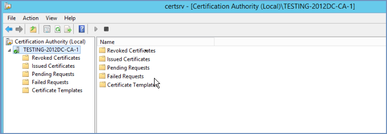
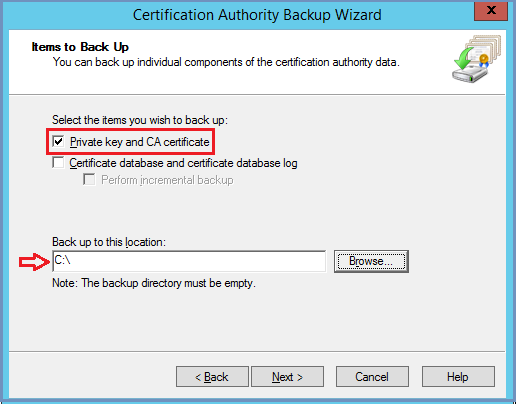
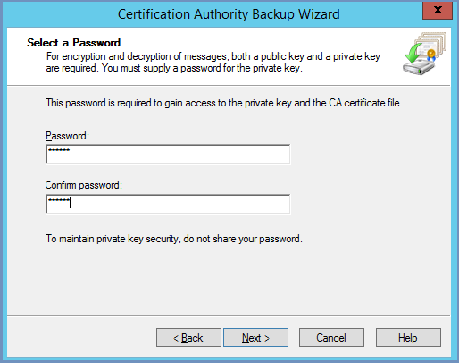
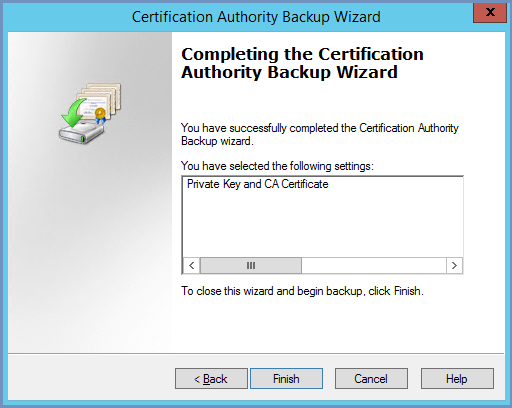
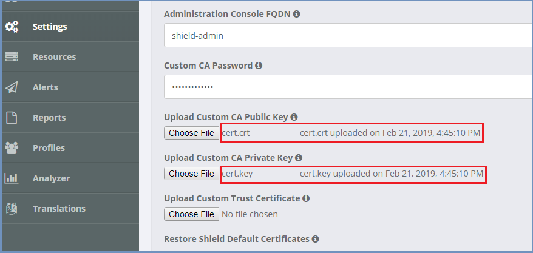

*********************************************************************
How To Install Custom CA Certificate In Shield Administration Console
*********************************************************************

To install a custom CA certificate in Shield, follow these steps:

*   Log on to the Domain Controller where the Certificate Authority is installed.

*   Open the Certificate Authority MMC (run certsrv.msc)

*   Right-click the CA name as shown above (TESTING.COM-CA-1 in this example), and select **All Tasks** --> **Back up CA**

*   The Certification Authority Backup Wizard starts. Click ``Next``. 

*   On the Items to Back Up page, select Private key and CA certificate, enter a location in which to save the file, and click ``Next``. 

*   On the Select a Password page, enter a password and confirm it. Remember it for future use

*   Click ``Next`` and then ``Finish``. When the process is complete, you will have a .p12 file (example CA_name.p12) in the folder you specified. This file contains both the public key and private key for the certificate.

*   Install OpenSSL for Windows: http://gnuwin32.sourceforge.net/packages/openssl.htm

*   To extract the certificate (public key), run the OpenSSL command::

    openssl pkcs12 -in <filename>.p12 -clcerts -nokeys -out cert.crt

*   To extract the private key, run the OpenSSL command::

    openssl pkcs12 -in <filename>.p12  -nocerts -out cert.key

*   Upload both cert.crt and cert.key files to Shield admin, under ``Settings | SSL`` section:

*   Enter the Custom CA Password and click ``Save``.

.. note:: This is the passphrase for your private keys when they were created, not the password used to export.

*   Open a browser and enter a domain. Verify all is working and that the desired certificate is used.

*****************************************************
How To Install Custom CA Certificate In Shield System
*****************************************************

In a Shield system that access the internet via a proxy with https inspection, trusting the proxy CA is needed for the setup to run.
To do that, follow these steps (repeat for each machine in the Shield system):

Copy the **trusted CA certificate** to ``/usr/local/share/ca-certificates/``
Update the CA store run::
	
	sudo update-ca-certificates
