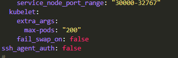

***************************************
How To Increase Number Of Pods Per Node
***************************************

In a Shield system, each node may be up to 24 cores (max).

When a node has more than 16 cores - the default number of pods (110) should be increased.

To do that follow these steps:

Open Rancher and select the cluster to update.

Click on ``Nodes`` and then select ``Edit Cluster`` (on the right).

Select the ``Edit as YAML`` option. Under **kubelet** add::

    extra_args:
      max-pods: 200

The recommended maximum number of pods is 200. Lower values may be entered, as desired.

Click ``Save``. The cluster will be updated immediately and kubelet will restart with the updated number of pods.