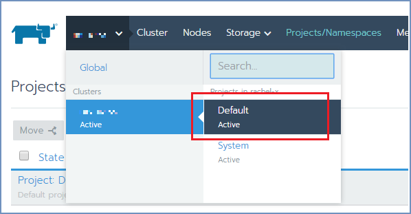
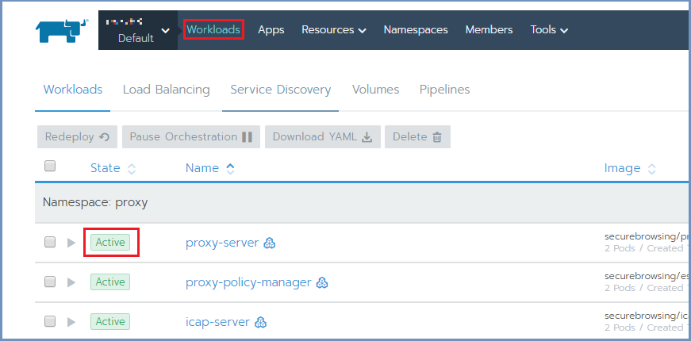
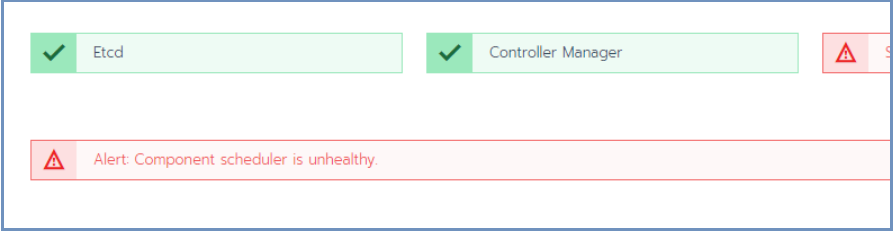
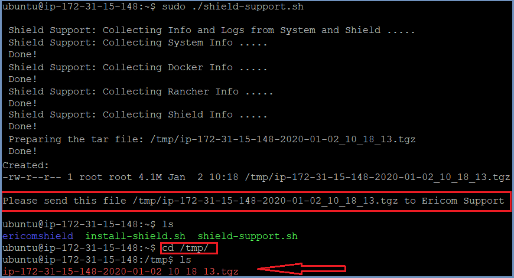

**************************
How To Check Shield Status
**************************

To check Shield system status, open Rancher and go to the cluster and select the ``Default`` option.

Under ``Workloads``, all namespaces and their deployments are displayed, each with a visual status indicator (green indicator = Healthy). 

It is possible to sort the list by ``State`` and then easily see if there are unhealthy deployments.

Repair Unhealthy Deployments
============================

If a deployment is unhealthy the visual indicator will be orange/red in color (depending on the severity of the problem).

To fix this issue, select the unhealthy deployments and choose the ``Redeploy`` option. 

If this option does not result as expected (some issues still remain), try the following:

Select the unhealthy deployment. The relevant pods are now displayed, each with a visual status indicator.

Select the unhealthy pod(s) and click ``Delete``. New and healthy pod(s) will be immediately created.

Unhealthy Controller Manager and Scheduler
==========================================

If Rancher includes messages/alerts regarding unhealthy controller manager and/or controller scheduler:

Some containers may be in ``Waiting`` mode, but wit no events or logs.
To solve this situation - restart the cluster management machines using::

	sudo reboot

Collect Shield Information
==========================

When there is an issue that requires further investigation by Ericom Support, use the shield-support service and send the 
output to Ericom for handling.

To run this service, follow these steps::

		curl -s -o shield-support.sh https://raw.githubusercontent.com/EricomSoftwareLtd/Shield/Rel-20.01.2/Utils/shield-support.sh
    	chmod +x shield-support.sh
    	sudo ./shield-support.sh

This service collects information about the: system, docker, Rancher, and Shield and creates a zipped tar file with all this information in it.
The tar file is located under the hidden ``/tmp`` folder.

Download this tar file locally (e.g. using winSCP) and send it to Ericom Shield Professional Services team.