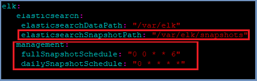
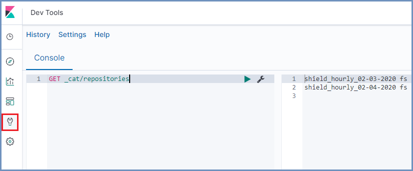

****************
Backup & Restore 
****************

Shield includes a backup and restore service to maintain availability of critical system configuration and logs. In case of system failure, 
the restore service can be used to restore configuration and/or logging information.

.. note:: All backup files are created locally. However, it is highly recommended that backup files be saved remotely, or on an NFS folder

Shield has three components that should be included in a backup plan:

*   System files

*   Service settings

*   Logs

System Files
============

Ericom Shield system files are in two locations:

*   ``~/ericomshield/``
*   ``~/.kube/config``

These two locations should be backed up on a regular basis.

Service settings
================

Ericom Shield service settings are stored in a local database. The system automatically creates a backup of this database during every save made in the 
Admin Console. In addition, the system also creates a full backup nightly. 

The default location of these backups is  ``~/home/ericom/shield``.

Change Default Location
-----------------------

To change the location of these backups, edit the custom-management.yaml file (located in ``~/ericomshield``) to update the local backup path. 
Uncomment the **localPath** variable (located under the consulBackup section) and set it to the designated path::

    localPath: <SPECIFIC_FOLDER_PATH>

Save the changes and deploy Shield, run::

    ./deploy-shield.sh

Remote Backup
-------------

Shield supports SFTP as a remote storage for backup files. Follow these steps to define the backup settings in the system.

Create a dedicated account for this purpose. This account will be used to store the backup files and to retrieve these files when restoring Shield. 

On the SFTP server, create a SSH key. For more details, see `here <../deploymentguide/FAQ/SSHKeys.html>`_.

On the Rancher Server machine, edit the custom-management.yaml file (located in ``~/ericomshield``) to configure the SFTP account (backup path, SFTP server IP & username) and copy the 
SSH private key. The settings that should be updated are marked with ``<>``)::

    remotePath: "<BACKUP_PATH>"
	config: |
      rclone.conf: |
      [SFTPStorage]
      type = sftp
      host = <SFTP_SERVER_IP>
      user = <SFTP_USERNAME>
      key_file = /keys/key_file.pem
    
    key: |
        key_file.pem: |
        ----BEGIN RSA PRIVATE KEY-----
        <PRIVATE_KEY>
        ----END RSA PRIVATE KEY-----

Save the changes and deploy Shield, run::

    ./deploy-shield.sh

.. note:: When editing the yaml file it is important to avoid any redundant characters (e.g. blank spaces, tabs etc.). In addition, it is recommended to back up this file.

Shield Service Settings Restore
-------------------------------

In the event of system failure, on restart, Shield will automatically attempt to restore from the latest backup. 

To perform a **manual** restore using a specific backup file, follow these steps:

In the Administration Console, go to ``Settings | Restore``

Select and upload a file to restore and click the ``Restore Shield`` option. 

For more info, please see `here <../deploymentguide/Admin/settings.html#id25>`_.

Shield Logs
===========

The system automatically takes snapshots of the log data on an hourly/daily/weekly schedule. These snapshots are saved locally in ``~/var/elk/snapshots``.

Settings are defined in the ``custom-values-elk.yaml`` file (located in ``~/ericomshield``). To customize it, retrieve the latest ``custom-values-elk.yaml`` file 
and edit the relevant settings::

    curl -s -o custom-values-elk.yaml https://raw.githubusercontent.com/EricomSoftwareLtd/Shield/Rel-20.01.2/Kube/scripts/custom-values-elk.yaml

.. note:: When editing the yaml file it is important to avoid any redundant characters (e.g. blank spaces, tabs etc.). In addition, it is recommended to back up this file.

Change Default Location
-----------------------

To change the location of these backups - update the **elasticsearchSnapshotPath** setting to a locally mounted NFS folder.

Change Default Schedule
-----------------------

To customize the backup schedule settings, update the ``fullSnapshotSchedule`` and ``dailySnapshotSchedule`` settings respectively (using **CRON** syntax).

Shield Logs Restore
-------------------

In case logs data is lost and needs to be restored, Go to ``Admin | Reports | Advanced`` and open Kibana. Open ``Kibana | Dev Tools | Console``. 
Follow the steps detailed below - enter the queries in the Kibana console and press the arrow, e.g.:

1.  List all registered repositories to check if the desired repository is registered::

        GET _cat/repositories

2. If desired repository is missing from search results mentioned above, but does exist in the file system, register it::

    PUT /_snapshot/<REPOSITORY_NAME>
    {
        "type": "fs",
        "settings": {
            "location": "REPOSITORY_NAME",
            "compress": true
        }
    }

3. List snapshots in the repository::

    GET _cat/snapshots/<REPOSITORY_NAME>

4. Restore a specific snapshot::

    POST /_snapshot/<REPOSITORY_NAME>/<SNAPSHOT_NAME>/_restore
    {
        "indices": "-.*kibana*",
        "ignore_unavailable": true
    }

For more info see `here <https://www.elastic.co/guide/en/elasticsearch/reference/current/snapshots-restore-snapshot.html>`_.
