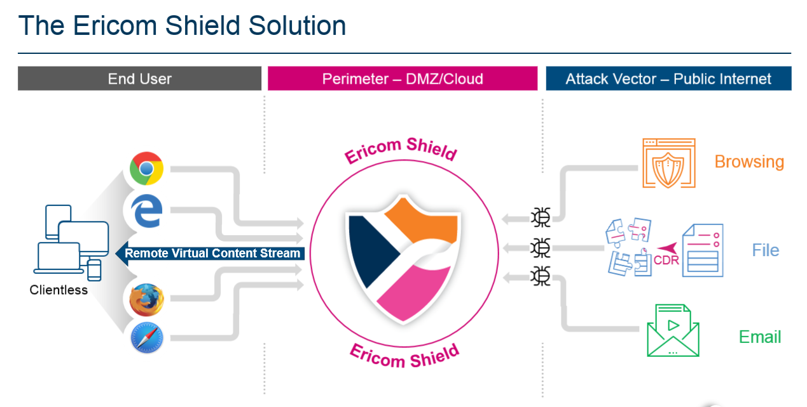
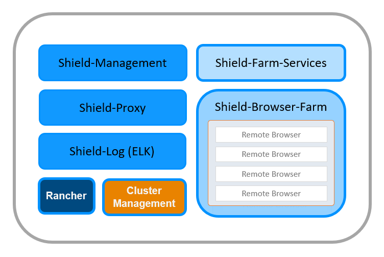
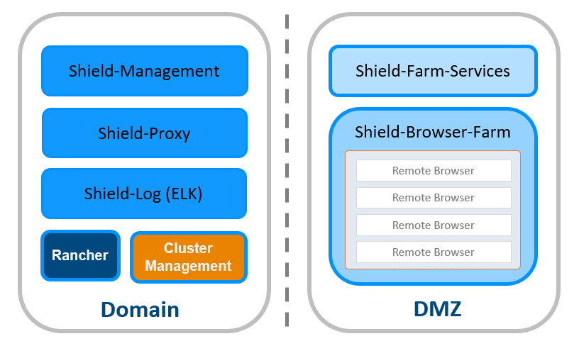
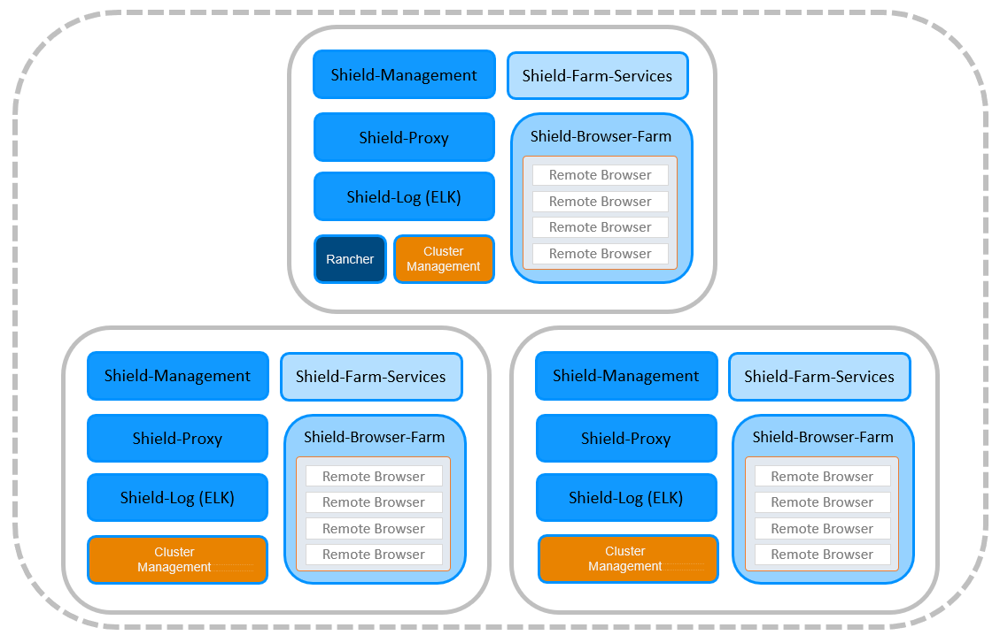
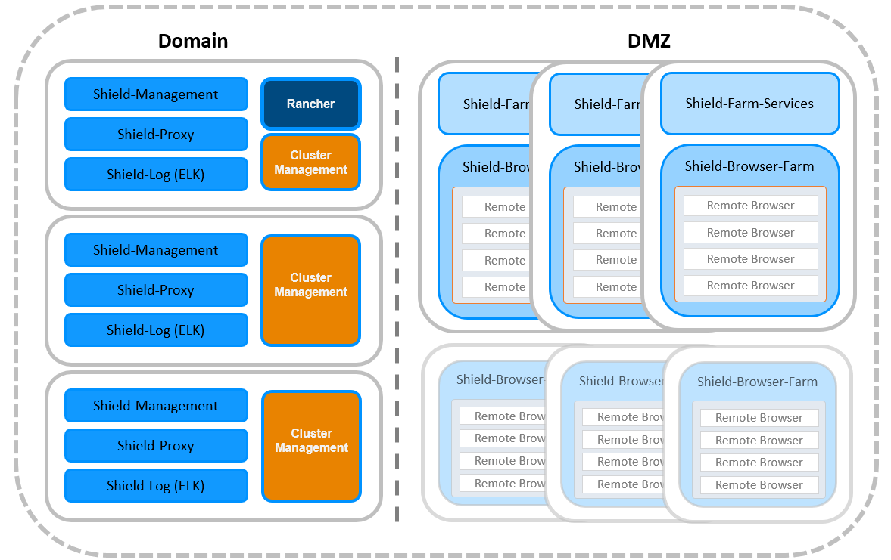
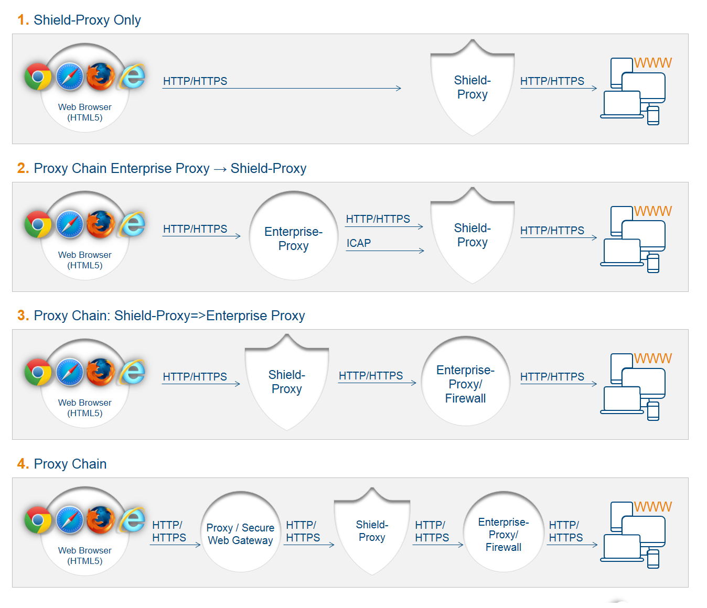

**************************
Ericom Shield Architecture 
**************************

Ericom Shield includes 5 separate logical components each containing several microservices. These microservices are published as 
Docker containers on Linux servers (running Ubuntu/CentOS on them).

The components can be installed together on a single machine or separated on different machines and locations. Some in the Domain, 
others in the DMZ - with great flexibility and according to the customers' needs.
These are the different components with the microservices running on each component.

**Shield-Management**

*	Web based Administration Console
*	In memory database – where all the internal configuration is kept
*	License Management

**Shield-Proxy**

*	Authentication
*	SSL Bumping for HTTPS
*	Policy Management & Enforcement - handles black and white policy rules

**Shield-Log (ELK)**

*	Logs
*	Reports (Kibana)

**Farm Services**

*	Entry point for Browser Farm (Proxy/Redirected)
*	Auto scaler - for both remote browsers and nodes
*	Policy Management - to manage all the Shield policies (Download, Print, Rendering etc.) 
*	CDR Services
*	Ad blocking and caching

**Browser Farm**

*	Remote browsers - the actual containers running the browsing connections
*	Policy Enforcement - uses the Farm Services policies manager and enforces those policies on the browsing connections  

**Common**

*	FluentBit
*	Collector

Process Flow
============	
	
A user navigates to a desired web page by entering a domain address in the browser address bar.

HTTP/S requests are sent to Shield Proxy for processing. Whitelisted domains and applications are forwarded directly to the user. 
All other requests are sent to the Farm, which processes the given domain according to the predefined policies (configured in the Administration Console). 

If the domain is blacklisted, then the connection is blocked, and a message is displayed to the user. If the domain is whitelisted, it is opened directly, without going through Shield. If the domain is shielded, Shield Proxy allocates a Shield Browser from the available browser pool, a new dedicated container is assigned for the session and the desired domain is opened and delivered to the user.

The Shield Browser allows the user a seamless browsing experience, including all commonly used features such as video, audio, printing, downloading, according to the predefined policies configured by the Administrator.  

When downloading a file, the downloaded file is first sent to the Content Disarm and Reconstruct (CDR) engine, which is designed to deconstruct the file and remove any content that can cause potential harm (both known and unknown threats). Once the file sanitization is complete, the sanitized file is sent to the user.

When the user closes the browser, the session ends, and the container is destroyed. This is also the scenario in case the session timed out.

Use Cases
=========

Shield can be deployed in various deployments, ranging from a single machine to multi machines to multi zones deployments.
Here are some general use cases for Shield deployments:

**Basic**

All Shield components are deployed on a single machine. 
This is the most basic option, used for quick evaluation of Shield. 

**Evaluation**

Includes one machine running the **Shield-Management**, **Shield-Proxy** & **Shield-Log** components on it. This machine should be 
placed in the Domain. A second machine, running the **Farm Services** & **Browser Farm** components on it. This machine should 
be placed in the DMZ.

This is the **recommended** deployment for **Evaluation**. 
This deployment is more stable and secure than the Basic option, but it does not support High Availability (HA).

**Small Deployments (HA)**

Includes 3 machines. Each machine includes ALL of Shield components on it. 
This deployment is suitable for small scale production environments, as it is stable and ensures HA. 
However, since all the machines are placed in the Domain, it lacks the security of the DMZ.

**Production**

This is the **recommended** deployment for production environments. 
Includes 3 machines running the **Shield-Management**, **Shield-Proxy** & **Shield-Log** components on them placed in the Domain, 
and 3 (or more) machines running the **Farm Services** & **Browser Farm** components on them, placed in the DMZ.

.. note:: 3 machines running the **Farm Services** are required. Additional **Browser Farm** can be added, as desired, without adding more **Farm Services** components.

This production deployment is stable, ensures HA and is more secure due to the Farm components located in the DMZ.

.. note:: According to Kubernetes recommendations, for deployments that include more than 10 Worker nodes, it is recommended to have a dedicated cluster management (3 Master nodes, running etcd & Control Plane) separated from the Worker nodes.

Deployment Topologies
=====================

There are several possible topologies for Ericom Shield in an existing customer's environment.

In the existing environment, there may be several components within the connectivity chain, between the end-user and 
the internet. Ericom Shield integrates into this connectivity chain.
There might be one or more existing proxies, or none at all. There might be a firewall or multiple firewalls and a DMZ.  
Shield can be placed in various positions along this chain. 

It is recommended that **Shield-Management**, **Shield-Proxy** and **Shield-Log** are placed in the Domain, while **Farm Services** and **Browsers Farm** are placed in the DMZ.
This is the safest and most secure deployment. 
However, the customer's existing environment will determine the final deployment, after taking in account all parameters and components in the system. 

Here are a few example topologies:

