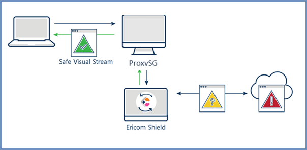
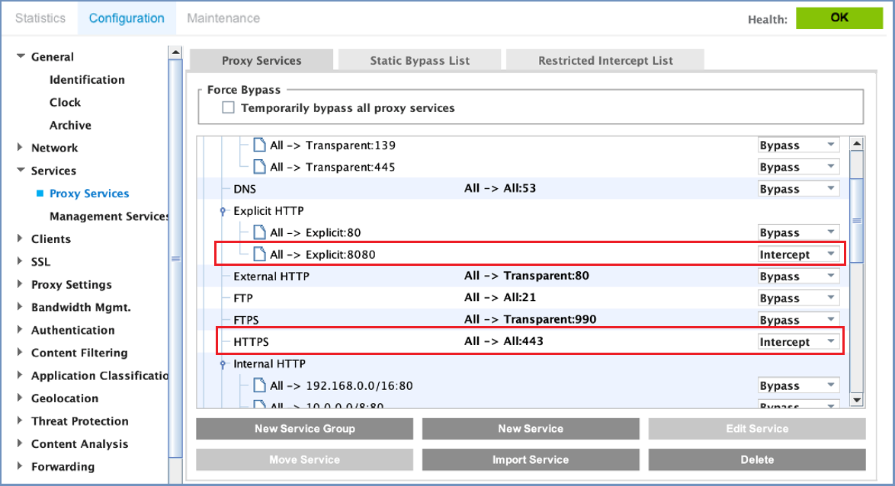
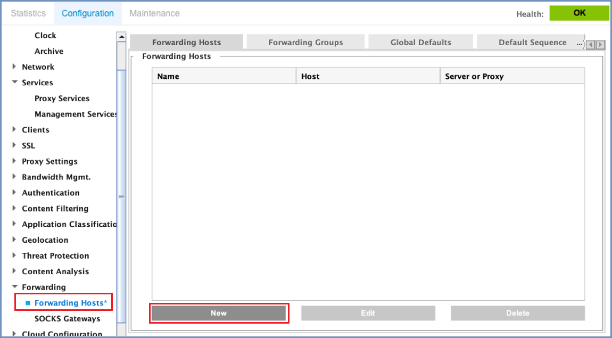
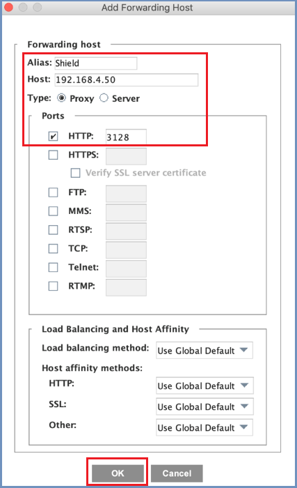
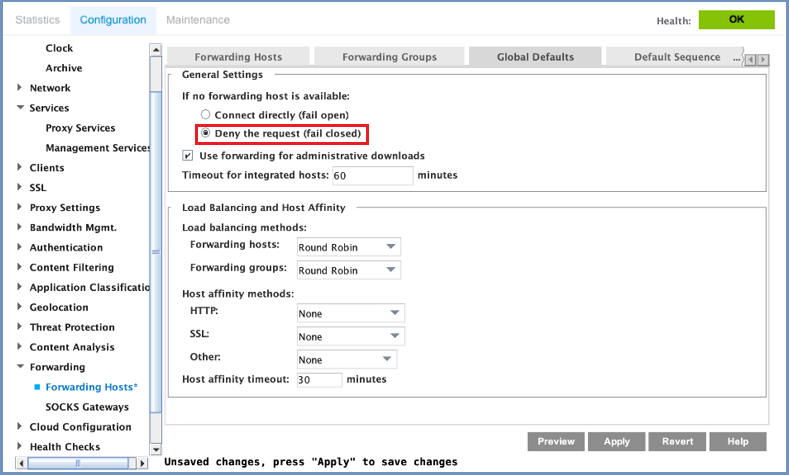
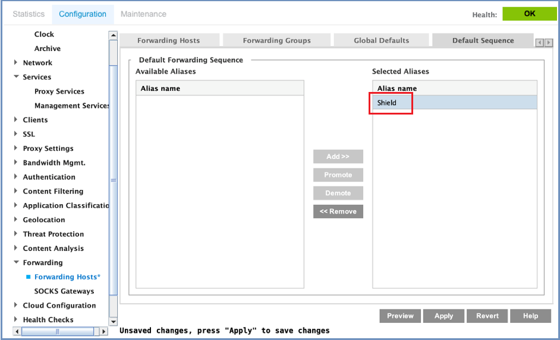

******************
Symantec Blue Coat
******************

Symantec Blue Coat Web ProxySG protects against malware from user-initiated web traffic and enforces corporate and 
regulatory policy compliance. These gateways usually include functionality like URL filtering, malicious-code detection 
and application controls for popular web-based applications. Native or integrated data leak prevention is also often 
included. Ericom Shield communicates with ProxySG via proxy chain to provide isolation-based zero-day malware protection. 
This technote will explain how to configure the Blue Coat ProxySG and Ericom Shield.
The hereunder refers to Blue Coat ProxySG 6.7.4.7 SWG edition.

Architecture
============

Data Flow
=========

*   End-user requests a website and uses Blue Coat as the web proxy

*	The Virtual Policy Manager Rule Set determines which URL’s and categories are sent to Ericom Shield.

*	Ericom Shield opens the content in disposable Linux containers and sends a safe visual stream of pixels Blue Coat ProxySG, which then sends it to the end-user’s browser

*	Once the user ends the browsing session by closing the browser tab, or the browser, the Linux container is destroyed

Ericom Shield Configuration
===========================

Ensure that you are using Ericom Shield 19.09.5 or later version and that the deployment architecture is Rancher and Kubernetes. 

No specific configuration in Ericom Shield is required for the integration.

Blue Coat ProxySG Configuration
===============================

Log into the ProxySG and navigate to ``Proxy Services``

Set the following options:

Under ``Predefined Service Groups``, expand the ``Standard`` section.
Under ``Explicit HTTP``, set ``All –> Explicit: 8080`` to **Intercept**.
Set ``HTTPS (ALL -> All:443)`` to **Intercept**.

Set Forwarding Host (Next Hop Proxy)
------------------------------------

Navigate to ``Forwarding`` and select **Forwarding Hosts**. Click ``New`` to create a new forwarding host.

In the dialog, set the following parameters (marked in red) and press **OK**

Forwarding Groups - As there is only one forwarding host for Shield, there is no need to create a forwarding group.

Global Defaults
---------------

It is recommended, during initial testing, to select the **Deny the request (fail closed)**. This is also true for cases when Shield Server is offline.

Default Sequence
----------------

Add the forwarding host to the Selected Alias.  

Final Steps
-----------

The above configuration will send ALL web traffic from the Blue Coat ProxySG to Shield as the next Hop Proxy.
Create rules using the Visual Policy Manager as required to forward selective traffic to Shield.
Finally, configure the browser with the address of the ProxySG in Proxy settings, over port 8080.

