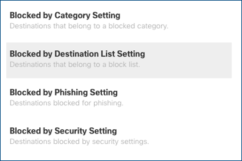

**************
Cisco Umbrella
**************

Ericom Shield can integrate with Cisco Umbrella gateway in the Redirection Mode. 
In this scenario, requests are redirected from the gateway to Shield, without passing through the built-in Shield proxy.

Architecture
============

.. figure:: images/umbrella.png	
	:scale: 100%
	:align: center

Data Flow
=========

Cisco Umbrella acts as the first line of defense. Requests are received in the Cisco Umbrella and are either passed, blocked or redirected to Shield. 
The redirected requests are processed in Shield according to the pre-defined policies and settings.

Configuration
=============

Ericom Shield Configuration
---------------------------

Login to Administration Console and go to ``Settings | Proxy & Integration`` section. 

Set the ``Enable Redirection Mode`` to **Yes**.

Cisco Umbrella Configuration
----------------------------

Login to Cisco Umbrella and go to the blocked settings section

Next, select ``Redirect users to this URL`` and enter the Ericom Shield server address:

.. figure:: images/umbrella2.png	
	:scale: 75%
	:align: center

When using this configuration, it is recommended to set the DNS addresses in Shield to use non-Umbrella addresses.

.. note:: While in Redirection Mode, the gateway handles White and Black domains. All other domains are passed to Shield and handled with the pre-defined policies. Access policy must be defined as Shield, since in this mode other options (white/black) are not supported.