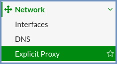
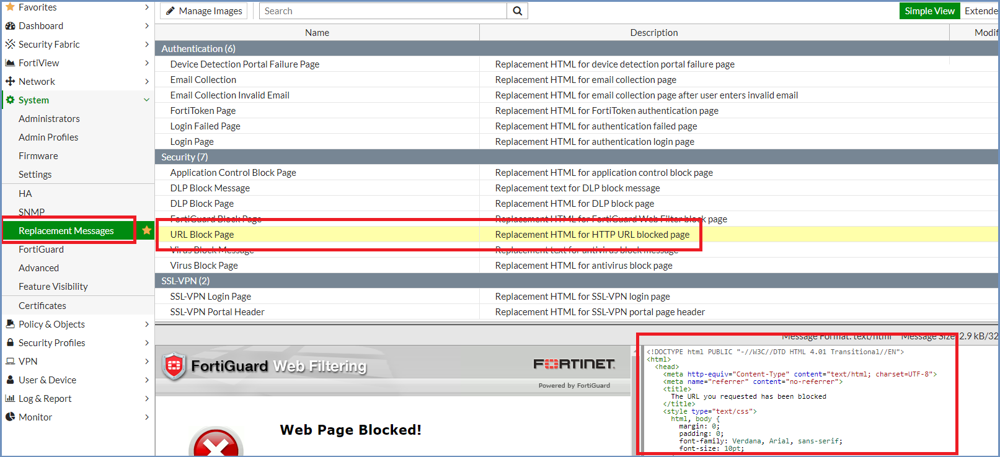

**********************************
Fortigate Secure Web Gateway (SWG)
**********************************

Fortigate Secure Web Gateway can integrate with Ericom Shield in the Proxy Chain scenario.

Architecture
============

.. figure:: images/FortigateChain.png	
	:scale: 75%
	:align: center

Data Flow
=========

*   End-user requests a website and uses Fortigate as a web proxy

*   Fortigate evaluates the request and if allowed, will forward the request to Ericom Shield

*   Ericom Shield attempts to navigate to the requested URL

*	Ericom Shield opens the content in disposable Linux containers and sends a safe visual stream of pixels to the end-user’s browser

*	Once the user ends the browsing session by closing the browser tab, or the browser, the Linux container is destroyed

Fortigate Configuration
=======================

Log into the Fortigate Admin Console.

Go to ``System | Feature Visibility | Explicit Proxy`` and enable it

.. figure:: images/Fortigate1.png	
	:scale: 55%
	:align: center

Explicit Proxy setting will now appear under ``Network``

Configure the Explicit Proxy, as per the example shown below:

*	Set to Enable
*	Enter the Interfaces to listen on (usually an internal/LAN port)
*	HTTP Port: 8080
*	HTTPS Port: Use HTTP Port
*	Unknown HTTP Version: Best Effort
*	Default Firewall Policy Action: Deny

.. note:: Default Firewall Policy Action should be set to **Deny** and **requires** a proxy policy to be defined for which users/machines will be accepted by the proxy. 
If this is set to Accept, then ALL traffic will use the FortiGate Proxy.

.. figure:: images/Fortigate3.png	
	:scale: 75%
	:align: center

Create a new **Web Proxy Forwarding Server**:

*	Enter a Name
*	Proxy Address Type: IP
*	Proxy Address: Address of the Ericom Shield proxy server
*	Port: Port of the Ericom Shield proxy server (3128)
*	Server Down Action: Block
*	Health Monitor: Enable
*	Health Monitor site: http://<SERVERIPADDRESS>:30443//api/v1/browsersSessionsInfo/
*	Alternate Health Monitor site: http://<SERVERIPADDRESS>/shield-stats
*	Click OK

.. note:: Server Down Action = Block, means that if Shield is down, the connection to the internet is blocked.

.. figure:: images/Fortigate4.png	
	:scale: 75%
	:align: center

Create a new entry in the URL Match List:

*	Enter a Name: Shield service.consul
*	URL Pattern: service.consul
*	Forward to Server: Select the Ericom Shield server
*	Exempt from Cache: Enable
*	Enable this URL: Enable
*	Click OK

.. figure:: images/Fortigate5.png	
	:scale: 75%
	:align: center

Repeat this for **farm-services.svc** as well.

Final URL Match List is:

Click ``Apply`` to save.

Go to ``Policy & Objects | Policy Proxy`` and create a new Forward proxy rule:

*	Proxy Type: Explicit Web
*	Enabled On: internal (LAN)
*	Source Address: all
*	Outgoing Interface: external (WAN)
*	Destination Address: all
*	Service: webproxy
*	Action: Accept
*	Enable Web Proxy Forwarding Server
*	Select the Ericom Shield Server
*	Click OK to save.

.. note:: The Source Address should be the group of machines or users that this policy will apply to. For example, apply a policy for a specified group of machines 
that will be forwarded to the Shield Server, and another policy that bypasses Shield and only uses the FortiGate proxy. 

Block Page Redirection (Optional)
---------------------------------

The FortiGate block page may be configured to provide a link to launch a blocked URL in Ericom Shield isolation. This option is used with FortiGate’s “Transparent Web” mode where 
web forwarding server is not available. To edit the block page in FortiGate, go to ``System | Replacement Messages``. Click on the Block Page that should be edited, 
i.e., URL Block Page, and edit the source code.

Add the line: 
Click here to browse the URL via isolation: <a href="https://<SERVERIPADDRESS>:30443/?url=https://%%URL%%">Isolate&user=%%SOURCE_IP%%<a/>

The “url=” parameter must be lower-case.

%%URL%% represents the URL that will be isolated.

%%SOURCE_IP%% represents the source of the IP of the web request (Optional). This information is used to attribute the URL to the owner and will be displayed in the Shield ``Sessions | Session History`` report.

Ericom Shield Configuration
===========================

No special configuration is required.

Testing of Interconnectivity
============================

To confirm that the inbound web content is using Fortigate Web Gateway as the first line of defense, the user simply has to visit a website that can detect the perimeter address, 
such as https://www.whatismyip.com/ to verify that the inbound address matches that of the Fortigate Web Gateway.