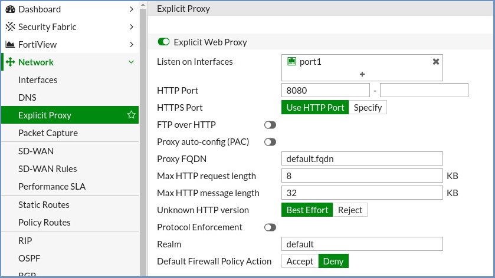

**********************************
Fortigate Secure Web Gateway (SWG)
**********************************

Fortigate Secure Web Gateway can integrate with Ericom Shield in the Proxy Chain scenario.

Architecture
============

Data Flow
=========

*   End-user requests a website and uses Fortigate as a web proxy

*   Fortigate evaluates the request and if allowed, will forward the request to Ericom Shield

*   Ericom Shield attempts to navigate to the requested URL

*	Ericom Shield opens the content in disposable Linux containers and sends a safe visual stream of pixels to the end-user’s browser

*	Once the user ends the browsing session by closing the browser tab, or the browser, the Linux container is destroyed

Fortigate Configuration
=======================

Log into the Fortigate Admin Console.

Go to ``Network | Config | Features``. In the **Security Features** make sure Explicit Proxy is enabled.

Go to ``Network | Interfaces``

.. figure:: images/Fortigate2.png	
	:scale: 75%
	:align: center

Select the internal network interface, and ensure that **Enable Explicit Web Proxy** is enabled.

Go to ``Network | Explicit Proxy``.  Enter the explicit proxy details, an example shown below:

Set the required Proxy FQDN.

.. note:: Default Firewall Policy Action should be set to **Deny**. If this is set to Accept, then ALL traffic will just use the Fortigate Proxy.

Create a new **Web Proxy Forwarding Server** 

Proxy address can be the FQDN or IP of the Shield Server. Port should be set to **3128**.

Create a new entry in the URL Match List:

Add **service.consul** to the URL Pattern. Enable the **Forward to Server** option and select the Shield Server. 
Enable the **Enable this URL** option:

.. figure:: images/Fortigate4b.png	
	:scale: 75%
	:align: center

Repeat this for **farm-services.svc** as well.

.. figure:: images/Fortigate4a.png	
	:scale: 75%
	:align: center

Click ``OK`` to add the **Forward Web Proxy Server**.

Go to ``Policy & Objects | Policy | Explicit Proxy`` and create a new Forward proxy rule:

Outgoing interface should be WAN. Select the option for Web Proxy Forwarding Server and select the forward proxy server that was added in the previous step.

Click ``OK`` to save.

Ericom Shield Configuration
===========================

No special configuration is required.

Testing of Interconnectivity
============================

To confirm that the inbound web content is using Fortigate Web Gateway as the first line of defense, the user simply has to visit a website that can detect the perimeter address, such as https://www.whatismyip.com/ to verify that the inbound address matches that of the Fortigate Web Gateway.