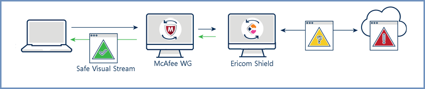
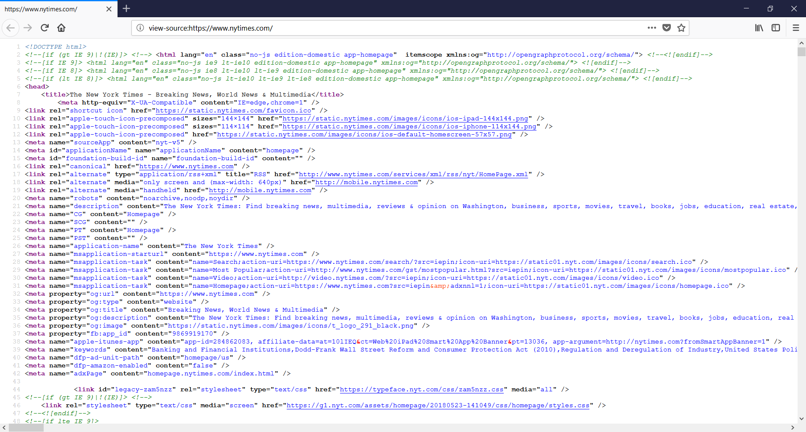
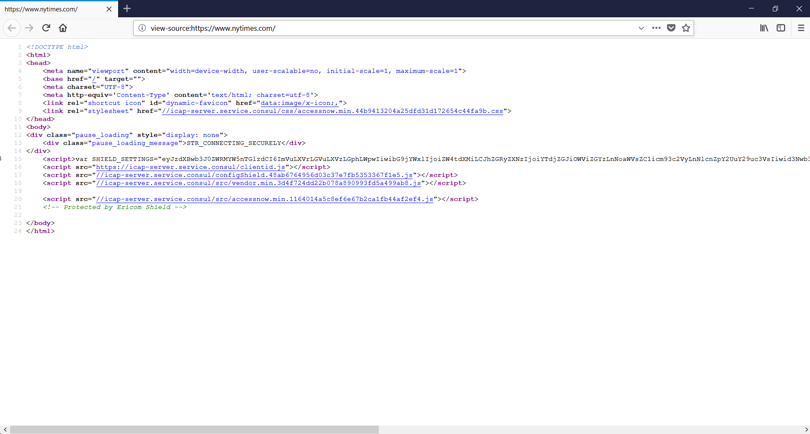

******************
McAfee Web Gateway
******************

McAfee Web Gateway (MWG) filters unwanted malware from user-initiated web traffic and enforces corporate and regulatory policy compliance. 
These gateways usually include functionality like URL filtering, malicious-code detection and application controls for popular web-based 
applications. Native or integrated data leak prevention is also often included. 
The hereunder refers to McAfee Web Gateway 7.7.2.9.0.

MWG is located at the perimeter of the network and acts as the first line of defense between Ericom Shield and the Internet. For the safest 
and most secure deployment, Ericom strongly recommends placing the Ericom Shield layer in the DMZ.

Architechture
=============

Data flow
=========

*   End-user requests a website and uses Ericom Shield as a web proxy

*   Ericom Shield attempts to navigate to the requested URL and passes the request to MWG

*	If the MWG policy (e.g. whitelist) allows the request, the web content will be retrieved

*	The retrieved web content is first inspected by MWG

*	The inspected web content is then passed to Ericom Shield for viewing

*	Ericom Shield opens the content in disposable Linux containers and sends a safe visual stream of pixels to the end-user’s browser

*	Once the user ends the browsing session by closing the browser tab, or the browser, the Linux container is destroyed

Ericom Shield Configuration
===========================

Ericom Shield supports the configuration of an Upstream proxy, port number, and trusted certificate. Ericom has certified that MWG may be configured in this manner - where all browsing traffic originating from Ericom Shield will be filtered and protected by 
MWG. To configure MWG in Ericom Shield follow these steps:

*	Go to Administration Console | Settings | Proxy & Integration section

*	Enable the ``Use External Upstream Proxy`` and fill in the required settings in the ``External Upstream Proxy Configuration`` subsection.

*	If white URLs are required to pass throught Shield proxy, enable the ``Use Internal Upstream Proxy`` and fill in the required settings
in the ``Internal Upstream Proxy Configuration`` subsection.

*	Upload the Client Certificate (public & private keys)

Connectivity Verification
=========================

To confirm that the inbound web content is using MWG as the first line of defense, the user simply has to visit a website 
that can detect the perimeter address, such as www.whatismyip.com to verify that the inbound address matches that of the MWG.

Testing of Interconnectivity
============================

Prior to using Shield with MWG, web pages are loaded **into** the local browser.
Any malicious content in the website would reach the actual device and could cause permanent damage.
This is the source contents of a web page reaching the local browser

Once the end-user is using Ericom Shield and MWG, all web page content is rendered and executed in the Ericom Shield 
isolation layer and never reaches the end-point device. Below is the source contents of a web page isolated by Ericom Shield as it is 
rendered on the local browser. Native web content is completely opened and executed in a remote Ericom Shield browsing container and 
destroyed once the browser session ends. Only a safe visual pixel stream reaches the end-point device.

