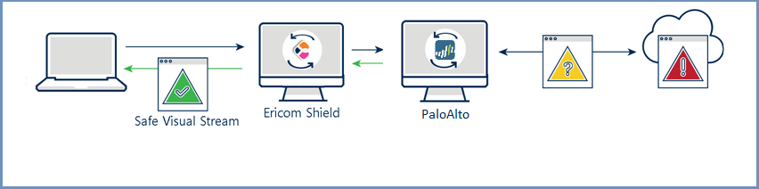
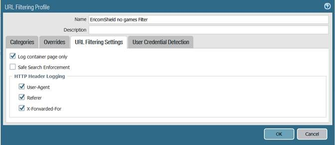
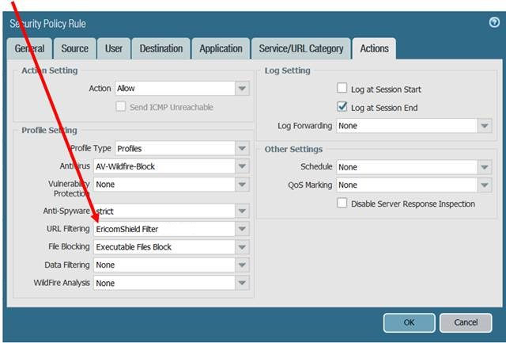
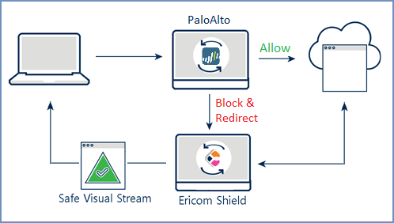

******************
Palo Alto Firewall
******************

Palo Alto firewall can integrate with Ericom Shield in the following scenarios: Proxy Chain & Redirection Mode.

====================
Proxy Chain Scenario
====================

Palo Alto sits at the perimeter of the network and acts as the first line of defense between Ericom Shield and the Internet.
For the safest and most secure deployment, Ericom strongly recommends placing the Ericom Shield layer in the DMZ.

Architecture
============

Data Flow
=========

*   End-user requests a website and uses Ericom Shield as a web proxy

*   Ericom Shield attempts to navigate to the requested URL and passes the request to Palo Alto

*	If the Palo Alto policy (e.g. whitelist) allows the request, the web content will be retrieved

*	The retrieved web content is first inspected by Palo Alto

*	The inspected web content is then passed to Ericom Shield for viewing

*	Ericom Shield opens the content in disposable Linux containers and sends a safe visual stream of pixels to the end-user’s browser

*	Once the user ends the browsing session by closing the browser tab, or the browser, the Linux container is destroyed

Ericom Shield Configuration
===========================

In case of using Palo Alto FW as a **transparent** proxy, there is no need to configure Shield.
When Palo Alto is used as an **upstream proxy**, it needs to be configured in the Shield Administration Console. To configure it, follow these steps:

*	Go to Administration Console | Settings | Proxy & Integration section

*	Enable the ``Use External Upstream Proxy`` and fill in the required settings in the ``External Upstream Proxy Configuration`` subsection.

*	If white URLs are required to pass throught Shield proxy, enable the ``Use Internal Upstream Proxy`` and fill in the required settings
in the ``Internal Upstream Proxy Configuration`` subsection.

*	Upload the Client Certificate (public & private keys)

Palo Alto Firewall Configuration
================================

In order to have visibility of the end user in Palo Alto FW, the XXF has to be configured. To do that, please follow these steps:

*   Go to Device | Setup | Content-ID

*   Open settings option (gear icon) for **X-Forwarded-For Headers** widget

*   Select both ``Use X-Forwarded-For Header in User-ID`` and ``Strip X-Forwarded-For Header`` checkboxes. 

.. note:: Consider selecting the ``strip`` option only after debugging the new setup and verifying that the headers indeed exist (e.g., http://myhttpheader.com/)

*   Go to Objects | Security Profiles | URL Filtering and define a dedicated URL Filtering security profile.

*   Within that URL Filtering security profile select relevant categories (as usual), and in addition go to URL Filtering Settings tab and check the ``X-Forwarded-For`` checkbox:

*   Finally, on the security policy that handles egress traffic from the Ericom Shield server, apply the relevant URL Filtering security profile:

================
Redirection Mode
================

Ericom Shield can also integrate with Palo Alto Firewall in the **Redirection Mode**. 
In this scenario, requests are redirected from the firewall to Shield, without passing through the built-in Shield proxy.

Architecture
============

Data Flow
=========

Palo Alto Firewall acts as the first line of defense. Requests are received in the Palo Alto Firewall and are either passed or blocked (based on the Palo Alto URL Filtering). 
The blocked requests are redirected to Shield and processed in Shield according to the pre-defined policies and settings.

Configuration
=============

Ericom Shield Configuration
---------------------------

Login to Administration Console and go to ``Settings | Proxy & Integration`` section. 

Set the ``Enable Redirection Mode`` to **Yes**.

Palo Alto Firewall Configuration
--------------------------------

Customize the Palo Alto URL Filtering response page by following these steps:

1. Go to ``Device | Response Pages`` 

2. Select the **Blocked** response page to modify and export it (save locally)

3. Edit the HTML page to redirect to Shield (enter the ShieldServerIP). For example::

	

4. Save the file (make sure it retains its UTF-8 encoding)

5. Go to ``Device | Response Pages``, select the **Blocked** response page and import the newly saved file

6. Commit the changes and verify that the redirection works (browse to a blocked URL and check that it is opened via Shield)

.. note:: While in Redirection Mode, the gateway handles White and Black domains. All other domains are passed to Shield and handled with the pre-defined policies. Access policy must be defined as Shield, since in this mode other options (white/black) are not supported.