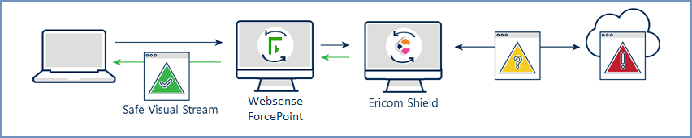
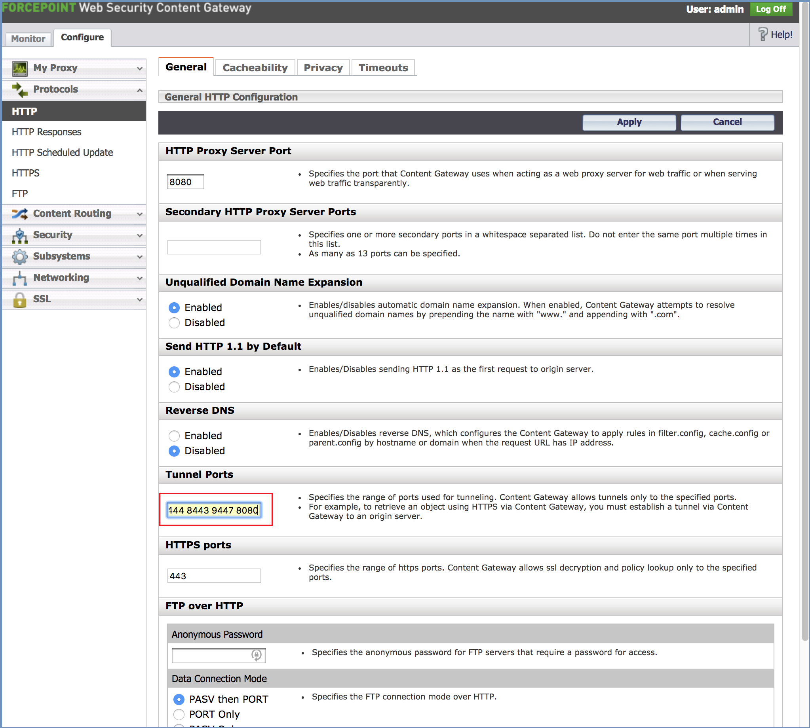
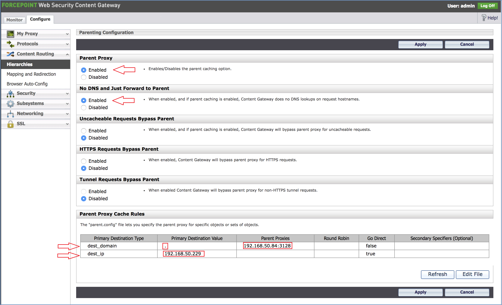

************************************************
Websense ForcePoint Web Security Content Gateway
************************************************

Websense ForcePoint Gateway can integrate with Ericom Shield in the Proxy Chain scenario.
The hereunder refers to Websense ForcePoint Web Security Content Gateway 8.4.

Architecture
============

Data Flow
=========

*   End-user requests a website and uses Websense as a web proxy

*   Websense evaluates the request and if allowed, will forward the request to Ericom Shield

*   Ericom Shield attempts to navigate to the requested URL

*	Ericom Shield opens the content in disposable Linux containers and sends a safe visual stream of pixels to the end-user’s browser

*	Once the user ends the browsing session by closing the browser tab, or the browser, the Linux container is destroyed

Websense ForcePoint Configuration
=================================

Open the ``Configure`` tab, go to ``Protocols | HTTP``. In the **General** tab enter the **8080** port in the list of **Tunnel Ports**:

Go to ``Content Routing | Hierarchies``, enable the **Parent Proxy** and the **No DNS and Just Forward to Parent**.
Add 2 rules:

1.  Primary Destination = **.** ('.') 
    parent proxy = **ShieldServerIP:3128**
    Go Direct = False

2.  Primary Destination = **websenseIP**
    Go Direct = True

Ericom Shield Configuration
===========================

No special configuration is required.

Testing of Interconnectivity
============================

To confirm that the inbound web content is using Websense ForcePoint as the first line of defense, the user simply has to visit a website 
that can detect the perimeter address, such as www.whatismyip.com to verify that the inbound address matches that of the Websense ForcePoint Gateway.