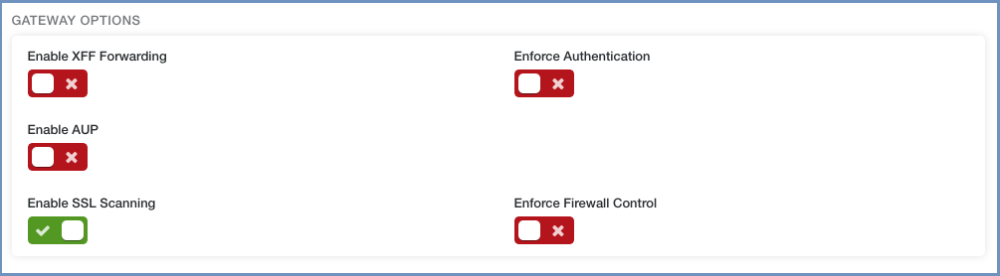

*************
Zscaler Cloud
*************

Ericom Shield can integrate with Zscaler Cloud gateway in the Redirection Mode. 
In this scenario, requests are redirected from the gateway to Shield, without passing through the built-in Shield proxy.

Architecture
============

Data Flow
=========

Zscaler Cloud acts as the first line of defense. Requests are received in the Zscaler Cloud and are either passed, blocked or redirected to Shield. 
The redirected requests are processed in Shield according to the pre-defined policies and settings.

Configuration
=============

Ericom Shield Configuration
---------------------------

Login to Administration Console and go to ``Settings | Proxy & Integration`` section. 

Set the ``Enable Redirection Mode`` to **Yes**.

Zscaler Cloud Configuration
---------------------------

To configure Zscaler Cloud, login and turn on the ``Enable SSL Scanning`` (expected to be off in production environments)

Next, edit the URL filtering rule - enter the Ericom Shield server address in the ``Redirect URL`` field:

.. figure:: images/zscaler2.png	
	:scale: 75%
	:align: center

.. note:: When operating in Redirection Mode, Zscaler Cloud handles White and Black domains. All domains redirected to Shield are handled according to the pre-defined policies. Access policy must be defined as Shield, since in this mode other options (white/black) are not supported.