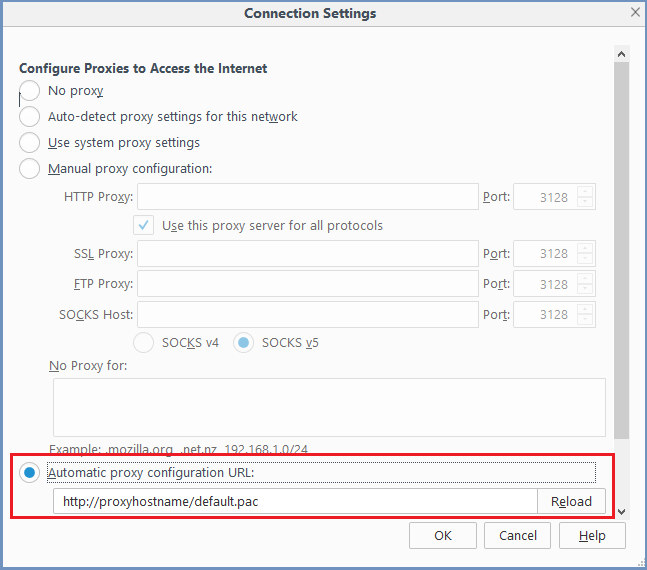

FireFox
=======

1. Open a browser and go to `<about:preferences>`. Scroll down to the ``Network Proxy`` section and select ``Settings``

2. Select the ``Automatic proxy configuration URL`` checkbox and enter the PAC file location (to use the default PAC file, use the following path: ``<http://ShieldHostname/default.pac>``).

