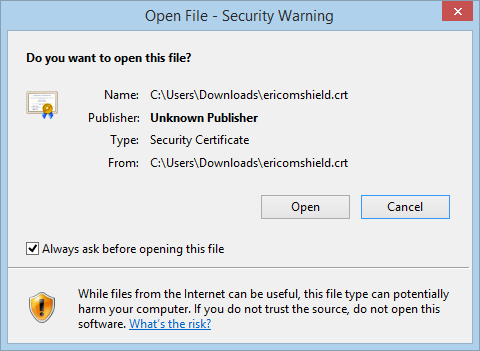
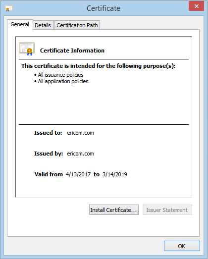
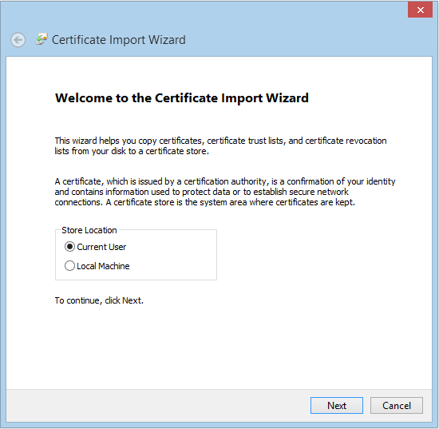
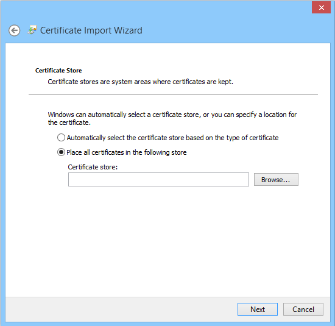
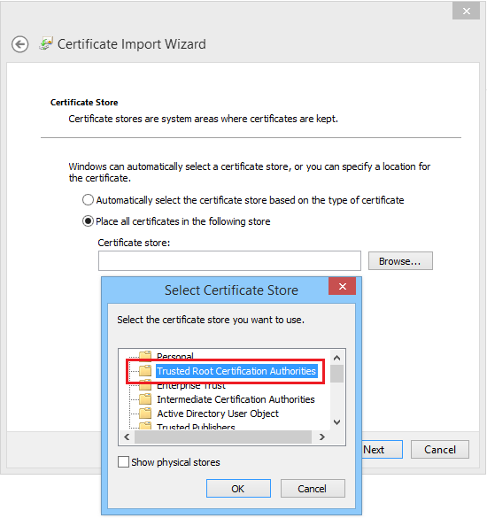
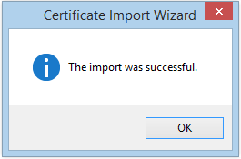

Chrome
======

These instructions are for Windows. If you are using Mac, please go `here <safari.html>`_.

Once the ``Download Certificate`` link is selected, the following prompt is displayed:

.. figure:: images/Chromedownloadconfirmation.png
	:scale: 75%
	:align: center
	
Click the “Keep” option, and the file ericomshield.crt is saved in the Downloads folder.

Go to the Downloads folder and open the .crt file. The following dialog is opened:

	
Click ``Open``

	
Click ``Install Certificate``

	
Click ``Next``

	
Click ``Browse`` and select the **Trusted Root Certification Authorities**. Click ``OK``.

Click ``Next``

.. figure:: images/importwizard3.png	
	:scale: 75%
	:align: center
	
Click ``Finish``	

An acknowledge message is displayed:

	
Click ``OK``	

Now the certificate is successfully installed in Chrome browser and browsing HTTPS websites is available.