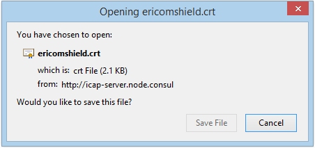
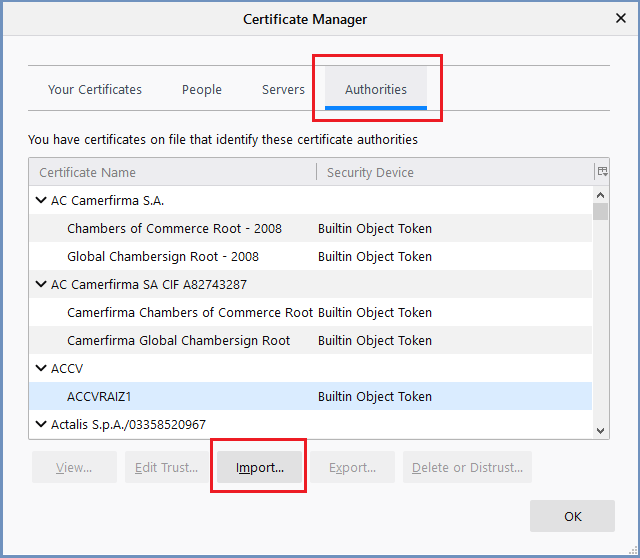
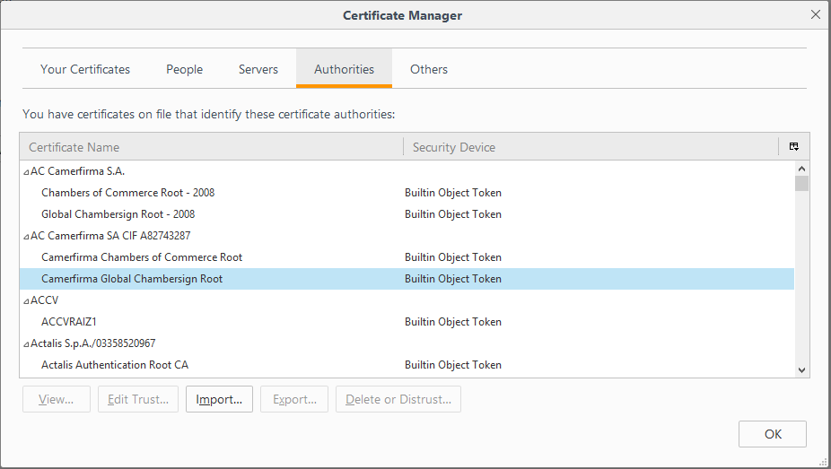
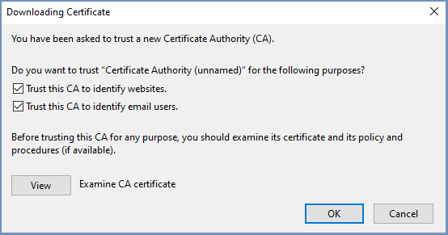

Firefox
=======

These instructions are for Windows. If you are using Mac, please go `here <safari.html>`_.

Once the ``Download Certificate`` link is selected, the following prompt is displayed:

	
Click ``Save File``. The file ericomshield.crt is saved in the Downloads folder. 

Next, open a browser and import the certificate into the browser itself: 
In the browser, go to ``Options | Privacy & Security | Certificates``:

	
Click ``View Certificates``

	
Under the Authorities tab, click ``Import...``

In the displayed dialog, select the .crt file from the Downloads folder and click ``Open``:

	
Check all three options to Trust the certificate and click ``OK``.

Now the certificate is successfully installed and added as a trusted authority in Firefox browser and browsing HTTPS websites is available.