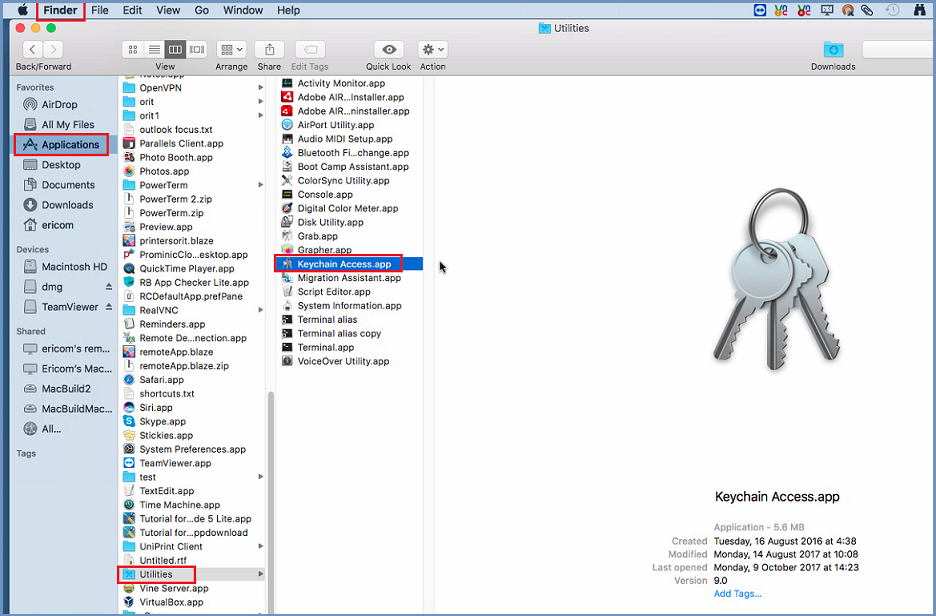
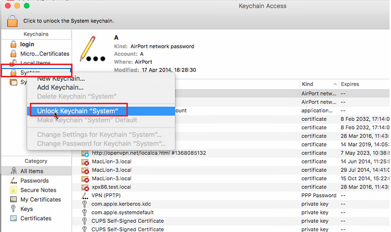
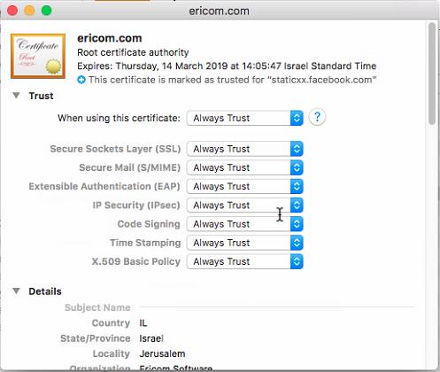

Safari/Mac
==========
After downloading the certificate, go to “Finder” and the bottom left, and select “Applications | Utilities | Keychain Access”. 

	
Double click it to open. 

	
Right-click the “System” and select “Unlock Keychain "System" ”. Once unlocked, go to “File | Import Items” and find the downloaded certificate. Select it and click “Add”. The certificate is now added to the keychain. Select the “ericom.com” certificate and double click it. 

	
Make sure all the fields are marked with “Always Trust” - set the first line to this value and the other lines will be updated. Once done, right-click the “System” and select “Lock Keychain "System" ”.