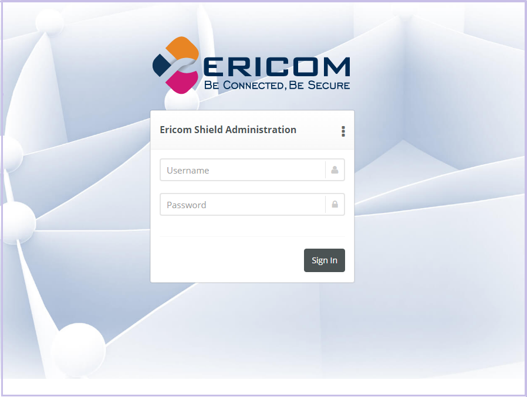
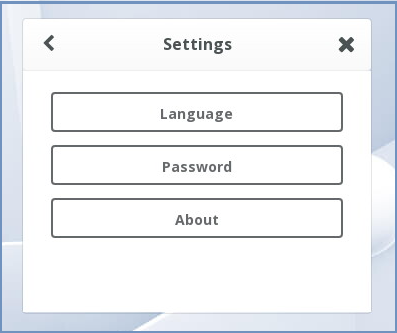
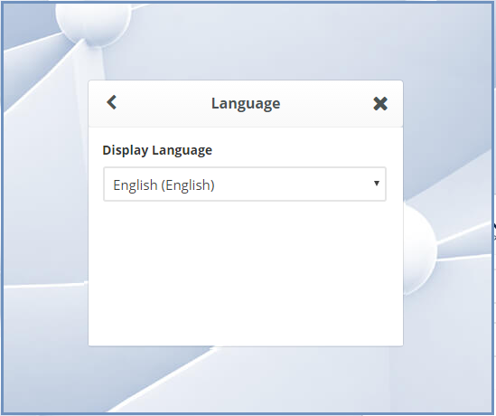
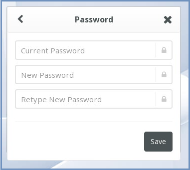
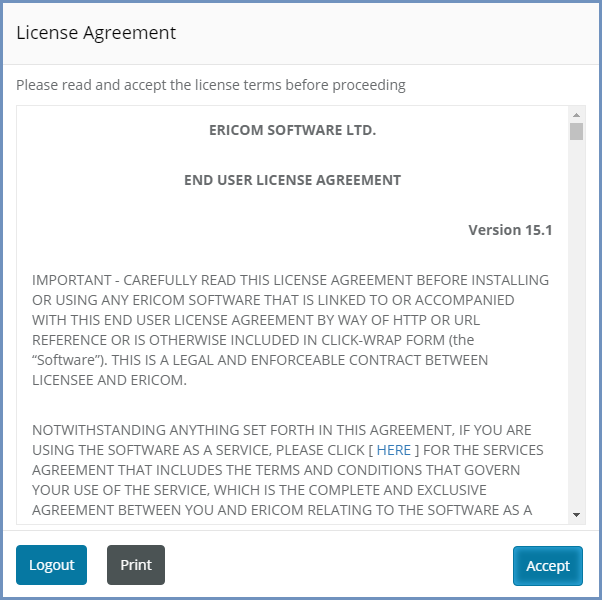
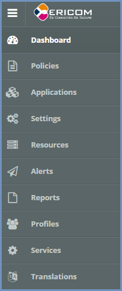
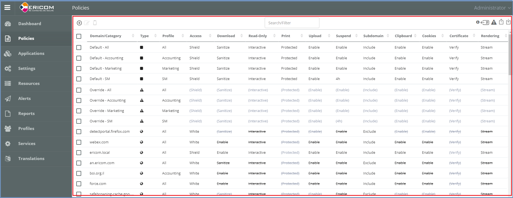
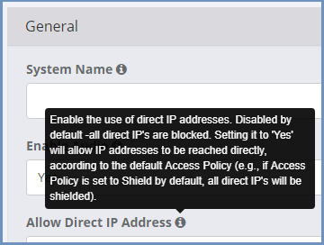

************
Introduction
************

Launch the web-based Administration Console at ``http://<ShieldHostname>:30181``.
Hostname/IP address - this is the address of the machine running the Shield Management component on it.

It is recommended to use the Administration Console with a Chrome browser.

Upon launching the console for the first time, there will be a security alert, stating that the **connection is not private**. This happens since the Administration Console is HTTPS and the proper certificate is missing. To handle this, login to the admin and set the Administration Console FQDN with the ``<ShieldHostname>`` of the machine. Further details `here <settings.html#administration-console-fqdn>`_.

The web interface is optimized for 1440 pixel horizontal resolution.

**Default credentials:**

	**Username:** admin
	
	**Password:** ericomshield

Select the UI Language
======================

To change the user interface language of the Administration Console, click on the context menu at the upper right corner to open the settings screen:

Select the ``Language`` option

Select the desired language from the list, log in to the system - the user interface will use the selected language.
		

Change Password
===============

To change login password, go to the settings screen and select the ``Password`` option

Enter current password and a new password (twice), and press save. Login to the Administration Console with the new password.

Using the Administration Console
================================

The first time the Administration Console is opened, the EULA is displayed. Before the Administration Console can be accessed, 
the EULA must be accepted. This popup will keep showing until it is accepted. 

The EULA can be printed from the popup. If the EULA cannot be accepted, select the **Logout** option to exit the Administration Console.

Once the EULA is accepted, the console can be used.

The Administration Console is comprised of the following panels:

Navigation Panel
----------------

The navigation panel is located on the left hand side of the console. It displays the configuration options available to the Administrator. 

Main Panel
==========
 

The main panel is in the middle area of the console. It displays the high-level information and configuration options related to the menu item selected. 

Tooltips
========

Hovering the mouse over an icon in the main panel will display a tooltip message to assist with configuration.

