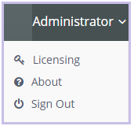
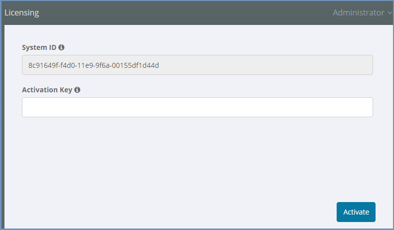

*********
Licensing
*********

The license information is detailed in the admin. To view it, open the menu on the top right corner, and select the ``Licensing`` option:

  
The ``Activation`` page is displayed

      
Activation
==========

To activate Shield or apply a license extension:

1. Select and copy the ``System ID``

2. Send it to Ericom Shield Professional Services 

3. Once the activation key is received, paste it into the ``Activation Key`` field 

4. Click the ``Activate`` option at the bottom. A green confirmation appears once the process completes. 

In the dashboard, the ``License Expiration Date`` is updated immediately. No service restart is required.

Licensing Options
=================

Ericom Shield comes with 3 main licensing options:

*	Named Users
*   Concurrent Users
*	Concurrent Sessions

Named Users
-----------

Each user has a dedicated, individual license. Number of licenses equals number of users.
Users are kept in the system as active users for 14 days from their last browsing session. 
Once this period has passed and the user did not use Shield - the license is freed and can be used by another user.

Concurrent Users
----------------

This licensing option allows several users to share a single license (but not at the same time). 
The number of licenses is the maximum number of **active users** that can browse Shield simultaneously.

Every time a user opens a new web browser window or web browser tabbed document interface (TDI or Tab), a new, concurrent, browsing session is created. 
The first time the user is browsing Shield, one license will be assigned to this (active) user.

If the maximum number of licenses is reached - no other users can connect and browse Shield, until active users close ALL thier active sessions and thier licenses are freed.

Concurrent Sessions
-------------------

This licensing option allows users to share licenses, according to the currently active sessions.
The number of licenses is the maximum number of **active sessions** that can be opened simultaneously.

.. note:: Concurrent sessions are controlled by different timeouts defined in the system. In addition, 
there is a limit of concurrent sessions per user. For more details, see `here <resources.html>`_.

Authentication
--------------

If Shield is operated without authentication, the system identifies a user based on a GUID generated per browser. Each GUID consumes a license. 
This is true for both Named Users and Concurrent Users licensing options.
Sometimes, several GUID may be generated for the same user. For example, when the user opens 2 browsers from the same computer, e.g. Chrome and IE, 
each browser will receive a different GUID. The same may happen when the user is using a single browser but uses it both in regular mode and in 
private/incognito mode. Each of these modes will receive a different GUID. 

For accurate license count, it is recommended to use Shield with authentication enabled and properly defined. This way, users are identified in the 
system by their credentials and can use the system according to their license, without consuming redundant licenses. 

.. note:: The ``Resouces | Resources Conservation | Maximum Active Remote Sessions Per User`` is also not enforced when Shield is operated without authentication. To find out how to enforce this option when there is no authentication, see `here <../FAQ/knownissues.html#limit-number-of-sessions-in-a-system-with-no-authentication>`_.
