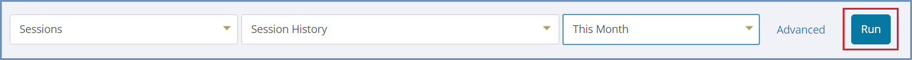
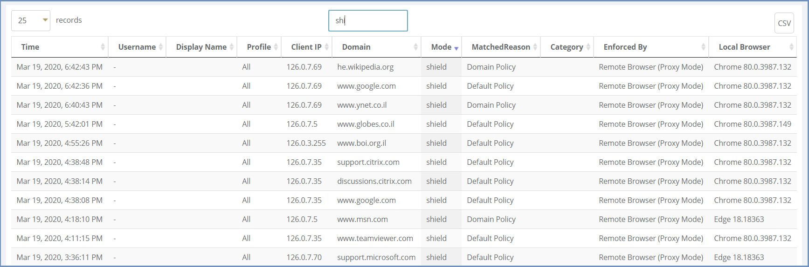

*******
Reports
*******

This section allows retrieving data and info collected using Kibana. These reports are displayed in a clear and informative manner. 
The available report categories are:

*   **Sessions** - displays information about browsing sessions (active and completed/history) and about user sessions (named users, currently active).

*   **System** - displays information about the system, technical status of user sessions and browser sessions.

*   **File Transfer** - displays information about file transfer in the system: which files were downloaded, which blocked and which sanitized successfully.

*	**Errors** - displays the errors that are issued by Shield components which have the severity of Error/Fatal.

*	**End User Feedback** - displays the feedback submitted by end users (using the in-session right click menu option).

*	**Applications** - displays information about applications in the Shield system.

*	**Notifications** - displays information about all the notifications that are issued in the system (shown in the dashboard).

*	**Analyzer** - displays the results of the full system health checks, performed via the Analyzer section. 

To retrieve the information, select the category, the type of the report and the time filter and press ``Run``.

The results are retrieved. A **Search** option is available and also export to CSV (on the right): 

.. note:: Some of the reports are displayed in the previous view, which includes the Kibana infrastructure.

Click the ``Advanced`` link to open Kibana in a new tab, for an enhanced view of system logs.

If, for some reason, the Shield logs information is lost, it can be restored using the Shield Logs Snapshot. 
For more details, see `here <../backuprestore.html#restore-using-snapshot>`_.