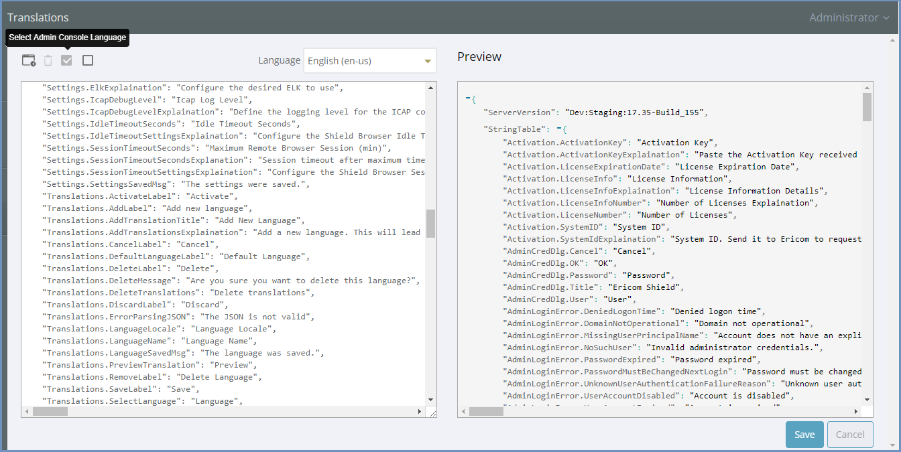
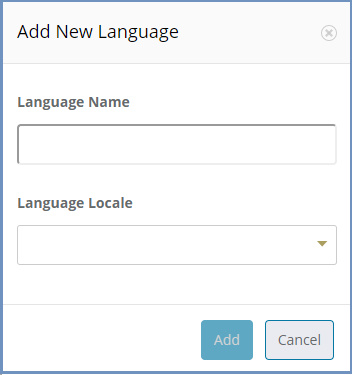
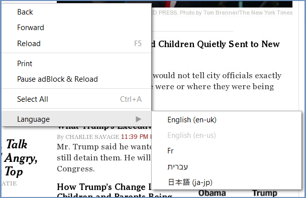
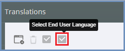

************
Translations
************

Ericom Shield system comes with English (US) as the default language. Japanese is also officially supported. 
Other languages can be added to Shield, using the instructions detailed hereunder.

In this section of the Administration Console, it is possible to add new languages or to edit existing language files.

The language file contains all Administration Console strings (labels, messages, dialogs etc.) and all end user messages (notifications, status updates, CDR related messages etc.).

It is possible to select a language file as the Administration Console display language, as the End User language, or as both. To select, mark the desired checkbox at the top.

I.e., if the administration is in English, but the end users prefer French, select the EN language file as the Administration Console display language and the FR language file as the End User language.

Add New Language
==================

Click the ``Add New Language`` option on the top left of the toolbar.
Enter a name for the required language and the language locale and click save.

The newly added language will now appear in the list of available Languages.

Select the new language from the Language drop down list. Once selected, changes can be made to the labels, strings, messages etc. Once done, save all changes.
Select the **Admin Console/End User** language checkboxes, as desired. 
If the changes were made to a file defined as **Administration Console Language**, the file will be reloaded and changes will be effective immidiately.

End User Language
=================

All strings visible to end users are defined in the language files (along with the administration console strings).
Users can select the desired language using the right-click-menu.

The available languages are the ones defined in the admin.
All texts generated by Shield system are affected by the selected language, including errors, messages, status details etc. 
The selected language is kept locally for the end user and will affect current & future sessions.

Customize End User Messages
---------------------------

It is possible to modify the messages the end users recieve when using Shield (error message, blocked URLs, etc.).
Possible modifications are:

1.	Additional texts (title, explanations etc.)
2.	Change text colors, fonts, size

This can be done using html tags within the messages strings.
End users' strings are prefixed with ``STR_``. Find the specific string using search option (CTRL+F) and modify as desired. Once strings are updated and saved, changes will take effect.

Native Browser Language
=======================

To define the native language of the browser, please follow these steps:

In the ``Administration Console | Translations`` - select the desired language from the list and mark the ``Select End User Language``. 

The selected language will be used to determine the browser native language.

Korean
======

Korean input may conflict with Japanese. 
To use Korean keyboard input in Shield, please do the following:

1. Add Korean as a new language to Shield Administration Console as specified above
2. In the browser, use the right-click menu to select Korean as the end-user language