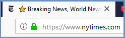
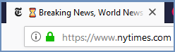

********************************
How To Modify End User Indicator
********************************

If the ``Allow End User Shield Indicator`` is set to Yes (under ``Settings | End User Options``), each remote browser tab will include a default indicator (⭐ ) appended to the domain name.

To customize this default indicator follow these steps:

*   Go to ``Translations`` section

*   Search for the string ``STR_END_USER_INDICATOR``

*   Update the string to the desired value (can be a combinations of characters or supported icons/emojis). 

*   Make sure to use short strings (more useful)

*   Keep the blank space at the end (so the domain name is separated from the Shield indicator).

In this example the default indicator was changed to be ⌛ :

	