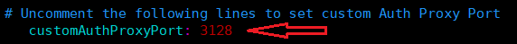

***************************
How To Customize Proxy Port
***************************

It is possible to change the default port used for Shield Proxy.
To do so, edit the ``custom-management.yaml`` & ``custom-proxy.yaml`` files: 

Uncomment the line referring to **customAuthProxyPort** and enter the desired value.

Final result should look like this:

Make sure not to enter redundant spaces/tabs. Save the changes.

Redeploy Shield to update the new proxy port.