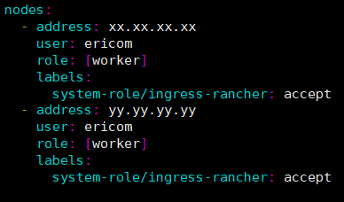
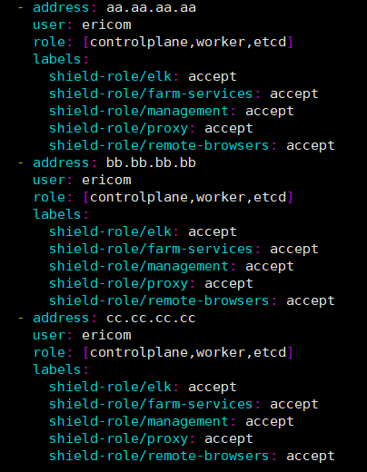
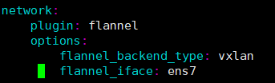

**************************************
How To Set A High Availability Cluster
**************************************

To set up a Shield system with a Rancher cluster, to allow for high availability, please follow the steps detailed below.

Prepare The Nodes
=================

The number of nodes required for a HA cluster, is the number of Shield servers (per the desired deployment) with the following additional nodes:

*   1 node for administrator workstation
*   2 nodes for load balancing proxy acting as a gateway to the Rancher Cluster. 

.. note:: Additional LB nodes can be used, but 2 LB nodes is the minimum for HA.

<Total#ofNodes> = <#ofShieldServers> + <2LBServers> + <1AdminWS>

E.g. a Shield system of 5 nodes (3 managers, 2 browser farm) with RancherHA will require 8 nodes.

.. note:: Please see the Shield Architecture page, for the `recommended deployment <../shieldarchitecture.html#production>`_.

Software Requirements
---------------------

*   Linux Ubuntu Server 18.04 (64-bit, not workstation) or CentOS 7.7-1908 (x86) with Kernel 4.4
*   Has a fixed IP Address
*   Has a unique hostname
*   Has the **same** user <USER> and password as the other nodes
*   Has the same timezone (as other machines in the system)
*   Has SSH server installed

Shield nodes should have these `requirements <../requirements.html>`_.
The other nodes (LB and administrator workstation) should have the minimum amount of memory and CPU resources.

Make sure that a local, accessible, DNS server exists for this system.

Configure Administrator Workstation
===================================

*   Make sure the WS has ssh-keygen and ssh-copy-id programs

*   Clone the Shield repository to the WS::

        git clone --branch Rel-20.03 --single-branch https://github.com/EricomSoftwareLtd/Shield.git && cd Shield/Kube/scripts/RKE

*   Install latest stable version of Kubectl (available `here <https://kubernetes.io/docs/tasks/tools/install-kubectl/#install-kubectl-on-linux>`_)::

        curl -LO https://storage.googleapis.com/kubernetes-release/release/`curl -s https://storage.googleapis.com/kubernetes-release/release/stable.txt`/bin/linux/amd64/kubectl
        chmod +x ./kubectl
        sudo mv ./kubectl /usr/local/bin/kubectl
        kubectl version –client
    
    The result is::
    
        Client Version: version.Info{Major:"1", Minor:"18", GitVersion:"v1.18.0", GitCommit:"9e991415386e4cf155a24b1da15becaa390438d8", GitTreeState:"clean", BuildDate:"2020-03-25T14:58:59Z", GoVersion:"go1.13.8", Compiler:"gc", Platform:"linux/amd64"}

*   Install latest stable version of helm 2. (APP_VERSION=v2.16.5)::

        curl -fsSL https://raw.githubusercontent.com/kubernetes/helm/master/scripts/get -o /tmp/get_helm.sh
        chmod +x /tmp/get_helm.sh
        sudo /tmp/get_helm.sh -v "$APP_VERSION"
        rm -f /tmp/get_helm.sh

*   Install RKE::

        wget https://github.com/rancher/rke/releases/download/v1.0.6/rke_linux-amd64
        chmod +x rke_linux_amd64

*   Install Docker on all nodes (using shield-prepare-servers)::

        cd ../
        curl -s -L -o shield-prepare-servers https://github.com/EricomSoftwareLtd/Shield/releases/download/shield-prepare-servers-Rel-20.03/shield-prepare-servers
        chmod +x shield-prepare-servers
        ./shield-prepare-servers [-u <USER>] <SERVERIPADDRESSES>

    Replace the <USER> with the user that matches ALL nodes. Replace the <SERVERIPADDRESSES> with the list of IP addresses of ALL nodes in the system.

*   Make sure all the nodes are accessible via SSH under the <USER> account from the WS, using SSH public keys. Run the following to generate a key pair and distribute the public key across all nodes (must be done each node separately). For more info go `here <http://manpages.ubuntu.com/manpages/bionic/man1/ssh-copy-id.1.html>`_::

        ssh-keygen 
        ssh-copy-id <IPADDRESSNODE1>
        ssh-copy-id <IPADDRESSNODE2>
        ssh-copy-id <IPADDRESSNODE3>
        .
        .
        .

    In case the key pair was not placed in the **default** path, add the path parameter in the ``rancher-cluster.yml`` as::

        ssh_key_path: <path>/id_rsa

DNS
---

Create a FQDN record in the DNS server to point to the LB nodes. A single record pointing to all LB nodes in the system. 
Edit the ``common`` file - Set the RANCHER_LB_HOSTNAME to the FQDN Record

Certificates
------------

To use an **existing** CA certificate (or chain of certificates), go to ``~/Shield/Kube/scripts`` and save it as ``cacerts.pem``.

In addition, **generate** a server certificate for the FQDN Record and save it, along with the matching private key, in the same directory under the names 
``cert.crt`` and ``cert.key`` respectively. 

In case there are **no** existing CA certificates, create a **new** CA certificate and a **new** server certificate (plus its matching keys respectively) to be used by the Rancher cluster, run::
    
    cd RKE/
    ./generate_ca.sh    (creates a new CA certificate & key)
    ./generate_cert.sh  (creates a new server certificate & key)

Configuration File
------------------

The configuration of the entire system is defined in the ``rancher-cluster.yml`` file. This file is edited to include the system configuration and then later used to deploy it.

LB nodes are marked with ``system-role/ingress-rancher: accept`` label. Copy the related section for each LB node. E.g. for 2 nodes, the file should include:

Update the user: <USER> - use the user mentioned above. 

**Shield Manager** nodes are marked with role: ``[controlplane,worker,etcd]``. 
**Worker** nodes are marked with role: ``[worker]``. 
    
Modify the file to include references to all the Shield nodes in the system. Match the labels/shield-role (e.g. management, proxy, elk, farm-services, remote-browsers) per each 
node, as per the planned Shield deployment. E.g.:

Change the ``kubernetes_version`` to be **v1.17.4-rancher1-2**. 
    
In case users have servers with multiple network interface cards, it is required to specify the **interface name** that was used for communication on the local network, 
in the flannel_iface (under network/options)

    
Save the changes.
    

Deploy Rancher
--------------

Build and deploy the Rancher cluster. Run::

    ./0_rke_up.sh
    ./1_install_tiller.sh
    ./2_deploy_rancher.sh

Make sure there are no fatal errors and wait for the Rancher to be deployed successfully. 
    
.. note:: certain errors may appear, e.g. “Error from server (NotFound): secrets "tls-ca" not found”. These may be ignored.

Open Rancher UI - go to ``https://<RANCHER_LB_HOSTNAME>:8443`` in your browser. Follow the instructions (e.g. set password). Make sure Rancher works with no errors, that 
``local`` cluster is imported and functions with no errors (may take a short while to be ready).

Copy the config file to the proper location:, under ``.kube``::

    cp kube_config_rancher-cluster.yml ~/.kube/config

Deploy Shield
-------------

Proceed to regular Shield installation procedure, run::

    ./add-shield-repo.sh -p <password>
    ./deploy-shield.sh

In Rancher, move the namespaces to be under ``Default`` project.
    
Shield is now installed with Rancher HA

Update Existing Cluster
=======================

To update an existing, running cluster (e.g. when a new Rancher version is released or additional nodes need to be added to Shield system), modify the ``rancher-cluster.yml`` 
as needed, save it and run::

    ./0_rke_up.sh

The new configuration is now applied to the cluster and the cluster is updated.
