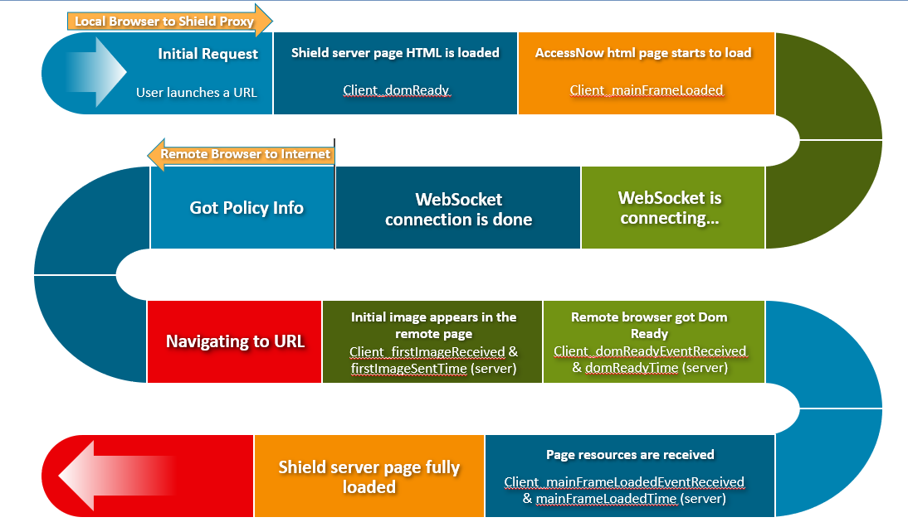
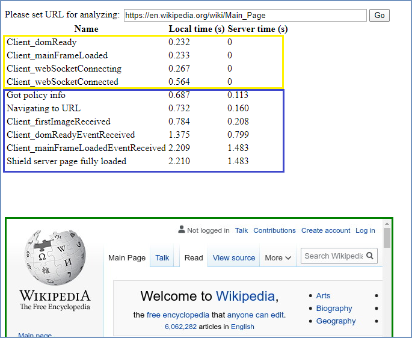
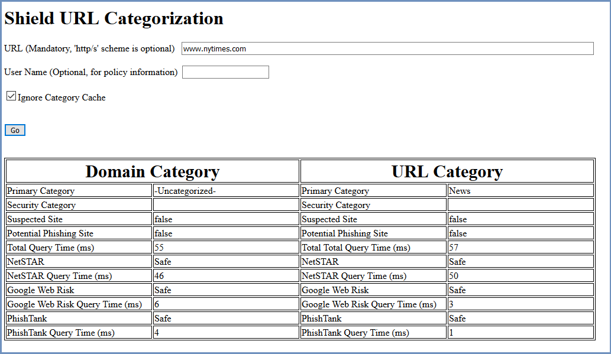
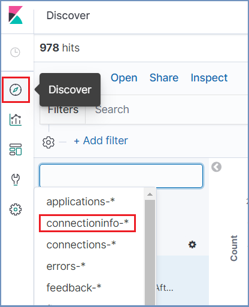
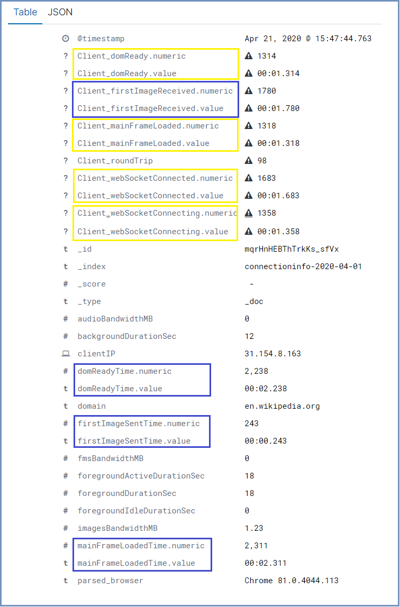

***************************
Troubleshoot Network Issues
***************************

Ericom Shield includes a **Page Load Analyzer** tool, used to measure webpages loading time. 
The Analyzer results include the different events in the browsing process and the duration of each event – the time until each event was received, both in the client side and in the server side.
The events are executed and received as follows:

.. note:: In the majority of cases, this is the sequence of events. Still, since it is an *array* of events, the order may vary a bit (e.g. the dom ready event is received after the page is fully loaded). This has no special affect over the analyzer results and may be ignored. 

The Analyzer tool can help identify network issues when pages take too long to load and can also pin-point the root cause of these issues. 

The results of the analyzer may vary based on the specific webpage, its resources, redirections, network conditions etc. 
Use this page to analyze commonly used URLs, which do not include redirections, as each redirection includes additional events, and the results may be harder to understand.
It is recommended to run the analyzer from two different end users computer - one which is considered as a proper baseline (performance-wise) and a second, which is slower or has performance issues – and then compare the results.

To use the Page Load Analyzer, open a Shield browser and go to http://shield-perf/. Enter the URL to analyze and click “Go”. After the page is analyzed, the results are displayed:

Reading The Analyzer Results
============================

The results can be divided into 2 segments: **Local Browser** to **Shield Proxy** (in yellow) and **Remote Browser** 
to the **Internet** (in blue).

Local Browser to Shield Proxy
-----------------------------

This is the first segment in the process which starts with the inital request and ends when the WS is connected. 
It includes the following events:

*   Client_domReady - Shield server page HTML is loaded
*   Client_mainFrameLoaded - AccessNow html page starts to load
*   Client_webSocketConnecting – the WebSocket is establishing a connection
*   Client_webSocketConnected - the WebSocket connection to the remote browser is done

If this segment is slow (total duration is longer than 2 sec), it may be due to one of the following options:

**Slow communication between the end user browser and shield proxy**

Sometimes a local AV or a local FW, between the user and the proxy, which inspects the communication, or any other inspection tool, may result in significant slowness. To verify if this is the case, use a browser that connects directly to the proxy (disable the AV, FW etc.).

**Slow DNS resolution**

The proxy does a DNS resolution of the URL. If the DNS is slow, it may delay page loading. This can be tested via the 
analyzer tool in the Admin Console (under Services | Analyzer). In case the internal DNS servers cause the slowness, 
try to set other DNS like google or others.

**Slow categories detection (when Categories are enabled in the system)**

The proxy does a request to get the proper categories per URL. If this communication is slow, the page load will 
be slow. To verify if this is the case, use the http://shield-cat/ page and check the query time it takes to get 
the categories. It should be less then 300ms in most cases.

If this is not the case (query time is longer), investigate the root cause of the slow connection to the Categories 
server.

Remote Browser to Internet
--------------------------

The second segment is between the Remote Browser and the Internet. It includes the following events:

*   Got Policy Info & Navigating to URL – both events are received the first time that the remote browser renders the web page
*	Client_firstImageRecieved - an initial image appears in the remote page
*	Client_domReadyEventReceived - the remote browser got Dom Ready event
*	Client_mainFrameLoadedEventReceived - when all page resources are received
*	Shield server page fully loaded - the page is completely loaded

If this segment is slow (total duration is longer than 10 sec), it may be due to one of the following options:

**Slow communication between the remote browser and the Internet**

This could indicate an issue with shield external proxy or the customer network equipment, in case there is an active 
SSL inspection or firewall.

**Ads**

Ads may cause the page to load slowly (up to 30%-50% slower). To avoid this, make sure that ad blocking service is 
enabled. To verify that ad blocking is enabled, use this `site <https://ads-blocker.com/testing/>`_.

**High CPU usage on the browser nodes** 

When the browser nodes resources are exhausted – page loads slower.

**Slow external DNS server**

Kibana - Connections Info Report
================================

The events mentioned above are monitored and recorded in Shield and are accessible in Kibana logs.

Go to Kibana and select ``Discover`` in the main menu. Search for the ``connectioninfo-*``. Make sure the 
relevant time frame is displayed.

Each entry in the results represents a completed browsing session. Select the desired entry and expand it. 
The available information is:

.. note:: The color of the different events is marked according to the relevant segment in the analyzer results. 

For example, this report can be used to detect slow connections or slow machines (due to incorrect configuration). 
Filter the results by a specific duration/interval field, one that would indicate a slow connection. 

For example, filter the results according to **firstImageSentTime.numeric** greater than 2500 (indicates slow loading), 
and with a **specific** clientIP. The results will indicate which machines are slow and may have problematic configurations.