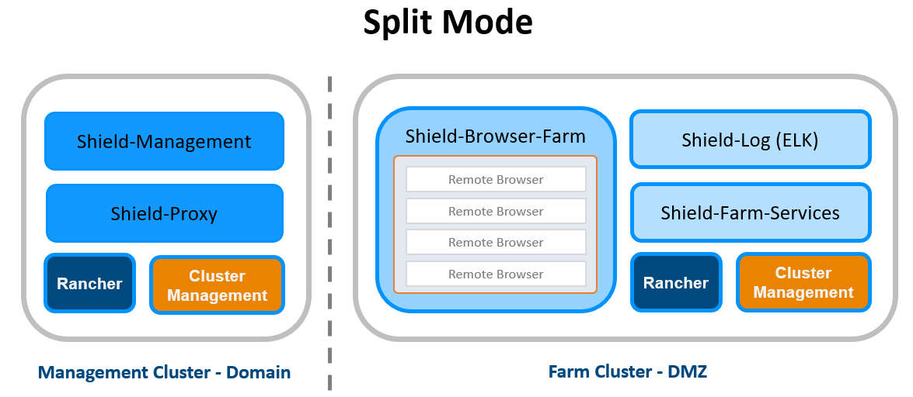
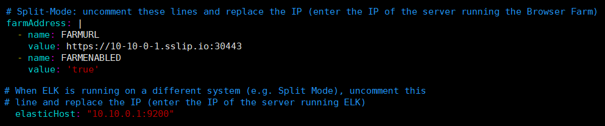
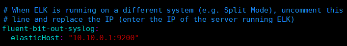
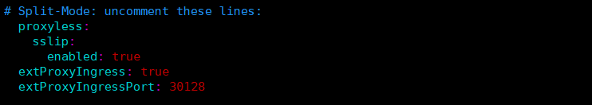

***************************
Deploy Shield In Split Mode
***************************

Shield may be deployed in Split Mode, when some components are in the LAN and others are in the DMZ.

When this is the selected deployment, 2 clusters are created, and defined per thier location (MDZ/LAN).

Management Cluster (referred to as Cluster A), located in the LAN, includes the Management and Proxy components.
Farm Cluster (referred to as Cluster B), located in the DMZ, includes the ELK and Browser Farm.

If this is the deployment, some settings must be configured, to connect between the 2 clusters, so that components in one cluster may be recognized and communicate with the other cluster, to allow Shield proper funcionality.

Configure DMZ Components In The LAN Components
==============================================

.. note:: The instructions below contains several changes in YAML files. Please note that the correct indentation **must** be kept, using spaces only. Using tabs is not supporte in YAML and causes errors. 

Go to the machine running **Cluster A** and update the following yaml files:

1. Edit ``custom-management.yaml`` & ``custom-proxy.yaml`` (follow instructions within the files)::

	# Split-Mode: uncomment these lines and replace the IP (dashes separated) of the server running the Browser Farm
	farmAddress: |
	  - name: FARMURL
	    value: https://10-10-0-1.sslip.io:30443
	  - name: FARMENABLED
	    value: 'true'

	# When ELK is running on a different system (e.g. Split Mode), uncomment this 
	# line and replace the IP (enter the IP of the server running ELK)
	  elasticHost: "10.10.0.1:9200"
	 
Final result should look like this:

2. In ``custom-common.yaml``, uncomment these lines (as described in the file) and update the IP to the Cluster B IP address (in the DMZ)::

	fluent-bit-out-syslog:
	  elasticHost: "10.10.0.1:9200"

Final result should look like this:

Go to the machine running **Cluster B** and update the ``custom-farm.yaml``. Uncomment these lines::

	# Split-Mode: uncomment these lines:
	  proxyless:
	    sslip:
	      enabled: true
	  extProxyIngress: true
	  extProxyIngressPort: 30128

Final result should look like this:

Ports
=====

According to the `Ports table <../requirements.html#connectivity>`_, verify that all the ports marked with **Yes/Exclusive** are opened.