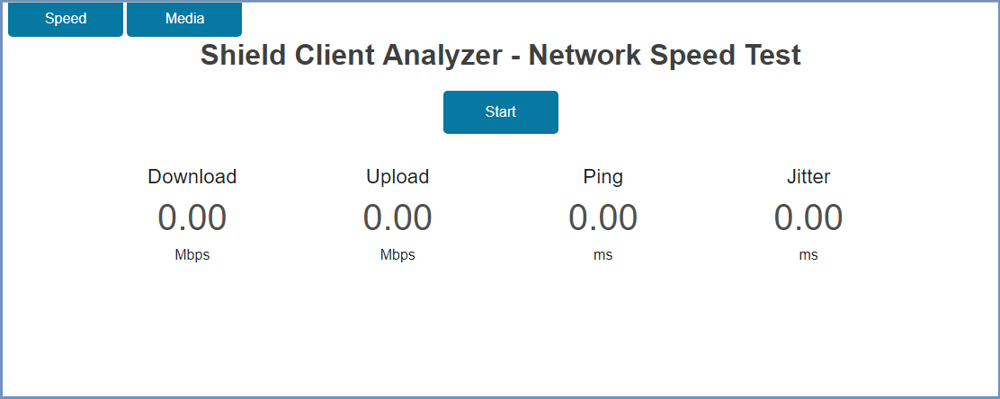
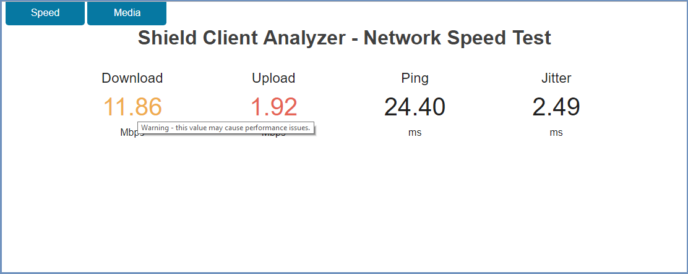

***************
Client Analyzer
***************

Shield includes a ``Client Analyzer``. This option is available for admins and end users at ``http://<ProxyHostname>:30185``.
In this page the following options are available (select from the options on the top left):

System Speed Test
=================

In this tab, it's possible to perform speed test, for the system that Shield is running in.

Select ``Start``. Once the results are displayed, some results may appear colored (to indicate warning/error). Hover over the colored results to review the relevant feedback.

Local Media Streaming
=====================

Streams high quality media on a **local** Shield container, while Shield is **offline**, thus separating between Shield performance and the system issues.

This is a good indicator to Shield functionality. If the media is played properly, but Shield is not functioning as expected, it's most likely due to network issues or latency.
