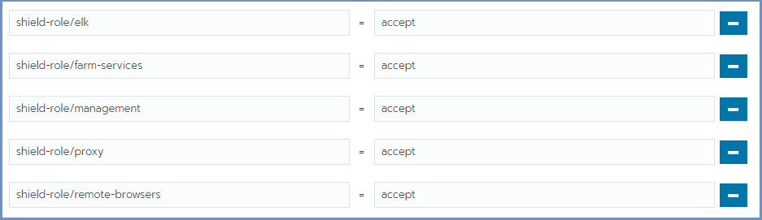
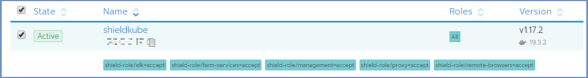

*****************************************
Install Shield Using Installation Scripts
*****************************************

The following process is dedicated to installing Shield using the **Installation Scripts**. It includes steps performed both on the **Rancher Server** Linux 
machine and on the Rancher user interface (using a browser).

.. note:: When using **Ubuntu 16.04** for a Kubernetes system, some steps are needed for Kubernetes to run successfully. For more details, go `here <../deploymentguide/FAQ/knownissues.html#run-kubernetes-on-ubuntu-16-04>`_.

Prepare The Rancher Server
==========================

.. note:: Shield repository requires a valid **PASSWORD**. Before you continue, contact Ericom Shield Professional Services to get a valid password.

On the Linux **Rancher Server** machine, download and run this service:: 

	curl -s -o install-shield.sh https://raw.githubusercontent.com/EricomSoftwareLtd/Shield/Rel-20.03/Kube/scripts/install-shield.sh
	chmod +x install-shield.sh
	sudo ./install-shield.sh -R -l -p <PASSWORD>

Prepare The Server Nodes
========================

Each server node that takes part in the Shield cluster must be prepared before creating the cluster.
From the Linux **Rancher Server** machine run::

	curl -s -L -o shield-prepare-servers https://github.com/EricomSoftwareLtd/Shield/releases/download/shield-prepare-servers-Rel-20.03/shield-prepare-servers
	chmod +x shield-prepare-servers
	./shield-prepare-servers [-u <USER>] <SERVERIPADDRESSES>

<SERVERIPADDRESSES> represents the IP addresses of all the server nodes (that will form the cluster). Multiple IP addresses may be entered, separated by a space (" ").

E.g.::

	./shield-prepare-servers -u ericom xx.xx.xx.xx yy.yy.yy.yy

.. note:: The Kernel may be updated during this process (if required).

Now, perform these steps on ALL the machines in the cluster (both **Rancher Server** machine and server nodes)::

1. Add current user to the docker group::

	sudo usermod -aG docker "$USER"

2. Logout and login again.

3. Verify that Docker is installed properly::

	docker version

4. All the machines should be synchronized. Configure the NTP (Network Time Protocol) and the timezone on the machine.

Connect The Machines To The Cluster Master
==========================================

Open Rancher at https://RancherServerIPAddress:8443 (using the Rancher Server IP address). 

Go To the cluster and select ``Edit`` 

Scroll down to the bottom of the page, mark the required checkboxes (according to the planned deployment) and copy the command on the bottom 
(using the **Copy to Clipboard** option in the right).

Run the copied command on **EACH** server node to join it to the cluster. Make sure the copied command matches the 
node to join (**Master**/**Worker**). Follow the node joining by clicking on ``Nodes`` in the cluster menu.

Wait until the process is finished. After the node is joined to the cluster, a green message appears at the bottom of the page. 
Repeat this process per each node until the cluster is complete. 

Set Node Labels
---------------

Set the node labels for each machine, according to the planned deployment:

In Rancher, select ``Nodes`` and for each node you wish to edit, select the ``Edit`` option from the menu on the right

.. figure:: images/rancher3.png
	:scale: 55%
	:align: center

In the ``Edit Node`` dialog, expand the ``Labels & Annotations`` section and add the desired labels to the node. For each label, set the value 
**accept**. The possible labels are:

Labels can be added manually, one by one, or using copy/paste for one or more lines of the following labels::

    shield-role/management=accept
    shield-role/proxy=accept
    shield-role/elk=accept
    shield-role/farm-services=accept
    shield-role/remote-browsers=accept

Press ``Save``. The updated labels now appear on the node details:

Deploy Shield
=============

Run the install-shield service a second time, to complete the Shield installation process::

	sudo ./install-shield.sh -p <PASSWORD>

The new cluster is now up and ready. 

Verify System Status
--------------------

In Rancher, check under ``Workloads`` if the system is up and running. For more information see `here <FAQ/status.html>`_.

Run ELK On NFS (Optional) 
-------------------------

ELK is running locally (by default). It is **highly recommended** that ELK will run on a shared **NFS** folder, rather than locally. 
To do that, edit the ``custom-values-elk.yaml`` file (located under ``ericomshield`` folder).
Update **elasticsearchDataPath** with the path to the shared NFS folder. Please also consider 
updating the **elasticsearchSnapshotPath**.

Run the install-shield service again::

	sudo ./install-shield.sh -p <PASSWORD>

Backup
------

Set up the backup path and storage account. For more details go `here <FAQ/backuprestore.html>`_.

Split Mode
----------

If the system is deployed in Split Mode, please see required configuration `here <../deploymentguide/FAQ/splitmode.html>`_.