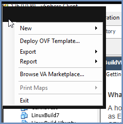
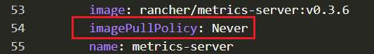

**********************************
Install Shield Using OVA - Offline
**********************************

Create The Server Machines
==========================

1.	From the VMware vSphere client, select ``File > Deploy From OVF Template``. 

Browse to the location of the OVA file and select it. Click ``Next``

.. figure:: images/ova2.png	
	:scale: 50%
	:align: center

.. figure:: images/ova3.png	
	:scale: 50%
	:align: center

2.	Name the file and select the storage path. Complete all the steps and click ``Finish``

.. figure:: images/ova4.png	
	:scale: 50%
	:align: center

.. figure:: images/ova5.png	
	:scale: 50%
	:align: center

3.	Wait for the machine to be ready

.. figure:: images/ova6.png	
	:scale: 75%
	:align: center

4.	Enter the machines settings and change the CPU to 8 cores (minimum) or 12 cores (recommended) and the memory to 16GB (minimum).

.. figure:: images/ova7.png	
	:scale: 55%
	:align: center

5.	Power on the machine.

.. figure:: images/ova8.png	
	:scale: 75%
	:align: center

6.	Follow the steps detailed in `Machine Preparation <preparation.html>`_

7.	If required, increase the size of the OS (to match the VMware size). Run::

		growpart /dev/sda1
		resize2fs /dev/sda1

Prepare The Rancher Server
==========================

.. note:: Shield repository requires a valid **PASSWORD**. Before you continue, contact Ericom Shield Professional Services to get a valid password.

On the Linux **Rancher Server** machine, run this service:: 

	sudo ./install-shield.sh -O -l -R -L shield-repo/

This command will run Rancher (-R) with all the labels (-l), start to create the cluster locally and offline (-O, -L) and use the Shield repository 
included in the OVA file. Before deploying Shield, the user will see a message with a detailed explanation on several required manual 
actions that need to be done before continuing with the process::

    offline mode: skipping adding Shield Repo
    notice : you are running in offline mode
    we need to edit a container that is not working correctly in rancher.
    please connect to rancher ui > select shield cluster
    on the menu on top, click the cluster name and select 'system'
    click on metrics-server under kube-system
    click on the ... in the right top corner and select 'view/edit YAML'
    change the value of ImagePullPolicy from 'Always' to 'Never'
    when you are done, press enter to continue the deployment
    
Follow the instructions detailed in the message. Go to ``Rancher`` | ``Global`` | ``Cluster Name`` | ``System``

Go to ``Namespace: kube-system`` (1), and select the ``metrics-server`` (2), menu on the right (3) - ``View/Edit YAML`` (4) 

Change the ImagePullPolicy to Never and Save

Wait for the ``metrics-server`` container to restart itself and once it turns green, it is ready.  
Go to the rancher server and press ``Enter`` to continue with the installation.

Now that all the Server Machines are ready, continue with the installation steps detailed `here <installation.html#connect-the-server-nodes-to-the-cluster-master>`_.