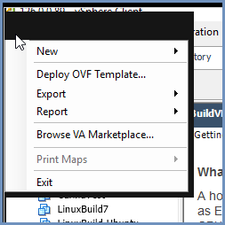
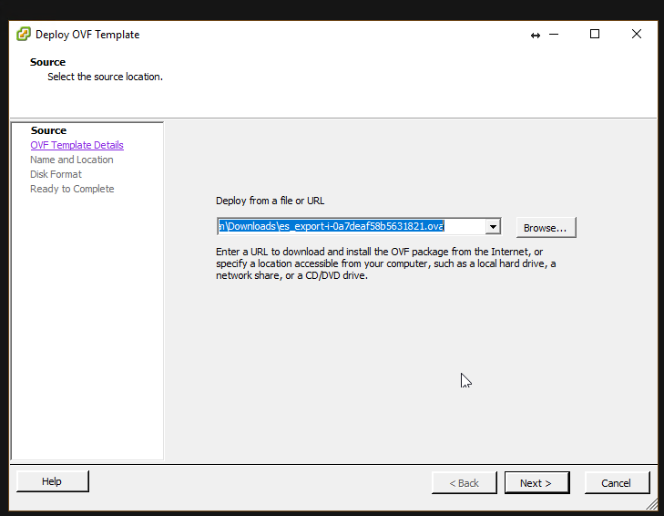
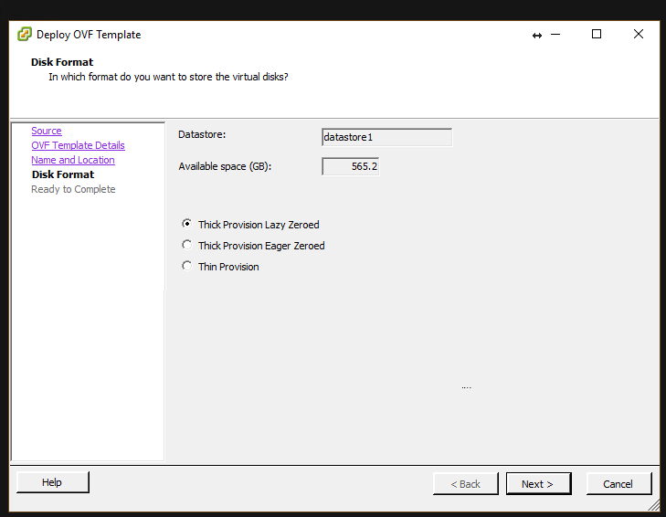
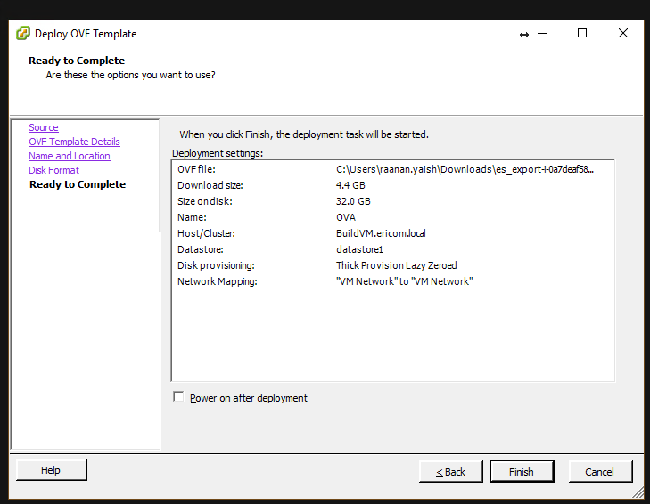
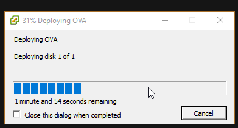
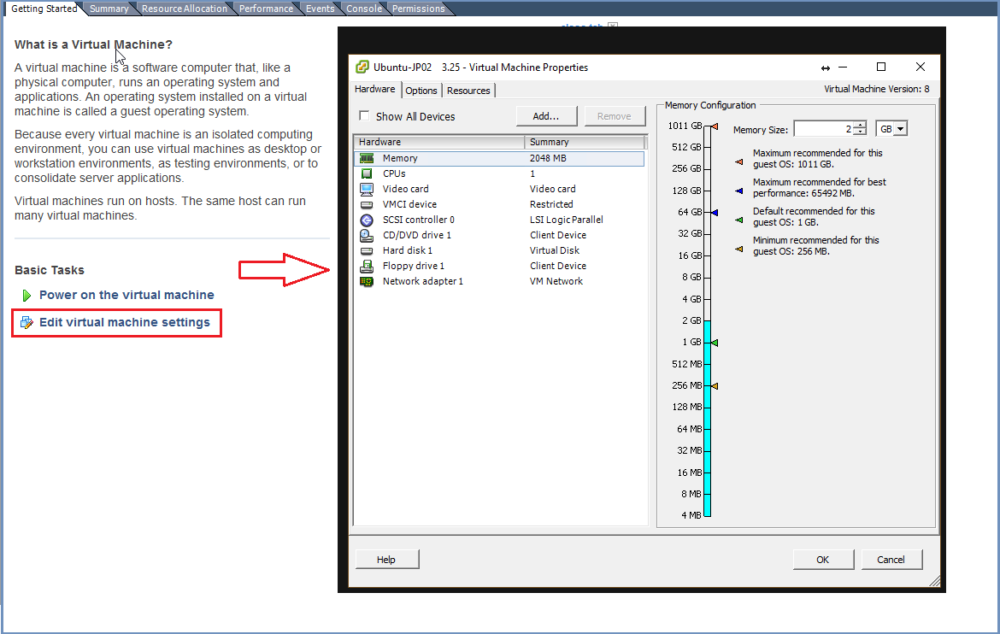
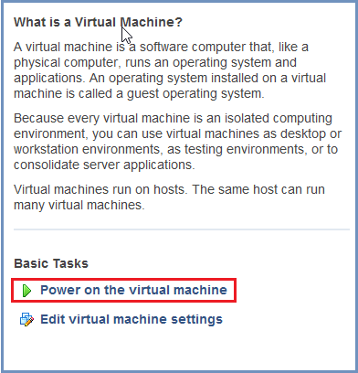

*********************************
Install Shield Using OVA - Online
*********************************

Create The Server Machines
==========================

1.	From the VMware vSphere client, select ``File > Deploy From OVF Template``. 

Browse to the location of the OVA file and select it. Click ``Next``

.. figure:: images/ova3.png	
	:scale: 50%
	:align: center

2.	Name the file and select the storage path. Complete all the steps and click ``Finish``

3.	Wait for the machine to be ready

4.	Enter the machines settings and change the CPU to 8 cores (minimum) or 12 cores (recommended) and the memory to 16GB (minimum).

5.	Power on the machine.

6.	Login using: **ericom/ericomshield**

7.	Configure the IP of the machine to be unique and **static**:

	*	Go to /etc/systemd/network

	*	Edit the 20-wired.network file. Change the line with **DHCP=ipv4** to refer to a specific IP address/subnet, for example::

			[Match]
			Name=en*
	
			[Network]
			Address=10.1.10.12/24
			Gateway=10.1.10.1
			DNS=10.1.10.1
			DNS=10.1.10.2 	//optional, multiples may be used
			IPForward=ipv4

.. note:: In case a DHCP server exists in the environment, configure it to lease a reserved (static) IP to the OVA. You should be able to determine the MAC address of the OVA by the IP address given the OVA at first startup.

8.  All the machines should be synchronized. Configure the NTP (Network Time Protocol) and the timezone on the machine::

		sudo timedatectl set-ntp on
		sudo systemctl restart systemd-timesyncd
		timedatectl set-timezone <Continent>/<City>

9.	Rename each node with a **unique** name (necessary for the cluster to be created properly). As **root**, run::

		hostnamectl set-hostname NEW_UNIQUE_HOSTNAME
		reboot
		
10.	Reboot the machine

Repeat these steps for **EACH** machine in the system. 

Prepare The Rancher Server
==========================

.. note:: Shield repository requires a valid **PASSWORD**. Before you continue, contact Ericom Shield Professional Services to get a valid password.

On the Linux **Rancher Server** machine, run this service:: 

	sudo ./install-shield.sh -R -l -p <PASSWORD>

Now that all the Server Machines are ready, continue with the installation steps detailed `here <installation.html#connect-the-machines-to-the-cluster-master>`_.