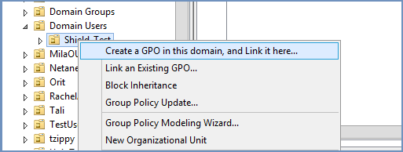
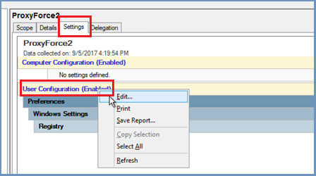
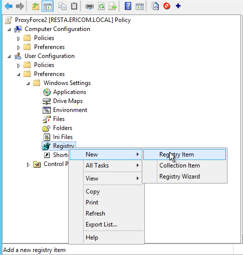
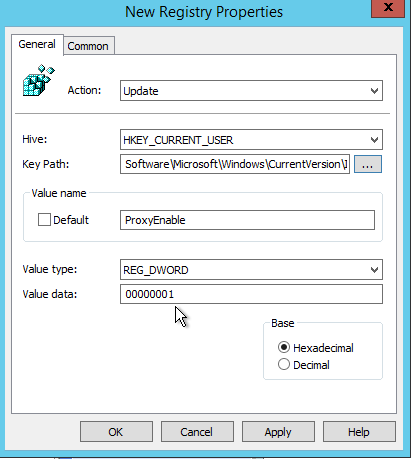
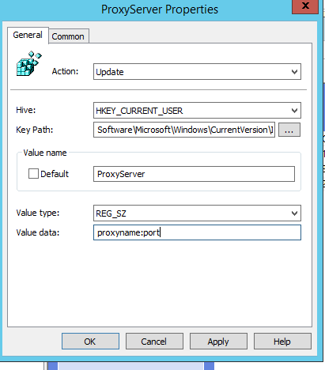
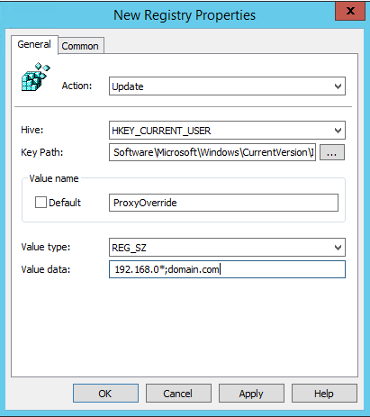
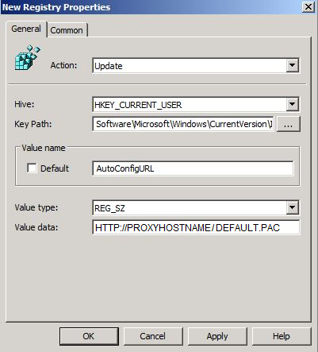
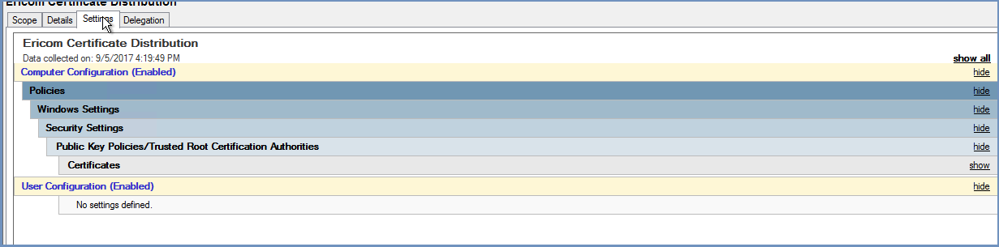
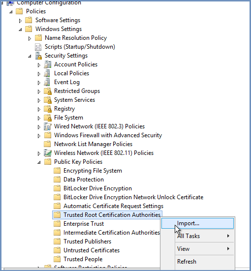
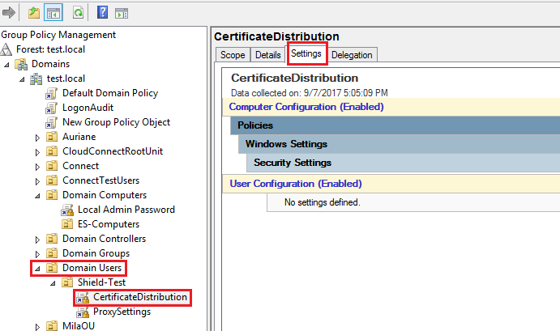

***********************
Post Installation Steps
***********************

End User Configuration
======================

After deploying Ericom Shield, the system is ready to use. In order to start browsing securely using Ericom Shield, 
the Browsing Traffic should be sent to a proxy server.

If a proxy server is already in use (for caching or content filtering purpose), this proxy should be configured to work with 
Ericom Shield.

Alternatively, the browser will be configured to use the Ericom Shield built-in Proxy.

Proxy Configuration
===================

There are several options to configure the proxy. It can be done at the single user level or at the group policy level to 
affect all users. Available options are detailed hereunder:

Set the Proxy Using Group Policy
--------------------------------

1. Open Group Policy Management Console - Press the Windows logo key + R to open the RUN dialog box. Type gpmc.msc in the text box, and then click OK or press ENTER.

2. Find an existing or create a new GPO to contain the proxy settings (more information can be found `here <https://technet.microsoft.com/en-us/library/cc754740(v=ws.11).aspx>`_ ). Ensure that the GPO is associated with the domain, site, or organizational unit whose users you want affected by the policy. 

3. If a new policy was created, provide a name for the policy. The Group Policy Management Editor opens, displaying the current content of the policy object. In the right pane under the **Settings tab | User Configuration** right click and select ``<Edit>``. 

	
4. Expand the **User Configuration | Preferences | Windows Settings | Registry**

5. Create a new registry item: right click on ``<Registry>`` and create a **New | Registry Item**

6. In the dialog, under the Key Path click on ``< ... >`` and go to **HKCU\\Software\\Microsoft\\Windows\\CurrentVersion\\InternetSettings\\ProxyEnable**

	Create a new Value Name: ProxyEnable

	Value type: REG_DWORD
		
	Value data: 00000001

7. Create a second registry item with the following values:

	Value Name: ProxyServer

	Value type: REG_SZ
		
	Value data: proxyname:port

	
.. note:: Replace proxyname:port with the <DNS>:<PORT> of your Shield server, e.g. shield.company.local:3128	The DNS name should be the clustered address name for the Shield Proxies if Kerberos authentication is also being used.
	
8. Create a third registry item with the following values:

	Value Name: ProxyOverride

	Value type: REG_SZ
	
	Value data: <local addresses>
	
.. note:: Replace <local addresses> with any local address on your network that you wish to exclude, e.g. 192.168.0*;domain.com
		

.. note:: More information can be found `here <https://social.technet.microsoft.com/wiki/contents/articles/5156.how-to-force-proxy-settings-via-group-policy.aspx>`_ 

Set the Proxy Using PAC File with Group Policy
----------------------------------------------

1. Open Group Policy Management Console. 

2. Find an existing or create a new GPO to contain the proxy settings. Ensure that the GPO is associated with the domain, site, or organizational unit whose users you want affected by the policy. 

The Group Policy Management Editor opens, displaying the current content of the policy object. 
In the right pane under the **Settings tab | User Configuration** right click and select ``<Edit>``. 

	
4. Expand the **User Configuration | Preferences | Windows Settings | Registry**. 

5. Create a new registry item: right click on ``<Registry>`` and create a **New | Registry Item**

6. In the dialog, under the Key Path click on ``< ... >`` and go to **HKCU\\Software\\Microsoft\\Windows\\CurrentVersion\\InternetSettings\\ProxyEnable**

	Create a new Value Name: AutoConfigURL

	Value type: REG_SZ
		
	Value data: <your pac file>
	
.. note:: Replace <your pac file> with the location of your file, for example: if you would like to use the Ericom Shield environment to host your PAC file, enter the address as... http://ShieldHostname/default.pac
	

Configure Firefox To Use Shield Proxy Using PAC File
----------------------------------------------------

Since Firefox settings are separated and are not affected by the Windows system definitions, using the proxy defined in the PAC file does not affect it automatically.
To configure Firefox to use the proxy defined in the PAC file (after defining the GPO for it), follow these steps: 

*	Place the ``shield.cfg`` file in the root of the Firefox directory. E.g.::

		C:\Program Files\Mozilla Firefox\shield.cfg

*	Place the ``autoconfig.js`` file in the \defaults\pref sub-directory. E.g.::

		C:\Program Files\Mozilla Firefox\defaults\pref\autoconfig.js

*	In ``autoconfig.js`` add these lines::

		pref("general.config.obscure_value", 0); 
		pref("general.config.filename", "shield.cfg");

*	In ``shield.cfg`` add this line::

		lockPref("network.proxy.autoconfig_url", "http://ShieldHostname/default.pac");
    	lockPref("network.proxy.type", 2);
    	lockPref("network.proxy.no_proxies_on", "localhost, 127.0.0.1");

.. note:: These files should be ANSI encoded. Please change the path of the PAC file to use local PAC file. In addition, specify the internal addresses to be excluded.

Set the Proxy at the Browser
----------------------------

Select your browser of choice and define the Proxy Settings to use the ``<ShieldHostname>`` and port 3128. 

.. toctree::
	:maxdepth: 1
	:glob:
	
	../proxysettings/*

Set the Proxy Using PAC File
----------------------------

It is possible to set the proxy to use a Proxy Auto-Config (PAC) file. Ericom Shield comes with a default PAC file that can be used out of the box. 
To use the default PAC file, use the following path: ``<http://ShieldHostname/default.pac>``. For more information, select the browser of choice.

Changes can be made to the default PAC file as needed, once the changes have been made, upload the new PAC file using the Administration Console (``Settings | PAC File`` section).  

Select your browser of choice and define the Proxy Settings to use the PAC file. 

.. toctree::
	:maxdepth: 1
	:glob:
	
	../PACsettings/*

Certificate Configuration
=========================

In order for Shield to handle HTTPS domains, the following certificate needs to be imported into the client machine (Local Computer). This can be done via Group Policy or manually. Download the Ericom Shield Certificate in one of the following ways:

1. Download from :download:`here <../downloads/ericomshield.crt>`
2. Open a Shield browser and go to `here <http://install-certificate/>`_
3. Open a browser and go to: ``<http://<ShieldHostname>/install-certificate>``

Install Certificate Using Group Policy
--------------------------------------

1. Open Group Policy Management Console. 

2. Find an existing or create a new GPO to contain the certificate settings. Ensure that the GPO is associated with the domain, site, or organizational unit whose users you want affected by the policy. 

3. In the right pane under the **Settings tab | Computer Configuration** click ``<Edit>``. 

	
4. The Group Policy Management Editor opens, displaying the current content of the policy object. 

In the navigation pane, open **Computer Configuration | Policies | Windows Settings | Security Settings | Public Key Policies | Trusted Root Certification Authorities**. Right click and select ``<import>``. 	

	
5. Select the Shield certificate file and import it.
	

6. After importing the certificate, right click the GPO and select “enforce”.

7. Link between the computer and the certificate:

	* Under **Domain Computers**, create a GPO to represent the computer that will be connected to.
	
	* Right click this GPO and select ``<Link an Existing GPO>`` and select the certificate GPO.
	
.. note:: More information can be found `here <https://technet.microsoft.com/en-us/library/cc770315%28v=ws.10%29.aspx?f=255&MSPPError=-2147217396>`_ 

Configure Firefox To Use Shield Certificate
------------------------------------------

Since Firefox settings are not affected by the Windows system definitions, the certificate that is defined in the GPO does not affect. 
To solve this, Firefox should be configured to trust certificates in the Windows certificate store.
Once the GPO is defined for the Shield Certificate, follow these steps (skip first 2 items if files already exist in the system):

*	Place the ``shield.cfg`` file in the root of the Firefox directory. E.g.::

		C:\Program Files\Mozilla Firefox\shield.cfg

*	Place the ``autoconfig.js`` file in the \defaults\pref sub-directory. E.g.::

		C:\Program Files\Mozilla Firefox\defaults\pref\autoconfig.js

*	In ``autoconfig.js`` add these lines::

		pref("general.config.obscure_value", 0); 
		pref("general.config.filename", "shield.cfg");

*	In ``shield.cfg`` add this line::

		pref(security.enterprise_roots.enabled", true);

.. note:: These files should be ANSI encoded.

Install the Certificate at the Browser
--------------------------------------

.. toctree::
	:maxdepth: 1
	:glob:
	
	../browsers/*

External Syslog
===============

Ericom Shield can be configured to send all Shield log messages to an external Syslog Server.

Define the External Syslog server details in the ``Admin | Settings | Logs`` section.
More details `here <../deploymentguide/Admin/settings.html#external-syslog-host>`_.

Authentication Settings
=======================

It is recommended, at this stage, to fill in the authentication settings in the Administration Console.
Shield supports the following authentication methods: Chaining, Basic, Kerberos and LDAP. For more details, see `here <../deploymentguide/Admin/profiles.html#authentication>`_.
